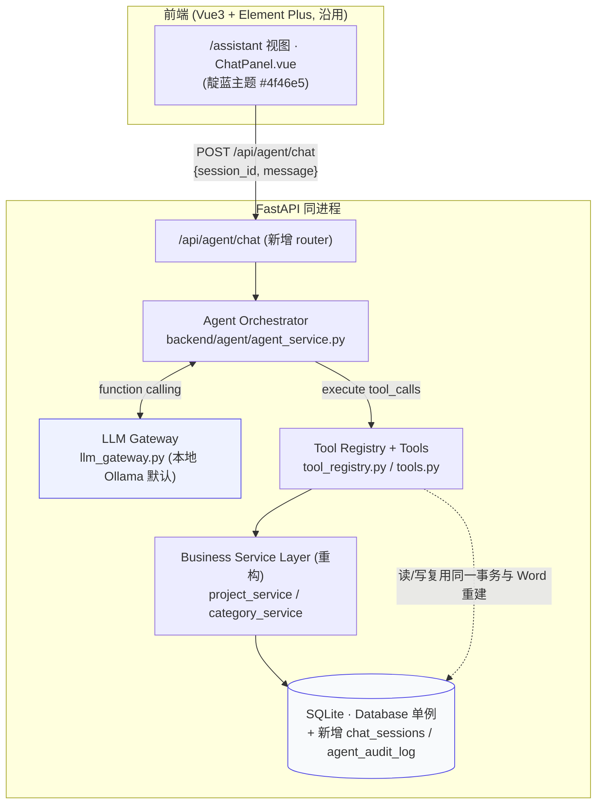
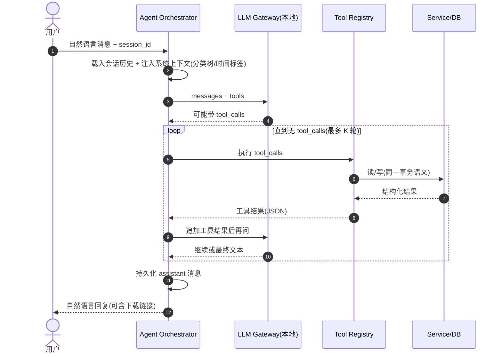
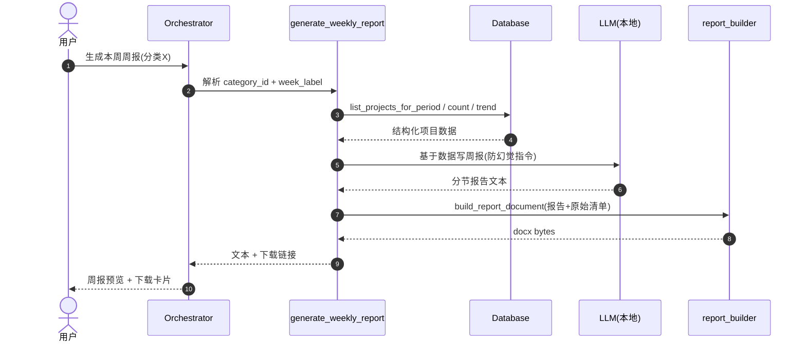

# 文档管理系统 · AI Agent 集成技术方案

> 目标：在现有「本地文档管理系统」（FastAPI + SQLite + Vue3/ElementPlus，单机本地运行）中接入 AI Agent，
> 实现自然语言对话式的项目信息增删改查（CRUD）与基于项目数据自动生成周报。
> 本文档是**可直接落地的设计契约**，所有命名均对齐现有 `backend/` 实现，不臆造接口。

---

## 0. 设计前提：从现有代码读出的两条硬约束

在动手前，先对齐现有系统的两个不可妥协的事实，它们直接决定了方案形态：

### 0.1 现状事实（已读源码确认）

| 事实 | 代码位置 | 对 Agent 设计的含义 |
|------|----------|----------------------|
| 进程内单例 `db = Database(DB_PATH)`，无独立服务 | `backend/main.py:83` | Agent 可作为**同进程模块**直接复用 `db`，无需 HTTP 绕行 |
| 项目保存 = 计算周期标签 → `precheck_period_files_writable` → 改库 → `rebuild_period_word`（含 `source_sha256` 去重 + 版本入库） | `save_project` / `rebuild_period_word`（`main.py`） | Agent 写操作**必须复用同一段业务规则**，绝不允许绕过 Word 重建/版本审计直接改表 |
| `save_project` 是 `multipart/form` 上传接口，内嵌业务规则 | `main.py:1375`（`delete_project` 约 1615） | 必须把"业务规则中枢"从 HTTP 壳抽离成可复用 service，否则 Agent 与 UI 会出现两套逻辑 |
| 周期标签由 `path_utils.get_time_labels` / `get_iso_week_range` 统一产出（ISO 周） | `backend/path_utils.py` | Agent 解析"上周/本周"等相对时间必须复用同一函数，避免口径漂移 |
| 读接口已齐备：`list_projects`、`list_projects_for_period`、`get_project`、`count_saved_projects_period`、`project_daily_counts` 等 | `database.py` | 读类工具可直接挂到 Agent，无需重写 |
| README 明文："数据只落本机，不联网上传" | `README.md:135` | **LLM 必须默认本地化**（Ollama 等），禁止默认把项目内容送往云端 |

### 0.2 由此导出的两条设计铁律

1. **铁律 A — LLM 默认本机化**：默认走本地 OpenAI 兼容网关（Ollama，监听 `http://localhost:11434/v1`）。云端 Provider 仅作为显式配置项，且开启时必须向用户提示"数据将出站"。
2. **铁律 B — 复用既有 service 层，绝不直接碰库**：所有 Agent 写操作经由重构后的 `project_service` / `category_service`，与现有 UI 共享同一套事务、Word 重建与版本审计语义。

---

## 1. 整体架构

Agent 以**同进程子模块**形态挂载在现有 FastAPI 应用内，共享 `db` 单例；前端新增一个复用靛蓝主题的对话面板。



**集成要点**：Agent 不是独立微服务，而是与应用共用一个进程、一个 `db`、一个 SQLite 文件。这样数据一致性天然由同一套代码保证，也避免了"AI 服务"成为新的数据出站口。

---

## 2. 核心组件

### 2.1 LLM 接口层（`backend/agent/llm_gateway.py`）

职责：屏蔽 Provider 差异，统一 function-calling 与流式输出。

- **协议**：OpenAI 兼容 Chat Completions（Ollama / vLLM / 云端均兼容同一套 `tools` 协议）。
- **默认本地**：`base_url = http://localhost:11434/v1`，`model` 默认 `qwen2.5:14b`（或 `llama3.1:8b`，按本机显存选）。
- **配置**：扩展 `config.json` 新增 `ai` 段（见 §8），含 `provider / base_url / model / api_key / max_tokens / temperature / enabled`。
- **数据不出站保证**：当 `provider != "local"`（即云端）时，网关在初始化阶段打印醒目警告并要求 `data_egress_ack = true`，否则拒绝启动 Agent。
- **能力封装**：
  - `chat(messages, tools) -> (content, tool_calls)`：解析 `tool_calls`，归一化参数。
  - `stream(...)`：可选流式，用于长报告生成时增量回传。
  - `supports_tools`：探测当前模型是否支持 function calling，不支持则降级为"LLM 输出结构化 JSON 指令"模式（保底）。

### 2.2 对话管理层（`backend/agent/conversation.py`）

职责：会话持久化、上下文窗口管理、实体引用解析。

**持久化（复用 SQLite，新增两张表）**

```sql
CREATE TABLE chat_sessions (
    id TEXT PRIMARY KEY,            -- UUID，前端 localStorage 持有
    title TEXT DEFAULT '',
    created_at TEXT NOT NULL,
    updated_at TEXT NOT NULL
);
CREATE TABLE chat_messages (
    id INTEGER PRIMARY KEY AUTOINCREMENT,
    session_id TEXT NOT NULL,
    role TEXT NOT NULL,             -- system | user | assistant | tool
    content TEXT DEFAULT '',
    tool_calls_json TEXT DEFAULT '',-- assistant 发起的工具调用
    tool_result_json TEXT DEFAULT '',
    seq INTEGER NOT NULL,           -- 同会话内有序
    created_at TEXT NOT NULL
);
```

**上下文管理三件套**

1. **滚动窗口**：每轮仅向 LLM 发送 `system + 最近 N 轮（默认 12）消息`。超窗消息不丢，而是压缩为一句" working summary"注入 system（例如："本会话已处理：删除项目#42、新建分类'投标2026'"）。
2. **实体引用上下文（解决代词/省略）**：会话状态机维护 `last_project_id / last_category_id / last_period`，用于把"把它删了""上周那个"解析为具体实体。
3. **系统上下文注入**：每轮在 system 中附带一份**精简只读上下文**——分类树（id/name/is_leaf/path）、当前 ISO `week/month/quarter` 标签（取自 `path_utils.get_time_labels`）。数据量极小，却能让 LLM 正确把"互联网业务单元的投标"映射到 `category_id`。

### 2.3 业务数据访问层（重构 + 复用）

**关键重构**：把 `main.py` 里 `save_project` / `delete_project` 中的"业务规则中枢"抽成 `backend/services/`：

- `project_service.save_project(*, title, category_id, content, time_modes, project_id=None, attachments=None)`
  → 内部执行：内容校验 → `ensure_leaf_category` → 计算标签 → `collect_period_targets` → `precheck_period_files_writable` → `db.create/update_project` → `rebuild_period_word` → `backup_database_if_due`。
- `project_service.delete_project(project_id)` → 复用现有删除 + 周期 Word 重建。
- `category_service.create/update/delete/reorder` → 包装 `db` 对应方法 + 现有校验（同级重名、防环等）。

**好处**：`POST /api/projects`（UI）与 Agent 的 `create_project` 工具调用**同一个函数**，Word 版本审计、`source_sha256` 去重、占用预检等不变量 100% 一致。

**读路径**：工具直接调用 `db.list_projects` / `db.list_projects_for_period` / `db.get_project` / `db.count_saved_projects_period` 等，不另起炉灶。

### 2.4 工具 / 函数调用机制（`backend/agent/tool_registry.py` + `tools.py`）

每个工具 = `JSON Schema 声明` + `Python 实现`，实现内部调用 §2.3 的 service 层。

| 工具名 | 入参（节选） | 作用 | 调用的 service/DB |
|--------|--------------|------|-------------------|
| `get_category_tree` | — | 取分类树（名称→id 映射） | `db.get_category_tree` |
| `search_projects` | `keyword?`, `category_id?`, `period?` | 检索项目 | `db.list_projects` |
| `get_project` | `project_id` | 取单条详情 | `db.get_project` |
| `create_project` | `title, category_id, content, time_modes` | 新建项目（走完整规则） | `project_service.save_project` |
| `update_project` | `project_id, …` | 编辑（带 id 幂等） | `project_service.save_project(project_id=…)` |
| `delete_project` | `project_id` | 删除 + 重建周期 Word | `project_service.delete_project` |
| `create_category` / `update_category` / `delete_category` | — | 分类 CRUD | `category_service.*` |
| `resolve_time_label` | `relative: "this_week"|"last_week"|"this_month"` | 相对时间→ISO 标签 | `path_utils.get_time_labels` |
| `get_stats_summary` / `get_stats_trend` | `range` | 看板数据（周报趋势用） | `db.count_saved_projects_period` 等 |
| `generate_weekly_report` | `category_id, week_label?` | 周报生成（见 §7） | `db.list_projects_for_period` + LLM + docx |

**执行循环（Orchestrator）**



---

## 3. Agent 与现有系统的集成方式

| 维度 | 方案 | 说明 |
|------|------|------|
| 进程 | 同进程模块 `backend/agent/`，`app.include_router(agent_router)` | 共享 `db` 单例，零网络跳转 |
| HTTP 入口 | 新增 `POST /api/agent/chat`（`{session_id, message}` → 流式/普通 JSON） | 与现有 `/api/*` 同中间件（CORS 已放行） |
| 前端 | 新增路由 `/assistant` + `ChatPanel.vue`，复用 Element Plus 与 `--wb-indigo` 主题 token | 不引入新 UI 框架；输入框 + 消息流 + 报告下载卡片 |
| 重构边界 | "业务规则"从 `main.py` 迁到 `services/`；`main.py` 的端点改为薄壳调用 service | UI 行为零回归（现有测试/脚本照常） |
| 审计 | 新增 `agent_audit_log(session_id, tool, args_json, result_summary, created_at)` | 每次 Agent 写操作留痕，便于追溯与安全审查 |
| 配置 | `config.json` 增加 `ai` 段（§8） | 默认关闭 Agent，用户显式开启并选择本地模型 |

**不破坏现有行为**：所有既有端点、Word 版本、备份调度完全不变；Agent 只是多了一个"用自然语言驱动同一套 service"的入口。

---

## 4. 数据一致性策略

Agent 的写操作若失控，最容易破坏的就是"项目数据 ↔ 周期 Word ↔ 版本审计"三者的一致性。策略如下：

1. **单一写入口**：所有 Agent 写操作经由 `project_service` / `category_service`，与 UI 共用 `Database.connect()` 的事务语义（异常自动 rollback）。
2. **串行化 Agent 写**：SQLite 是单写者。Agent 聊天请求在编排层对"写工具"加进程内异步锁（`asyncio.Lock`），避免并发会话同时重建同一 Word 导致半成功。
3. **Word 一致性铁规**：Agent **绝不直接生成/修改 .docx**，一律走 `rebuild_period_word` + `source_sha256` 去重 + `precheck_period_files_writable`（被 Word/WPS 占用时返回明确错误，让 LLM 转告用户先关文件）。这保证了"数据库当前版本 ↔ 本地文件"始终一致，且不会产生无意义的重复版本。
4. **幂等编辑**：编辑操作必须带 `project_id`（同 UI 的复用逻辑），失败重试不会新建重复项目；`time_modes` 变更会自动清理旧周期标签（`clear_week/month/quarter`）。
5. **多步操作的补偿**：对"把 A 分类下项目迁到 B 分类"这类复合指令，尽量在单个 service 事务内完成；若必须分步，任一步失败则整体回滚并向用户报告已回退。
6. **审计与可追溯**：每次写操作写入 `agent_audit_log`，结合既有 `period_file_versions` 的 `source_snapshot_json`，任何 Agent 改动都可还原与追责。

---

## 5. 对话上下文管理策略

| 问题 | 策略 |
|------|------|
| 长会话 token 膨胀 | 滚动窗口（最近 12 轮）+ 超窗消息压缩为 working summary 注入 system |
| "它""那个""上周"指代 | 会话状态机维护 `last_project_id / last_category_id / last_period`，工具执行前自动补全省略参数 |
| 模糊名称→实体 | 每轮注入精简分类树（id/name/is_leaf）；LLM 先 `get_category_tree`/`search_projects` 取候选，再定点操作；找不到时反问用户澄清，不臆造 id |
| 时间歧义 | `resolve_time_label` 复用 `path_utils`，把"上周/本周/本月"统一转成与存储一致的 ISO 标签 |
| 多标签/多会话 | `session_id` 由前端持有（localStorage），后端按会话隔离历史与实体上下文 |
| 上下文污染 | 工具结果只回传结构化数据摘要，不在历史里堆积大段项目正文（正文按需经 `get_project` 拉取） |

---

## 6. 意图识别与结构化数据操作处理逻辑

**主路径 — LLM Function Calling**：模型依据 system 中的工具 schema 与系统上下文，自行决定调用哪个工具、填哪些参数。这是处理中文自然语言最稳的路径，无需自训分类器。

**副路径 — 轻量意图路由**：对"你能做什么""刚才那步再解释下"等非结构化请求，路由到直接回复，避免强行套工具；对意图不清的输入，由 LLM 生成澄清问题反问用户。

**结构化操作闭环（以"把'投标2026'分类下所有项目导出本周周报"为例）**

1. 用户句 → Orchestrator 注入上下文。
2. LLM 先调 `get_category_tree` 解析"投标2026"→ `category_id=37`。
3. LLM 调 `resolve_time_label("this_week")` → `week_label="2026-W32"`。
4. LLM 调 `generate_weekly_report(category_id=37, week_label="2026-W32")`（见 §7）。
5. 工具返回报告文本 + 下载链接，LLM 组织成自然语言回给用户。

**参数校验闭环**：工具执行前在 service 层做硬校验（分类须存在且为叶子才能正式保存、内容非空、`time_modes` 合法）。校验失败返回**友好错误 JSON**（如 `{"ok":false,"error":"分类 37 尚未设置本地目录，无法正式保存"}`），Orchestrator 把错误回灌给 LLM，由它决定重试或转问用户——而非直接抛 500。

---

## 7. 周报生成功能

### 7.1 触发与解析
- 触发语："生成本周周报""生成本周互联网业务单元下的周报""把投标分类的 2026-W32 周报做一下"。
- 解析：先定位 `category_id`（分类树/搜索），再定 `week_label`（默认当前 ISO 周，或用户指定）。

### 7.2 数据提取（复用既有读接口）
```python
projects = db.list_projects_for_period(category_id, "week", week_label)  # status='saved'
summary  = db.count_saved_projects_period()        # 当期总量
trend    = db.project_daily_counts(14)             # 趋势（报告"近期节奏"段）
```
每个 project 已带 `title / content / content_preview / attachments / category_path_names`。

### 7.3 LLM 摘要（防幻觉是第一优先级）
构造提示词：把**结构化数据**（项目清单、计数、趋势）作为唯一事实来源，指令要求输出中文周报，分节：
`概览 → 工作进展 → 重点项目 → 风险与待办 → 下周计划`，并明确"仅基于提供数据，不得编造未提及的事项"。
可选：把原始项目清单附为"附录（数据来源）"，保证可追溯、可核对。

### 7.4 渲染为 Word（复用 python-docx，新增渲染函数）
新增 `backend/agent/report_builder.py`：
- `build_report_document(report_sections: dict, raw_projects: list) -> bytes`
- 复用现有 `word_service` 的样式/段落习惯，但产出**叙事型报告**而非原始合并文档（区别于 `build_period_word_document`）。
- 落盘策略：存到该分类目录下 `reports/YYYY-Www_周报.docx`，同时在 DB 侧可复用 `period_file_versions` 的 BLOB 版本机制（新增 `report_files` 表镜像该结构）以享版本审计与备份。

### 7.5 返回
- 聊天消息中返回报告正文（Markdown/纯文本）+ 一个"下载周报"卡片（链接到新增的 `GET /api/agent/reports/{id}/download`）。
- 全程遵守 Word 占用预检（`precheck_period_files_writable` 思路），被占用时明确告知。



---

## 8. 配置与依赖变更

**`config.json` 新增 `ai` 段（默认关闭，显式开启）**

```json
{
  "ai": {
    "enabled": false,
    "provider": "local",
    "base_url": "http://localhost:11434/v1",
    "model": "qwen2.5:14b",
    "api_key": "",
    "data_egress_ack": false,
    "max_tokens": 2048,
    "temperature": 0.2
  }
}
```

**依赖**：仅新增 `openai`（Python SDK，同时兼容本地 Ollama 与云端），`python-docx` 已存在。不引入前端新依赖。

**不破坏现有行为**：`ai.enabled=false` 时，`/api/agent/*` 直接返回 503 且 UI 不显示入口；其余功能零影响。

---

## 9. 实施路线（阶段化，避免一次性大改）

| 阶段 | 任务 | 关键文件 | 依赖 |
|------|------|----------|------|
| **P0 地基** | 抽取 `project_service` / `category_service`；`main.py` 端点改为调用 service（行为不变） | `backend/services/*.py`、`backend/main.py` | — |
| **P0 网关** | `llm_gateway.py` + `config.json` 的 `ai` 段 + 本地模型探测与降级 | `backend/agent/llm_gateway.py`、`config.json` | — |
| **P1 编排** | `conversation.py`（会话表/上下文）、`tool_registry.py` + 工具实现、`agent_service.py` 执行循环、`agent_audit_log` | `backend/agent/*` | P0 |
| **P1 入口** | `POST /api/agent/chat` router；`/assistant` 路由 + `ChatPanel.vue`（靛蓝主题） | `backend/agent/router.py`、`web/src/views/AssistantView.vue`、`web/src/components/ChatPanel.vue` | P1 编排 |
| **P2 周报** | `report_builder.py` + `generate_weekly_report` 工具 + 报告下载端点 + `report_files` 表 | `backend/agent/report_builder.py` | P1 |
| **P3 打磨** | 意图澄清体验、长上下文压测、Word 占用提示文案、构建验证 | 全仓库 | P2 |

P0 先把"复用 service 层"落地，本身就是一次无风险的重构（UI 行为不变），却为 Agent 与未来其他入口铺好了唯一正确的写入口。

---

## 10. 风险与对策

| 风险 | 对策 |
|------|------|
| 本地模型中文 function-calling 不稳定 | 选用 `qwen2.5:14b+`；网关探测 `supports_tools`，不支持则降级"LLM 输出结构化 JSON 指令"模式；工具参数做 schema 校验兜底 |
| 长会话上下文膨胀 / 指代丢失 | 滚动窗口 + working summary + 实体引用上下文（§5） |
| 并发写导致 SQLite 写冲突或 Word 半成功 | Agent 写加 `asyncio.Lock` 串行化；严格走 `precheck_period_files_writable` |
| 项目内容经 LLM 外泄 | 铁律 A：默认本地；云端需 `data_egress_ack=true` 才放行 |
| 周报幻觉 | 仅以 `list_projects_for_period` 返回的结构化数据为事实源，附原始清单附录 |
| 破坏现有 Word 版本/备份体系 | Agent 写一律经由 `project_service` → `rebuild_period_word`，与 UI 同一代码路径 |

---

## 结论

方案的核心思想是**"不另起炉灶，而是给现有系统加一个自然语言驾驶舱"**：Agent 以同进程模块共享 `db` 单例，所有写操作复用从 `main.py` 抽出的 service 层（从而天然继承 Word 重建、版本审计、占用预检等一致性不变量），LLM 默认本地化以坚守"数据不出本机"的产品底线。周报生成则直接站在既有 `list_projects_for_period` 与统计聚合之上，用 LLM 做"基于真实数据的摘要"，并复用 python-docx 渲染成可追溯的 Word。
