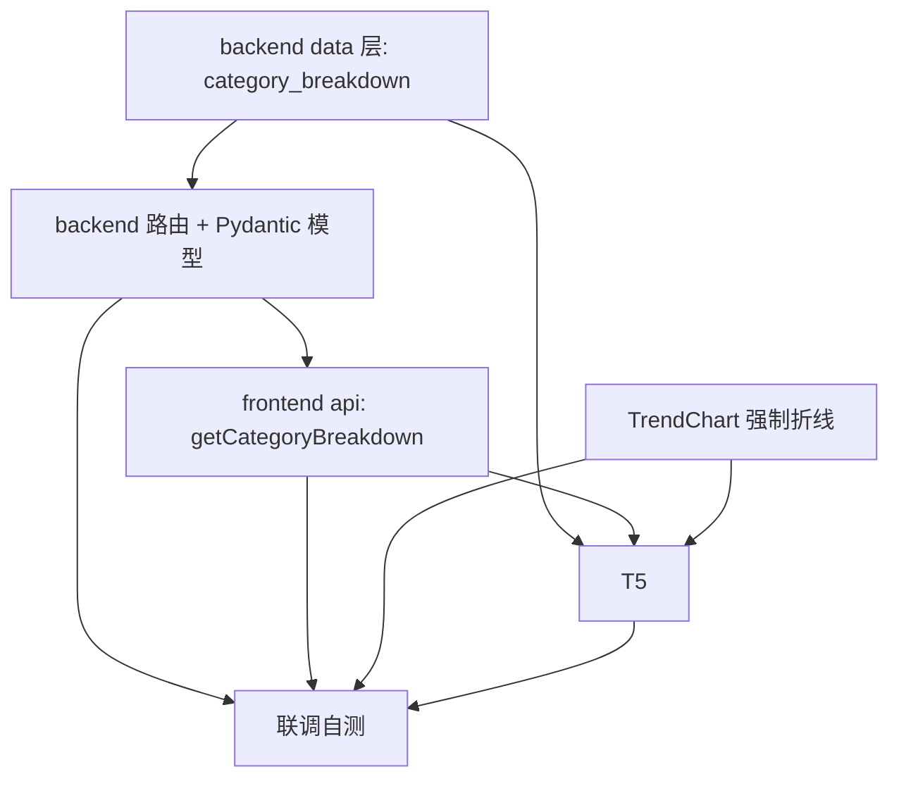

# 数据看板改造 · 实现方案与任务分解

> 作者：高见远（software-architect-2）
> 范围：概览卡合并、趋势改折线、按分类统计（层级下钻）
> 约束：仅做设计，不写最终实现代码；沿用现有栈，无新增依赖。

---

## 1. 实现方案概述 + 框架选型结论

### 框架选型结论
**沿用现有技术栈，不引入任何新依赖。**

| 层 | 技术 | 说明 |
|----|------|------|
| 前端 | Vite + Vue3 + ElementPlus + 自绘 SVG | 图表继续零图表库、自绘 SVG（与 `TrendChart.vue` 一致） |
| 后端 | FastAPI + SQLite（单文件 `backend/main.py` + `backend/database.py`） | 复用 `db = Database()` 单例；路由沿用 `@app.get`；响应模型沿用纯 snake_case 无 alias |
| 通信 | 既有 `web/src/api/http.js` 封装（`http.get`，`toastError`） | 无新封装需求 |

### 核心难点与对策
1. **分类子树汇总（project_total）**：需把"某节点及其全部后代"的 saved 项目数算出来。对策——复用 `list_categories_flat()`（已带 `child_count`/`project_count`），在 Python 侧用 `children_map`（按 `parent_id` 分组）做一次**后序聚合**，O(N) 一次 SQL 完成，避免每级 N 次查询。
2. **层级下钻导航**：前端维护"下钻路径栈"，支持"下钻子级 / 返回上一级 / 回到顶级"。
3. **概览卡合并**：3 张并列卡 → 1 张卡内展示 3 个数值（保留 today/month/quarter，不合并为单值）。后端接口不变。
4. **趋势强制折线**：删除 `isBar` 柱状分支与 `bars` 计算，三个周期均走折线 + 面积渲染；日模式保留 X 轴标签抽稀。

---

## 2. 文件列表（相对路径 + 改动性质）

| 文件 | 改动性质 |
|------|----------|
| `backend/database.py` | **新增方法** `category_breakdown(parent_id)`（约在"统计聚合"区段、`project_quarterly_counts` 之后插入） |
| `backend/main.py` | **新增 Pydantic 模型** `CategoryBreakdownItem` + **新增路由** `GET /api/stats/category-breakdown`（插入现有 stats 区段，约 1940 行之后；`response_model` 用新模型） |
| `web/src/api/index.js` | **新增函数** `getCategoryBreakdown(parentId = null)`（在现有 stats 导出区下方追加） |
| `web/src/components/TrendChart.vue` | **改模板/改逻辑**：删除 `isBar` 柱状分支与 `bars` 计算，恒走折线；`labelPositions` 简化为只取 points；保留日模式抽稀 |
| `web/src/components/DashboardPanel.vue` | **改模板/改脚本/改样式**：概览卡合并为 1 张；新增"按分类统计"区块 + 下钻状态(breadcrumb/back stack) + 加载逻辑并入 `refresh/loadStats`；新增区块样式 + 容器查询断点 |

> 无新增文件；无 SQL 表结构变更；无迁移脚本。

---

## 3. 接口契约：`GET /api/stats/category-breakdown`

**说明**：返回 `parent_id` 下的**直接子分类**列表；每项含子树项目总数与是否可下钻。响应体为 **JSON 数组**（直接是 list，非 `{code,data,message}` 信封——与现有 stats 接口一致）。

### 3.1 请求
| 参数 | 位置 | 类型 | 必填 | 默认 | 说明 |
|------|------|------|------|------|------|
| `parent_id` | query | `int \| null` | 否 | `null` | 缺省/空/不传 = 根级（`parent_id IS NULL`）。传整数 = 该父级下的直接子分类 |

- 非法整数（如 `parent_id=abc`）→ FastAPI `RequestValidationError` → 全局 handler 返回 **400**（见 `main.py:2013`）。
- 不存在的 `parent_id` → 返回空数组 `[]`（不报错）。

### 3.2 响应（HTTP 200）
响应模型类名：**`CategoryBreakdownItem`**（Pydantic，纯 snake_case，无 alias），`response_model=list[CategoryBreakdownItem]`。

数组元素字段：

| 字段 | 类型 | 说明 |
|------|------|------|
| `id` | `int` | 分类 id |
| `name` | `string` | 分类名 |
| `parent_id` | `int \| null` | 父级 id；根级子项此处为 `null` |
| `sort_order` | `int` | 同级排序权重（缺省 0） |
| `has_children` | `bool` | `true` = 有子分类，可继续下钻；`false` = 叶子，不可点 |
| `project_total` | `int` | 该节点**子树**（含自身与全部后代）的 saved 项目总数 |

### 3.3 响应示例
```json
[
  { "id": 1, "name": "产品文档", "parent_id": null, "sort_order": 0, "has_children": true, "project_total": 42 },
  { "id": 2, "name": "会议纪要", "parent_id": null, "sort_order": 1, "has_children": false, "project_total": 7 },
  { "id": 3, "name": "技术博客", "parent_id": null, "sort_order": 2, "has_children": true, "project_total": 15 }
]
```

### 3.4 口径假设（重要）
`project_total` 的计数口径 = **`status != 'draft'` 的项目子树汇总**。理由：严格复用 `list_categories_flat()` 的 `project_count` 列（该列即 `WHERE status != 'draft'`），**不另写 SQL**，与需求"status != 'draft' 子树汇总 / 复用现有列"一致。需求文内"saved 项目总数"表述为同义口语化写法，本设计统一以 `status != 'draft'` 为准（详见第 9 节待明确）。

---

## 4. 数据结构 / 类图要点

### 4.1 后端：`Database.category_breakdown(parent_id)` 的输入/输出与聚合逻辑

**输入**：`parent_id: Optional[int]`（`None` 表示根级）。

**输出**：`list[dict]`，每项 `{id, name, parent_id, sort_order, has_children, project_total}`。

**聚合逻辑（伪代码）**：
```python
def category_breakdown(self, parent_id=None):
    flat = self.list_categories_flat()          # 每项含 child_count / project_count / parent_id / sort_order / name / id
    by_id, children_map = {}, {}
    for c in flat:
        by_id[c["id"]] = c
        children_map.setdefault(c.get("parent_id"), []).append(c["id"])

    subtree = {}                                 # 后序聚合：子树项目总数
    def dfs(cid):
        total = by_id[cid]["project_count"] or 0
        for ch in children_map.get(cid, []):
            total += dfs(ch)
        subtree[cid] = total
        return total
    for c in flat:
        if c["id"] not in subtree:
            dfs(c["id"])

    rows = [c for c in flat if c.get("parent_id") == parent_id]   # 筛选直接子级
    rows.sort(key=lambda c: (c.get("sort_order") or 0, (c.get("name") or "").lower()))
    return [{
        "id": c["id"], "name": c["name"], "parent_id": c.get("parent_id"),
        "sort_order": c.get("sort_order") or 0,
        "has_children": (c.get("child_count") or 0) > 0,
        "project_total": subtree.get(c["id"], 0),
    } for c in rows]
```
- 仅 1 次 `list_categories_flat()` SQL；后序聚合纯 Python，O(N)。
- 复用 `db._category_and_descendant_ids` 中已有的 `children_map` 思路，但此处需"自底向上汇总"，故用 `dfs` 后序。

### 4.2 前端组件状态要点（DashboardPanel）
| 状态 | 类型 | 说明 |
|------|------|------|
| `catParentId` | `ref<int \| null>` | 当前层级父 id；`null` = 根级 |
| `catRows` | `ref<array>` | 当前层直接子分类列表（含归一化字段） |
| `catLoading` | `ref<bool>` | 分类区块 loading |
| `catPath` | `ref<array<{id,name}>>` | 面包屑/下钻栈：从根到当前父的祖先链 |
| 方法 | | `loadCategoryBreakdown()` / `drillDown(row)` / `goUp()` / `goTop()` |

### 4.3 类图（另见 `dashboard-stats-class-diagram.mermaid`）
- `Database` → 新增 `category_breakdown`
- `CategoryBreakdownItem`（Pydantic，纯 snake_case）
- `CategoryBreakdownRoute`（FastAPI GET）→ 调用 `Database`，`response_model=list[CategoryBreakdownItem]`
- `ApiClient.getCategoryBreakdown` → HTTP GET 路由
- `DashboardPanel` → 调 `ApiClient`、持有下钻状态、渲染 `TrendChart`
- `TrendChart` → 恒折线渲染

---

## 5. 调用流程（时序要点）

### 5.1 面板挂载 → 加载根级分类 → 点击下钻 → 返回
（完整时序见 `dashboard-stats-sequence-diagram.mermaid`）

1. `onMounted` → `refresh()` → `loadStats()` 内 `Promise.all([loadSummary(), loadTrend(range), loadCategoryBreakdown(catParentId)])`。
2. `loadCategoryBreakdown(null)` → `getCategoryBreakdown(null)` → `GET /api/stats/category-breakdown`（无参）→ 后端 `category_breakdown(None)` → 返回根级直接子分类 → 前端 `catRows`。
3. 用户点击 `has_children=true` 的行：`drillDown(row)` → `catPath.push({id,name})`、`catParentId=row.id` → `loadCategoryBreakdown(row.id)` → `GET ...?parent_id=row.id` → 返回该级子分类。
4. "返回上一级" `goUp()`：`catPath.pop()`，父设为新栈顶（空则 `null`）；"回到顶级" `goTop()`：`catPath=[]`、`catParentId=null`；均重新 `loadCategoryBreakdown`。
5. 行的水平占比条宽度 = `projectTotal / max(projectTotal in 当前层)`；叶子（`has_children=false`）不可点、无箭头。

### 5.2 趋势强制折线后的渲染路径
- `TrendChart` 不再分支：`isBar` 移除或恒为 `false`；模板删除 `<g v-if="isBar">` 柱状 `<rect>`。
- 三个周期均走：`points`（折线坐标）→ `areaPath`（渐变面积）→ `linePath`（折线描边）→ `circle`（数据点）。
- `visibleLabelIdx` 仅 `range==='day'` 时抽稀（step=ceil(n/7)），月/季全显；`labelPositions` 简化为 `points.map(p=>p.x)`。

---

## 6. 有序任务列表（按实现顺序，标注依赖）

> 注：团队负责人明确要求 T1–T6 共 6 个任务，故本设计突破 Bob 默认"≤5 任务"上限，以遵循直接指派。

| 任务 | 名称 | 源文件 | 依赖 | 优先级 |
|------|------|--------|------|--------|
| **T1** | 后端数据层 `category_breakdown` 方法 | `backend/database.py` | — | P0 |
| **T2** | 后端路由 + Pydantic 模型 `CategoryBreakdownItem` | `backend/main.py` | T1 | P0 |
| **T3** | 前端 api 客户端 `getCategoryBreakdown` | `web/src/api/index.js` | T2 | P1 |
| **T4** | TrendChart 强制折线（删柱状分支） | `web/src/components/TrendChart.vue` | — | P1 |
| **T5** | DashboardPanel 合并概览卡 + 新增按分类统计区块与下钻逻辑 + 样式 | `web/src/components/DashboardPanel.vue` | T3, T4 | P0 |
| **T6** | 联调自测（接口/前端/边界用例） | 全部上述文件 | T2, T3, T4, T5 | P1 |

**依赖关系图（Mermaid graph，另见文末）**：
- T1 → T2 → T3 → T5
- T4 → T5
- T2/T3/T4/T5 → T6

---

## 7. 依赖包列表
**无新增依赖。**
- 后端：FastAPI / Pydantic / SQLite（已具备）
- 前端：Vue3 / ElementPlus / `@element-plus/icons-vue`（已有，下钻箭头复用 `ArrowRight` 或 `ChevronRight`）

---

## 8. 跨文件约定（Shared Knowledge）

- **字段命名**：后端响应纯 snake_case、无 alias（仿 `ProjectStatsSummary`）；前端读取 `data.today` / `row.project_total` 等原始字段。
- **响应信封**：stats 接口**不使用** `{code,data,message}` 信封；`http.get` 直接解析为 JSON（`summary` 为对象、`category-breakdown` 为数组），前端直接用返回值。
- **错误处理**：统一 `toastError(error, '加载分类统计失败')`（`web/src/api/http.js:47`）。
- **loading 态**：新增 `catLoading`；趋势沿用 `trendLoading`；概览沿用 `loading`。
- **设计令牌**：主色 `#4f46e5`；卡片复用 `.workbench-card`（圆角 19px、边框 `#dde5ef`、阴影）；标题沿用 `.section-kicker` / `h2`。
- **容器查询响应式**：沿用 `@container (max-width: 620px)` 写法，保证列窄不错位；分类区块行在窄列下堆叠。
- **下钻栈一致性**：`catPath` 仅存祖先（不含当前父自身），保证"返回上一级/回到顶级"语义单一。
- **刷新并入**：`refresh()`/`loadStats()` 内加载当前 `catParentId` 层（保留用户下钻位置，不强制回根）。

---

## 9. 待明确事项

1. **`project_total` 口径**：需求文内同时出现"status != 'draft' 子树汇总"与"saved 项目总数"。本设计按 `list_categories_flat().project_count`（=`status != 'draft'`）统一口径，不新增 SQL。**若需严格按 `status = 'saved'` 计数，则必须另写 SQL，违背"复用现有列"约束——请确认口径。**
2. **`parent_id` 空值归一化**：前端仅在不传参时省略；后端以 `Optional[int] = None` 处理根级。若未来需支持显式 `parent_id=null` 字符串，需在路由层归一化（当前无需）。
3. **无**（其余均已明确，按本设计可直接进入实现）。

---

## 附录：任务依赖图（Mermaid）


