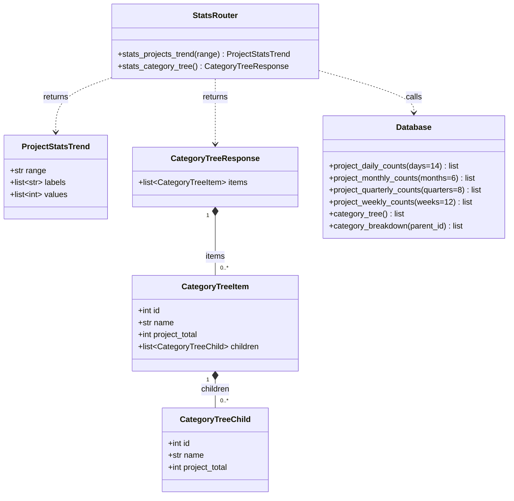
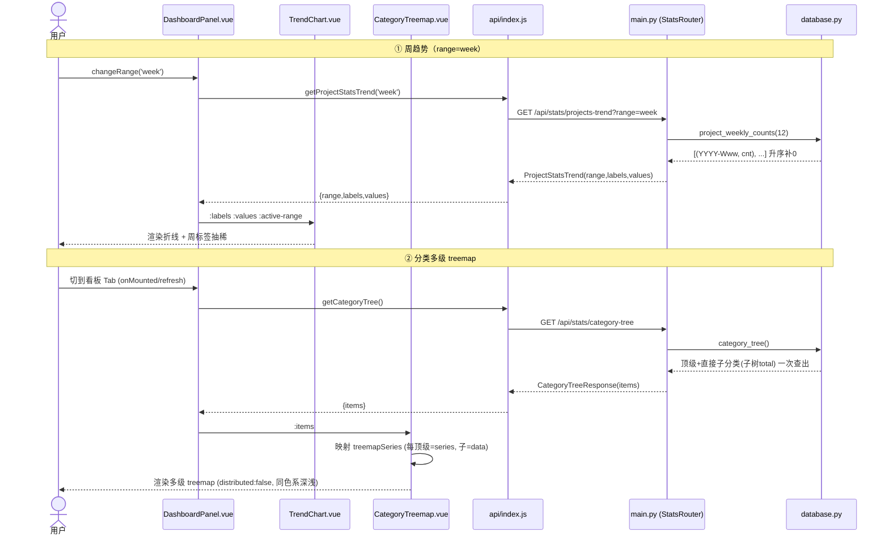
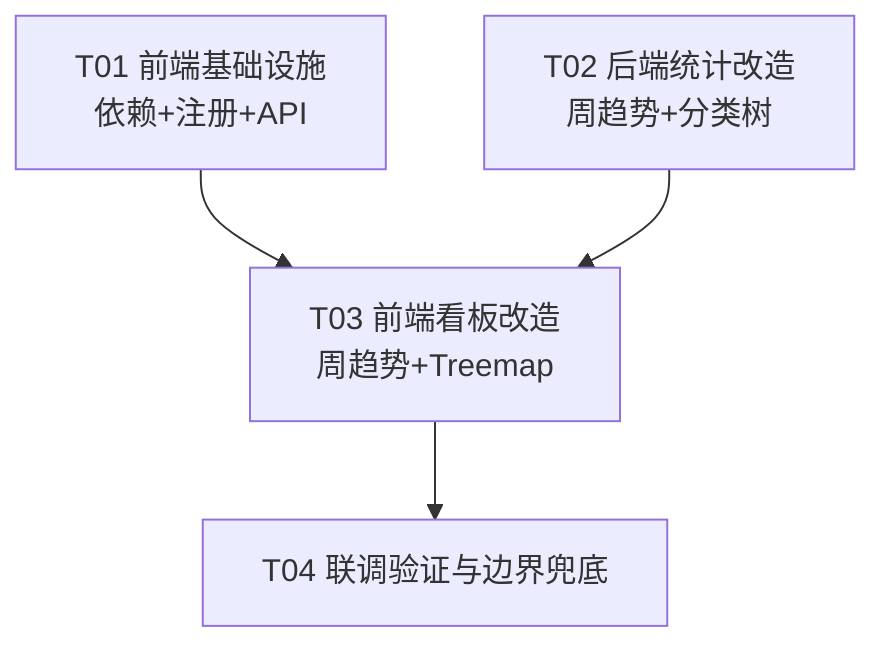

# 数据看板改造 · 系统设计规格（趋势「按周」 + 分类多级 Treemap）

> 角色：架构师（高见远）
> 状态：设计稿（供工程师实现，非完整实现）
> 全部结论基于 team-lead 已核实的现状（backend/main.py、backend/database.py、web/src/components/DashboardPanel.vue、TrendChart.vue、api/index.js、main.js）

## 0. 概述与目标

两项改造，互相独立、可并行开工，最终在「看板 Tab」联调：

1. **趋势新增「按周」**：`el-segmented` 选项从 日/月/季 增加 周；趋势图显示最近 N 周每周新增（ISO 周）。
2. **分类统计改为多级 treemap**：用 **ApexCharts**（`apexcharts` + `vue3-apexcharts`）替换现有的自绘 SVG 圆环图。顶级分类为外层分组（series），其直接子分类为嵌套矩形（data）。

### 设计原则

- 沿用现有后端风格：`stats_*` 接口纯 snake_case、无 alias；趋势沿用 `ProjectStatsTrend(range, labels, values)` 模型。
- 周聚合复用现有「查全量分组 → 按窗口回填补 0」模式，标签由 `path_utils` 统一产出，保证前后端一致（同 `list_recent_quarters`）。
- 避免 N+1：`category_tree()` 复用 `list_categories_flat()` + `children_map` + 后序聚合，一次查出。
- 颜色沿用现有靛蓝主题色板（`#4f46e5` 系），保证视觉一致。

---

## 1. 后端改动

### 1.1 新增 `path_utils.list_recent_weeks(n=12)`

镜像 `list_recent_quarters`，返回最近 n 个 ISO 周 `(iso_year, iso_week, label)`，label 形如 `YYYY-Www`。以「本周一」为锚点向前推。

```python
# backend/path_utils.py  (在 list_recent_quarters 之后新增)
def list_recent_weeks(n: int = 12) -> list[tuple[int, int, str]]:
    """按升序返回最近 n 个 ISO 周 (iso_year, iso_week, label)。

    标签 'YYYY-Www'，与 database.project_weekly_counts 产出一致。
    锚点：本周一（isoweekday() 周一=1）。
    """
    now = datetime.now()
    monday_this_week = now - timedelta(days=now.isoweekday() - 1)
    result: list[tuple[int, int, str]] = []
    for offset in range(n - 1, -1, -1):
        mon = monday_this_week - timedelta(weeks=offset)
        iso = mon.isocalendar()
        result.append((iso.year, iso.week, f"{iso.year}-W{iso.week:02d}"))
    return result
```

> 说明：锚点用「本周一」而非「今天」，保证窗口起点对齐 ISO 周边界。

### 1.2 新增 DB 函数 `project_weekly_counts(weeks=12)`

按 **ISO 周**聚合最近 weeks 周每周新增（`status='saved'`），回填补 0，label = `YYYY-Www`。

实现思路（复用 daily 的「查全量按天分组 → Python 归并到 ISO 周 → 按窗口回填」）：

```python
# backend/database.py  (在 project_quarterly_counts 之后新增)
def project_weekly_counts(self, weeks: int = 12) -> list[tuple[str, int]]:
    """最近 weeks 周每周新增（status='saved'），按 ISO 周聚合。

    返回 [(label 'YYYY-Www', count), ...] 按周升序，无数据补 0。
    """
    from .path_utils import list_recent_weeks
    with self.connect() as conn:
        rows = conn.execute(
            """
            SELECT substr(created_at, 1, 10) AS day, COUNT(*) AS cnt
            FROM projects
            WHERE status = 'saved'
            GROUP BY day
            """
        ).fetchall()
    counts: dict[str, int] = {}
    for r in rows:
        try:
            d = datetime.strptime(r["day"], "%Y-%m-%d")
        except (ValueError, TypeError):
            continue
        iso = d.isocalendar()               # 同一 ISO 周内任一天 iso 年/周相同
        label = f"{iso.year}-W{iso.week:02d}"
        counts[label] = counts.get(label, 0) + int(r["cnt"])
    result: list[tuple[str, int]] = []
    for (_year, _week, label) in list_recent_weeks(weeks):
        result.append((label, counts.get(label, 0)))
    return result
```

> 关键不变量：某 ISO 周（周一~周日）内任意一天 `isocalendar()` 的 `(year, week)` 相同，因此先按天分组再归并到 ISO 周是正确且等价的。label 与 `get_iso_week_range` 产出格式一致（`f"{iso.year}-W{iso.week:02d}"`）。

### 1.3 `stats_projects_trend` 增加 `week` 分支

在 `backend/main.py` 的 `stats_projects_trend`（约 1923 行）中，`month`/`quarter` 之后增加 `elif range == "week"`。非法值仍回退 day。

```python
@app.get("/api/stats/projects-trend", response_model=ProjectStatsTrend)
def stats_projects_trend(range: str = "day") -> ProjectStatsTrend:
    if range == "month":
        rows = db.project_monthly_counts(6)
    elif range == "quarter":
        rows = db.project_quarterly_counts(8)
    elif range == "week":                       # 新增
        rows = db.project_weekly_counts(12)
    else:
        range = "day"
        rows = db.project_daily_counts(14)
    return ProjectStatsTrend(
        range=range,
        labels=[r[0] for r in rows],
        values=[int(r[1]) for r in rows],
    )
```

> `ProjectStatsTrend` 模型无需改动（range/labels/values 已通用）。前端 `rangeOptions` 增加 `{value:'week',label:'周'}` 即可。

### 1.4 新增 DB 函数 `category_tree()`（复用 children_map + 后序聚合，无 N+1）

返回**顶级分类**列表，每个顶级含其**直接子分类**（仅一层）及各自 `project_total`（= 该分类及其全部后代的 `status!='draft'` 项目总数，与现有 `category_breakdown` 口径一致）。

```python
# backend/database.py  (在 category_breakdown 之后新增)
def category_tree(self) -> list[dict[str, Any]]:
    """顶级分类树：每个顶级含其【直接子分类】及各自子树 project_total。

    返回: [{id, name, project_total, children:[{id, name, project_total}]}]
    顶级 = parent_id 为 None；空库/无分类返回 []。
    """
    flat = self.list_categories_flat()          # 复用现有扁平表
    by_id = {c["id"]: c for c in flat}
    children_map: dict = {}
    for c in flat:
        children_map.setdefault(c.get("parent_id"), []).append(c["id"])
    memo: dict = {}

    def subtree_total(cid: int) -> int:         # 后序聚合，记忆化
        if cid in memo:
            return memo[cid]
        node = by_id[cid]
        total = int(node.get("project_count") or 0)
        for ch in children_map.get(cid, []):
            total += subtree_total(ch)
        memo[cid] = total
        return total

    def sort_key(x):
        return (x.get("sort_order") or 0, (x.get("name") or "").lower())

    result: list[dict[str, Any]] = []
    for top in sorted([x for x in flat if x.get("parent_id") is None], key=sort_key):
        children = [
            {"id": ch["id"], "name": ch["name"], "project_total": subtree_total(ch["id"])}
            for ch in sorted(children_map.get(top["id"], []), key=sort_key)
        ]
        result.append({
            "id": top["id"],
            "name": top["name"],
            "project_total": subtree_total(top["id"]),
            "children": children,
        })
    return result
```

> 与现有 `get_category_tree()` 的区别：后者返回**完整递归树**且用 `project_count`（仅直接归属，含 draft 判定 `status!='draft'`）。本函数只取**一层**子分类，且 `project_total` = 子树总数（与看板口径一致）。二者并存不冲突；看板改用本函数。

### 1.5 新增接口 `GET /api/stats/category-tree` + Pydantic 模型

```python
# backend/main.py  (在 CategoryBreakdownResponse 之后新增)
class CategoryTreeChild(BaseModel):
    """顶级分类下的直接子分类（含其子树总数）。"""
    id: int
    name: str
    project_total: int = 0

class CategoryTreeItem(BaseModel):
    """顶级分类：含直接子分类列表。"""
    id: int
    name: str
    project_total: int = 0
    children: list[CategoryTreeChild] = []

class CategoryTreeResponse(BaseModel):
    """分类层级结构：顶级分类列表。"""
    items: list[CategoryTreeItem] = []

@app.get("/api/stats/category-tree", response_model=CategoryTreeResponse)
def stats_category_tree() -> CategoryTreeResponse:
    """返回顶级分类及其直接子分类层级（project_total = 各自子树总数）。"""
    rows = db.category_tree()
    return CategoryTreeResponse(
        items=[
            CategoryTreeItem(
                id=r["id"],
                name=r["name"],
                project_total=r["project_total"],
                children=[CategoryTreeChild(**c) for c in r["children"]],
            )
            for r in rows
        ]
    )
```

### 1.6 空库 / 无分类返回

- 无任何分类：`db.category_tree()` 返回 `[]` → `CategoryTreeResponse(items=[])`。
- 有顶级但无子分类：该顶级 `children=[]`，`project_total` 为其直接+后代总数（0 或 N）。
- 前端据此显示「暂无分类数据」空态（见 §2.7）。

### 1.7 后端接口契约汇总

| 接口 | 方法 | 入参 | 返回模型 | 说明 |
|---|---|---|---|---|
| `/api/stats/projects-trend` | GET | `range=day\|month\|quarter\|week`（默认 day；非法→day） | `ProjectStatsTrend{range,labels,values}` | 新增 `week` 分支 → `project_weekly_counts(12)` |
| `/api/stats/category-tree` | GET | 无 | `CategoryTreeResponse{items:[CategoryTreeItem{id,name,project_total,children:[CategoryTreeChild]}]}` | 新增；顶级+直接子分类 |

响应示例（`category-tree`，正常）：

```json
{
  "items": [
    {
      "id": 1, "name": "产品文档", "project_total": 42,
      "children": [
        {"id": 11, "name": "需求", "project_total": 20},
        {"id": 12, "name": "设计", "project_total": 14},
        {"id": 13, "name": "验收", "project_total": 8}
      ]
    },
    { "id": 2, "name": "会议纪要", "project_total": 5, "children": [] }
  ]
}
```

响应示例（`category-tree`，空库）：`{"items": []}`

---

## 2. 前端改动

### 2.1 依赖与注册

在 `web/` 下安装：

```bash
cd web && npm install apexcharts vue3-apexcharts
```

注册（全局，改 `web/src/main.js`）——项目入口是 `main.js`（非 main.ts）：

```js
// web/src/main.js
import VueApexCharts from 'vue3-apexcharts'
// ... 现有 createApp 逻辑 ...
app.use(VueApexCharts)   // 注册全局组件 <apexchart>
```

> 备选：在 `CategoryTreemap.vue` 内 `import VueApexCharts from 'vue3-apexcharts'` 并 `components: { VueApexCharts }` 局部注册。本文档采用**全局注册**（一处注册，看板统一使用）。

### 2.2 `api/index.js` 新增 `getCategoryTree()`

```js
// web/src/api/index.js  (在 getCategoryBreakdown 之后新增)
export const getCategoryTree = () =>
  http.get('/api/stats/category-tree')
```

> `getCategoryBreakdown` 暂不删除（分类管理钻取可能复用）；看板不再调用它。是否清理见 §7。

### 2.3 `DashboardPanel.vue` 改造

**a) `rangeOptions` 增加「周」：**

```js
const rangeOptions = [
  { value: 'day', label: '日' },
  { value: 'week', label: '周' },      // 新增
  { value: 'month', label: '月' },
  { value: 'quarter', label: '季' },
]
```

**b) 替换分类加载：**

```js
// 删除 loadCategoryBreakdown / catRows / catTotal / catSegments / CAT_COLORS
// 改为：
const catTree = ref([])          // = CategoryTreeResponse.items
const catLoading = ref(false)

async function loadCategoryTree() {
  catLoading.value = true
  try {
    const data = await getCategoryTree()
    catTree.value = Array.isArray(data?.items) ? data.items : []
  } catch (error) {
    toastError(error, '加载分类统计失败')
    catTree.value = []
  } finally {
    catLoading.value = false
  }
}
```

`loadStats()` 内 `loadCategoryBreakdown(null)` 改为 `loadCategoryTree()`。

**c) 删除 donut 相关：** 移除 `CAT_COLORS`、`catTotal`(computed)、`catSegments`(computed)；移除模板 `.dashboard-cat` 内的 `donut-wrap` / `donut-center` / `cat-legend` 及对应 `<style>`（`.donut*` / `.cat-legend*`）。保留 `catLoading` 与 `.cat-empty` 空态。

**d) 模板改为 treemap（引用新组件）：**

```html
<section class="workbench-card dashboard-cat">
  <header class="workbench-card-head">
    <div>
      <span class="section-kicker">CATEGORIES</span>
      <h2>按分类统计</h2>
    </div>
  </header>
  <div class="cat-body">
    <div v-if="catLoading" class="cat-loading">加载中…</div>
    <div v-else-if="!catTree.length" class="cat-empty">暂无分类数据</div>
    <CategoryTreemap v-else :items="catTree" />
  </div>
</section>
```

```js
import CategoryTreemap from './CategoryTreemap.vue'
```

### 2.4 新增 `web/src/components/CategoryTreemap.vue`

**series 映射规则（核心契约）：**
- 每个顶级分类 → 一个 series（`name` = 顶级名）。
- 若顶级**有**直接子分类：`data = children.map(c => ({ x: c.name, y: c.project_total }))`。
- 若顶级**无**子分类（叶子）：`data = [{ x: 顶级名, y: 顶级.project_total }]`。

```vue
<script setup>
import { computed } from 'vue'

const props = defineProps({
  items: { type: Array, default: () => [] },
})

// 沿用现有靛蓝主题色板
const TREEMAP_PALETTE = [
  '#4f46e5', '#6366f1', '#818cf8', '#0ea5e9', '#22d3ee',
  '#34d399', '#f59e0b', '#fb7185', '#a78bfa', '#2dd4bf',
]

const treemapSeries = computed(() => {
  if (!Array.isArray(props.items) || !props.items.length) return []
  return props.items.map((top) => {
    const children = Array.isArray(top.children) ? top.children : []
    const data = children.length
      ? children.map((c) => ({ x: c.name, y: Number(c.project_total) || 0 }))
      : [{ x: top.name, y: Number(top.project_total) || 0 }]
    return { name: top.name, data }
  })
})

const hasData = computed(() =>
  treemapSeries.value.some((s) => s.data.some((d) => d.y > 0))
)

const treemapOptions = computed(() => ({
  chart: {
    type: 'treemap',
    fontFamily: 'inherit',
    toolbar: { show: false },
    animations: { enabled: true, speed: 400 },
  },
  legend: { show: false },
  plotOptions: {
    treemap: {
      distributed: false,        // 按 series(顶级) 分组上色
      enableShades: true,        // 子分类用同色系深浅区分
      shadeIntensity: 0.45,
    },
  },
  colors: TREEMAP_PALETTE,        // 每个 series(顶级) 取一个基色
  dataLabels: {
    enabled: true,
    style: { fontSize: '12px', fontWeight: 600, colors: ['#fff'] },
    // 显示 名称 + 数量
    formatter: (text, op) => [text, op.value].join('  '),
  },
  stroke: { width: 2, colors: ['#fff'] },
  tooltip: {
    enabled: true,
    y: { formatter: (val) => `${val} 个项目` },
  },
}))
</script>

<template>
  <div class="cat-treemap">
    <apexchart
      v-if="hasData"
      type="treemap"
      height="320"
      :options="treemapOptions"
      :series="treemapSeries"
    />
    <div v-else class="cat-empty">分类下暂无项目</div>
  </div>
</template>

<style scoped>
.cat-treemap { width: 100%; }
.cat-empty { padding: 24px; text-align: center; color: #94a3b8; font-size: 13px; }
</style>
```

> **关于颜色的两套方案（默认采用 distributed:false）：**
> - `distributed:false`（本文档默认）：每个顶级系列一种基色，其子分类用同色系深浅 → 视觉上「顶级=外层分组，子分类=嵌套矩形」，最贴合需求。
> - 若想要每个叶子各自独立配色：设 `distributed:true` 并将 `colors` 数量配足（叶子总数）。
>
> **顶级自身数量**：当前 `distributed:false` 下，顶级 total 不直接显示为独立矩形（其值是子分类之和）。若产品要求显式展示顶级总数，可在 series `name` 中拼接，如 `name: `${top.name}（${top.project_total}）``（见 §7）。

### 2.5 `TrendChart.vue` 周标签抽稀（避免 12 个点 + 7 字符标签拥挤）

现有 `visibleLabelIdx` 仅对 `day` 抽稀。新增 `week` 分支：12 个 `YYYY-Www` 标签（每标签约 8 字符）横向较挤，建议抽稀到约 6 个。

```js
// web/src/components/TrendChart.vue  (修改 visibleLabelIdx)
const visibleLabelIdx = computed(() => {
  const n = props.labels.length
  if (props.activeRange === 'day') {
    const step = Math.max(1, Math.ceil(n / 7))
    const set = new Set()
    for (let i = 0; i < n; i += step) set.add(i)
    set.add(n - 1)
    return set
  }
  if (props.activeRange === 'week') {            // 新增：周标签较长，抽稀
    const step = Math.max(1, Math.ceil(n / 6))
    const set = new Set()
    for (let i = 0; i < n; i += step) set.add(i)
    set.add(n - 1)
    return set
  }
  return new Set(props.labels.map((_, i) => i))   // month / quarter 全显示
})
```

> 绘图逻辑本身无需改（横轴标签 = `points.map`，任意 labels 都能画，team-lead 已确认）。仅标签显隐抽稀。

### 2.6 空数据 / 全 0 兜底

| 场景 | 行为 |
|---|---|
| `catTree` 为空（`[]`，无分类） | DashboardPanel 显示「暂无分类数据」（`.cat-empty`）。`treemapSeries=[]`，不渲染图表。 |
| 有分类但全部 `project_total=0`（`hasData=false`） | CategoryTreemap 显示「分类下暂无项目」空态，不渲染 0 值矩形。 |
| 趋势 `labels` 为空（无任何 saved 项目） | DashboardPanel 趋势区显示「暂无新增项目数据」空态（现有逻辑已覆盖）。 |
| ApexCharts 收到全 0 series | 默认会渲染等面积矩形并显示 0；我们用 `hasData` 短路，避免该怪异表现。 |

---

## 3. 数据结构与接口（classDiagram）



## 4. 调用流程（sequenceDiagram）



---

## 5. 文件清单（新建 / 修改，相对路径）

### 后端（修改）
- `backend/path_utils.py` — 新增 `list_recent_weeks(n=12)`
- `backend/database.py` — 新增 `project_weekly_counts(weeks=12)`、`category_tree()`
- `backend/main.py` — `stats_projects_trend` 增加 `week` 分支；新增 `CategoryTreeChild`/`CategoryTreeItem`/`CategoryTreeResponse` 模型与 `GET /api/stats/category-tree`

### 前端（修改 / 新建）
- `web/package.json` — 新增依赖 `apexcharts`、`vue3-apexcharts`（npm install 自动写入）
- `web/src/main.js` — 全局注册 `VueApexCharts`（`app.use(VueApexCharts)`）
- `web/src/api/index.js` — 新增 `getCategoryTree()`
- `web/src/components/DashboardPanel.vue` — `rangeOptions` 加「周」；分类加载改 `loadCategoryTree`；删除 donut 相关 state/模板/CSS；引入 `CategoryTreemap`
- `web/src/components/TrendChart.vue` — `visibleLabelIdx` 增加 `week` 标签抽稀
- `web/src/components/CategoryTreemap.vue` — **新建**：ApexCharts treemap 封装（series/options 映射 + 空态）

### 文档（新建，本设计稿与联调清单）
- `docs/dashboard_treemap_week_design.md` — 本设计规格
- `docs/dashboard-treemap-week-class.mermaid` — classDiagram 提取
- `docs/dashboard-treemap-week-sequence.mermaid` — sequenceDiagram 提取
- `docs/dashboard-treemap-week-acceptance.md` — 联调验收清单（见 §6）

---

## 6. 任务分解（有序，含依赖、前后端、联动）

> 规则：≤5 任务；每任务 ≥3 文件；首任务=基础设施（依赖+入口+声明）；尽量让任务仅依赖首任务或彼此独立。顺序：**先装依赖 → 后端 → 前端 → 联调**。

### 6.1 任务列表

| Task | 名称 | 类型 | 源文件 | 依赖 | 优先级 |
|---|---|---|---|---|---|
| **T01** | 前端基础设施：依赖安装 + 插件注册 + API 客户端 | frontend / 基础设施 | `web/package.json`, `web/src/main.js`, `web/src/api/index.js` | 无 | P0 |
| **T02** | 后端统计改造：周趋势 + 分类树 | backend | `backend/path_utils.py`, `backend/database.py`, `backend/main.py` | 无 | P0 |
| **T03** | 前端看板改造：趋势「周」选项 + treemap 替换圆环 | frontend | `web/src/components/DashboardPanel.vue`, `web/src/components/CategoryTreemap.vue`(新), `web/src/components/TrendChart.vue` | T01, T02 | P0 |
| **T04** | 联调验证与边界兜底（空库/全 0/标签拥挤 + 验收） | 集成/验收 | `web/src/components/CategoryTreemap.vue`, `web/src/components/DashboardPanel.vue`, `docs/dashboard-treemap-week-acceptance.md` | T03 | P1 |

### 6.2 任务依赖图



### 6.3 执行顺序与联动说明

1. **T01（装依赖）**：`npm install apexcharts vue3-apexcharts`；`main.js` 全局 `app.use(VueApexCharts)`；`api/index.js` 加 `getCategoryTree()`。不依赖后端，可立即开工，是 T03 的前置。
2. **T02（后端）**：`path_utils.list_recent_weeks` → `db.project_weekly_counts(12)` → `stats_projects_trend` 加 `week` 分支；`db.category_tree()` → `GET /api/stats/category-tree` + 模型。与 T01 并行无冲突，是 T03 的前置。
3. **T03（前端功能）**：依赖 T01（插件+API 就绪）与 T02（接口就绪）。改 `DashboardPanel`（加周选项、换 treemap、删 donut）、新建 `CategoryTreemap`、改 `TrendChart` 周抽稀。本步即完成两端联调接线。
4. **T04（联调/验收）**：验证空库、全 0、周标签拥挤、颜色分组等边界，输出 `docs/dashboard-treemap-week-acceptance.md` 验收清单。仅依赖 T03。

---

## 7. 待明确事项（需用户 / team-lead 拍板）

1. **周数取 12 是否合适？** 本文档默认 `project_weekly_counts(12)`（最近 12 周 ≈ 3 个月）。若看板希望更短（如 8 周）或更长，请确认；改动仅一处常量。
2. **treemap 是否显式展示顶级自身数量？** 默认 `distributed:false` 下顶级 total 不直接成矩形（= 子分类之和）。如需在分组标题显示顶级总数，建议在 series `name` 拼接（如 `产品文档（42）`）。请确认是否要。
3. **叶子顶级（无子分类）的呈现**：本文档对无子分类的顶级用 `data=[{x:顶级名, y:顶级total}]` 画一个独立矩形。是否接受？或希望隐藏（仅显示有子分类的顶级）？
4. **旧 `getCategoryBreakdown` / `category_breakdown` 是否清理？** 看板不再使用，但分类管理钻取可能复用。默认保留，待确认是否删除。
5. **颜色方案**：默认沿用现有靛蓝色板（`CAT_COLORS` 同款）。是否需为 treemap 单独设计更丰富的多色板？当前采用「每顶级一基色 + 同色系深浅」，如需每叶子独立配色请说明（改 `distributed:true`）。
6. **周聚合口径**：趋势一律用 `status='saved'`（与 day/month/quarter 一致）；分类 `project_total` 沿用现有 `status!='draft'` 口径（与 `category_breakdown` 一致）。两处口径不同属历史现状，本文档保持一致性不改口径，如要统一请指示。
