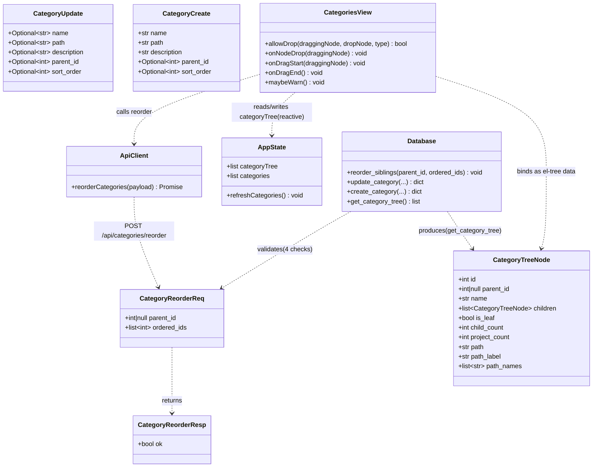
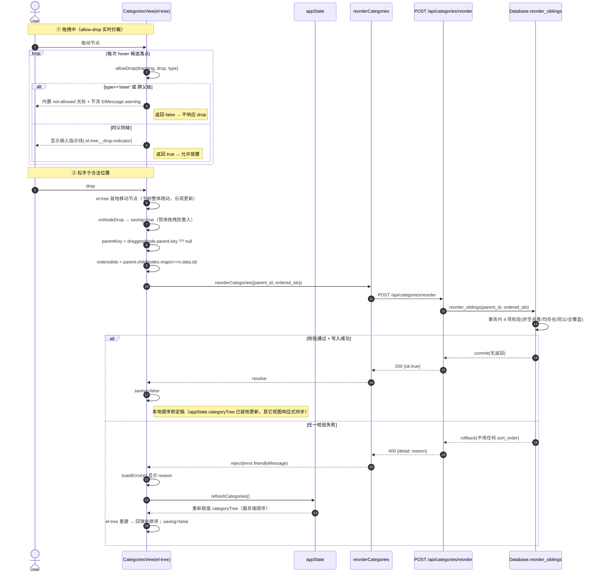
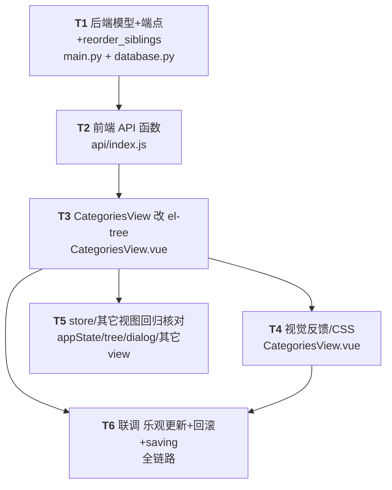

# 增量架构设计：分类管理页 — 分类顺序拖拽修改

> 面向对象：工程师（寇豆码）。本文档为可直接落地的增量设计，覆盖 `docs/prd_category_order_drag.md` 中 P0/P1 范围。
> 选型结论：**前端改用 `el-tree` 树形（放弃现有 `el-table` 扁平表格）+ 后端新增批量 `reorder` 端点**；沿用现有 Vue3 + Element Plus + FastAPI + 原生 sqlite3 技术栈，**不新增任何依赖**。
> 全部 P0 硬约束（同级重排 / 子树整体移动 / 视觉反馈 / 非法拦截+提示 / 后端原子持久化 `sort_order`）均在本文设计中落实。

---

## 0. 已核实代码事实（设计不臆测的根基）

| 事实 | 位置 | 对本次设计的影响 |
|------|------|------------------|
| `orderedCategories()` 仅被 `CategoriesView.vue` 引用；`flattenTree` 仅被 `appState.js` 引用 | grep 结果 | 把 `CategoriesView` 改成 `el-tree` 不会波及其它页面，**store 可保持不变** |
| `appState.categoryTree` / `appState.categories` 被 `AppLayout/ComposeView/ProjectsView/PeriodView/CategoryDialog` 直接消费 | grep 结果 | 只要 `refreshCategories()` 仍同时填 `categories` 与 `categoryTree`，其它视图零回归 |
| `db.update_category` / `db.create_category` 已接受 `sort_order` 入参 | `database.py:369/427/444/489` | 单点排序已具备；批量端点可复用或新增更原子的 `reorder_siblings` |
| `get_category_tree()` 已按 `sort_order` 排兄弟序；`list_categories_flat()` `ORDER BY COALESCE(parent_id,0), sort_order, name` | `database.py:303/312` | 写入 `sort_order` 即生效，前端树/扁平链路自动按新序 |
| `CategoryCreate` / `CategoryUpdate` 均无 `sort_order` 字段 | `main.py:203-214` | 需补 `sort_order` 字段（留口 + 路由透传） |
| `http` 拦截器返回 `res.data`；错误时挂 `error.friendlyMessage = res.data.detail` | `api/http.js:38-51` | 回滚提示直接用 `toastError(e)` 取 `detail` |
| Element Plus 内置拖拽态类 `.el-tree.is-dragging`、`.el-tree.is-dragging.is-drop-not-allow`（自动 `not-allowed` 光标）、`.el-tree__drop-indicator`（插入线） | `theme-chalk/el-tree.css` | 插入线/禁止光标**零 CSS 自管**；仅需为「源节点半透明」补自定义样式 |
| `node.parent.key` 根级为 `undefined`、子节点为其父 `id`；`node-drop` 在 el-tree 完成数据移动**之后**才触发 | Element Plus 源码 | 可在 `node-drop` 中直接从 `draggingNode.parent.childNodes` 读取新兄弟顺序 |

---

## 1. 实现方案 + 框架选型

### 1.1 选型：前端 `el-tree`

主理人已拍板采用 `el-tree`（PRD 倾向 A）。理由与代价已在 PRD 5.4 说明，本设计据此落地：

- **利用 `allow-drop(draggingNode, dropNode, type)`**：在一步内拦截——
  - `type === 'inner'`（拖成他人子节点 = 跨层级）→ 返回 `false`；
  - `draggingNode.parent.key !== dropNode.parent.key`（跨父级）→ 返回 `false`。
  - 返回 `false` 时 el-tree **不响应 drop**，松手自动回弹（天然满足「回弹」），并对「最近一次非法 hover」做**节流 `ElMessage.warning`**。
- **利用 `@node-drop="onNodeDrop"`**：el-tree 已就地把节点移动到新位置（子树整体随节点移动天然成立），事件回调里读取新兄弟顺序 → 乐观调用 `reorder`。
- **代价处理**：现有多列（目录/项目数/操作按钮）改写为树节点 `#default` 插槽内的 `flex` 行；`path`/`path_label` 等信息不再需要独立列（树形缩进本身表达层级）。

### 1.2 必须改动 / 新增的文件清单

| 文件 | 动作 | 说明 |
|------|------|------|
| `backend/database.py` | **修改** | 新增 `reorder_siblings(parent_id, ordered_ids)`（原子事务 + 4 项校验） |
| `backend/main.py` | **修改** | ① `CategoryCreate`/`CategoryUpdate` 增加 `sort_order`；② 新增 `CategoryReorder` 模型；③ 新增 `POST /api/categories/reorder`；④ `PUT /api/categories/{id}` 透传 `sort_order` |
| `web/src/api/index.js` | **修改** | 新增 `reorderCategories(payload)` |
| `web/src/views/CategoriesView.vue` | **重写** | `el-table` → `el-tree`；`allow-drop`/`node-drop`、节点插槽四按钮、视觉反馈、乐观更新+回滚 |
| `web/src/stores/appState.js` | **不改动** | `orderedCategories`/`refreshCategories` 保留（向后兼容）；T5 仅做回归核对 |
| `web/src/components/CategoryDialog.vue` | **不改动** | 新建 payload 本就不含 `sort_order`，默认追加末尾即可 |
| `web/src/utils/tree.js` | **不改动** | `flattenTree` 仍被 `orderedCategories` 引用（保留） |
| `web/src/layouts/AppLayout.vue`、`ComposeView.vue`、`ProjectsView.vue`、`PeriodView.vue` | **不改动** | 直接读 `appState.categoryTree`/`appState.categories`，刷新逻辑不变 → 零回归 |

> **重点**：本次增量**只碰 2 个后端文件 + 2 个前端文件**，store / utils / dialog / 其它视图全部原样保留，最大化降低回归风险。

---

## 2. 后端设计

### 2.1 端点

```
POST /api/categories/reorder
Content-Type: application/json
Body: { "parent_id": int | null, "ordered_ids": [int, ...] }
```

- 语义：把 `parent_id` 下的**全部兄弟**，按 `ordered_ids` 给出的顺序赋 `sort_order = 索引(0..n-1)`。根级用 `parent_id = null`。
- 成功：`200 { "ok": true }`（前端已乐观更新本地顺序，成功即定稿，无需回传整棵树）。
- 失败：任一校验不满足 → `400 { "detail": "<reason>" }`，且**事务回滚，不改任何 `sort_order`**。

### 2.2 Pydantic 模型（`backend/main.py`）

```python
from pydantic import BaseModel, Field

class CategoryReorder(BaseModel):
    parent_id: Optional[int] = None          # 根级传 null
    ordered_ids: list[int] = Field(..., min_length=1)

# —— 在既有模型上补 sort_order 留口 ——
class CategoryCreate(BaseModel):
    name: str = Field(..., min_length=1, max_length=100)
    path: str = ""
    description: str = ""
    parent_id: Optional[int] = None
    sort_order: Optional[int] = None          # 新增：新建时指定插队位置（可选）

class CategoryUpdate(BaseModel):
    name: Optional[str] = None
    path: Optional[str] = None
    description: Optional[str] = None
    parent_id: Optional[int] = None
    sort_order: Optional[int] = None          # 新增：单节点调序留口
```

### 2.3 路由（`backend/main.py`）

```python
@app.post("/api/categories/reorder")
def reorder_categories(body: CategoryReorder):
    try:
        db.reorder_siblings(body.parent_id, body.ordered_ids)
    except ValueError as e:
        raise HTTPException(status_code=400, detail=str(e))
    except Exception as e:
        raise HTTPException(status_code=400, detail=f"排序保存失败：{e}")
    return {"ok": True}
```

`PUT /api/categories/{id}` 路由透传 `sort_order`（保持既有 `parent_id` 哨兵逻辑不变）：

```python
@app.put("/api/categories/{category_id}")
def update_category(category_id: int, body: CategoryUpdate):
    current = db.get_category(category_id)
    if not current:
        raise HTTPException(404, "分类不存在")
    new_path = body.path
    if new_path is not None:
        new_path = new_path.strip()
        if new_path:
            abs_path = resolve_category_path(new_path)
            ensure_dir(abs_path)
            new_path = str(abs_path)
    try:
        parent_arg = ...
        data = body.model_dump(exclude_unset=True)
        if "parent_id" in data:
            parent_arg = data["parent_id"]
        item = db.update_category(
            category_id,
            name=body.name,
            path=new_path if new_path is not None else None,
            description=body.description,
            parent_id=parent_arg,
            sort_order=body.sort_order,   # None 时 db 保持原值
        )
        if not item:
            raise HTTPException(404, "分类不存在")
        return enrich_category(item)
    except ValueError as e:
        raise HTTPException(400, str(e))
    except HTTPException:
        raise
    except Exception as e:
        raise HTTPException(400, f"更新失败：{e}")
```

> `body.sort_order` 未传时为 `None` → `db.update_category` 内部 `new_sort = sort_order if sort_order is not None else current` → 保持原 `sort_order`，安全。

### 2.4 `database.py` 新增方法：选「新增 `reorder_siblings`」而非「路由层循环 `update_category`」

**选择：新增 `reorder_siblings(parent_id, ordered_ids)`。** 理由：

1. **原子性**：所有校验与全部 `UPDATE sort_order` 在 `self.connect()` 的**同一个事务**内完成；任一校验失败抛 `ValueError` → 上下文管理器 `rollback()` → 不改任何 `sort_order`（满足 P0「原子写入」与 DoD-7）。
2. **避免半成功**：若路由层循环调用 `update_category`，每次调用各自 `connect()` 开独立事务，且 `update_category` 内含「同级重名/防环」校验与 `updated_at` 写，可能中途失败留下部分写入、且产生 N 次事务。
3. **校验集中**：4 项校验（非空去重 / 均存在 / 同父 / 全覆盖兄弟）放在一个方法里一次判完，错误信息明确。

```python
def reorder_siblings(self, parent_id: Optional[int], ordered_ids: list[int]) -> None:
    """原子重排某父级下的全部兄弟分类（sort_order = 索引）。

    parent_id=None 表示根级。ordered_ids 必须覆盖该父级下全部兄弟。
    任一校验失败抛 ValueError，调用方转 HTTP 400，事务回滚（不改任何 sort_order）。
    """
    if not ordered_ids:
        raise ValueError("ordered_ids 不能为空")
    if len(set(ordered_ids)) != len(ordered_ids):
        raise ValueError("ordered_ids 存在重复，请提交完整的兄弟顺序")

    with self.connect() as conn:  # 单事务：成功 commit，异常 rollback
        placeholders = ",".join("?" * len(ordered_ids))
        rows = conn.execute(
            f"SELECT id, parent_id FROM categories WHERE id IN ({placeholders})",
            tuple(ordered_ids),
        ).fetchall()
        found = {
            int(r["id"]): (r["parent_id"] if r["parent_id"] is not None else None)
            for r in rows
        }

        # 1) 全部存在
        missing = [cid for cid in ordered_ids if cid not in found]
        if missing:
            raise ValueError(f"存在不存在的分类：{missing[0]} 等")

        # 2) 同父（None 与 None 视为相等；非 None 严格相等）
        for cid in ordered_ids:
            cur = found[cid]
            same = (cur is None) == (parent_id is None) and (
                cur is None or int(cur) == int(parent_id)
            )
            if not same:
                raise ValueError("ordered_ids 包含不同父级的分类，仅允许同级重排")

        # 3) 全覆盖兄弟
        if parent_id is None:
            sibs = conn.execute(
                "SELECT id FROM categories WHERE parent_id IS NULL"
            ).fetchall()
        else:
            sibs = conn.execute(
                "SELECT id FROM categories WHERE parent_id = ?", (parent_id,)
            ).fetchall()
        sibling_ids = {int(r["id"]) for r in sibs}
        given = set(ordered_ids)
        if sibling_ids != given:
            miss = sorted(sibling_ids - given)
            extra = sorted(given - sibling_ids)
            if miss:
                raise ValueError(f"ordered_ids 未覆盖该父级下全部兄弟，缺少：{miss}")
            raise ValueError(f"ordered_ids 包含非该父级兄弟的 id：{extra}")

        # 原子写入
        now = self._now()
        for k, cid in enumerate(ordered_ids):
            conn.execute(
                "UPDATE categories SET sort_order = ?, updated_at = ? WHERE id = ?",
                (k, now, cid),
            )
```

### 2.5 接口契约（JSON 示例）

**请求（根级重排）**
```json
POST /api/categories/reorder
{ "parent_id": null, "ordered_ids": [3, 1, 2] }
```

**请求（某父级 id=5 下的子分类重排）**
```json
{ "parent_id": 5, "ordered_ids": [8, 9, 7, 10] }
```

**成功响应** `200`
```json
{ "ok": true }
```

**失败响应** `400`（覆盖不全 → 不改任何 sort_order）
```json
{ "detail": "ordered_ids 未覆盖该父级下全部兄弟，缺少：[7]" }
```

**失败响应** `400`（跨父级）
```json
{ "detail": "ordered_ids 包含不同父级的分类，仅允许同级重排" }
```

---

## 3. 前端设计

### 3.1 `web/src/api/index.js` 新增

```js
// 批量同级重排：body = { parent_id: int|null, ordered_ids: number[] }
export const reorderCategories = (data) => http.post('/api/categories/reorder', data)
```

复用既有 `http` 实例与拦截器（`res.data` 直返；错误挂 `friendlyMessage`）。

### 3.2 `CategoriesView.vue` 改造为 `el-tree`

**数据绑定**：直接 `:data="appState.categoryTree"`，`node-key="id"`，`:props="{ label: 'name', children: 'children' }"`。
> 关键决策：el-tree 会**就地**移动该响应式数组中的节点（子树整体随节点移动天然成立），因此拖拽成功后 `appState.categoryTree` 已是新顺序；其它读 `appState.categoryTree` 的视图（左侧导航 `AppLayout` 等）经 Vue 响应式自动同步，无需额外广播。失败时 `refreshCategories()` 重新赋值 `appState.categoryTree`（新数组引用）→ el-tree 重建 → 回弹到服务端顺序。

**`allow-drop`（拦截 + 节流提示）**
```js
let lastWarnAt = 0
function maybeWarn() {
  const now = Date.now()
  if (now - lastWarnAt > 1000) {        // 节流，避免 dragover 刷屏
    lastWarnAt = now
    ElMessage.warning('只能在同一父分类下、同级之间调整顺序')
  }
}
function allowDrop(draggingNode, dropNode, type) {
  if (type === 'inner') { maybeWarn(); return false }      // 禁止跨层级
  const dp = draggingNode.parent?.key ?? null
  const tp = dropNode.parent?.key ?? null
  if (dp !== tp) { maybeWarn(); return false }             // 禁止跨父级
  return true                                               // 仅同父同级兄弟之间
}
```

**`@node-drop`（乐观更新 → 调接口 → 成功定稿 / 失败回滚）**
```js
async function onNodeDrop(draggingNode) {
  if (saving.value) return
  const parentNode = draggingNode.parent
  if (!parentNode) return
  const parentKey = parentNode.key ?? null                 // 根级 → null
  const orderedIds = (parentNode.childNodes || []).map((n) => n.data.id)
  saving.value = true                                       // 禁用拖拽，防重入
  try {
    await reorderCategories({ parent_id: parentKey, ordered_ids: orderedIds })
    // 成功：el-tree 已就地更新 appState.categoryTree，本地顺序即定稿（不刷新）
  } catch (e) {
    toastError(e)                                           // 显示后端 detail
    await refreshCategories()                               // 回滚到服务端顺序
  } finally {
    saving.value = false
    draggingId.value = null
  }
}
```

**节点插槽（保留四枚按钮 + 名称/层级/计数）**
```vue
<el-tree
  ref="treeRef"
  class="cat-tree"
  :data="appState.categoryTree"
  node-key="id"
  :props="{ label: 'name', children: 'children' }"
  :draggable="!saving"
  :allow-drop="allowDrop"
  :expand-on-click-node="false"
  default-expand-all
  v-loading="appState.loadingCategories"
  @node-drag-start="onDragStart"
  @node-drag-end="onDragEnd"
  @node-drop="onNodeDrop"
>
  <template #default="{ node, data }">
    <div class="cat-node" :class="{ 'is-source': draggingId && data.id === draggingId }">
      <el-icon class="type-icon" :class="{ leaf: data.is_leaf }">
        <Document v-if="data.is_leaf" /><Folder v-else />
      </el-icon>
      <span class="name-text" :title="data.name">{{ data.name }}</span>
      <el-tag size="small" effect="plain" round class="level-tag">{{ levelLabel(node.level) }}</el-tag>
      <span class="cat-meta">子类 {{ data.child_count || 0 }} · 项目 {{ data.project_count || 0 }}</span>
      <div class="ops">
        <el-tooltip content="添加子分类" :show-after="300">
          <el-button circle :icon="Plus" @click.stop="openAddChild(data)" />
        </el-tooltip>
        <el-tooltip v-if="data.path" content="打开本地目录" :show-after="300">
          <el-button circle :icon="FolderOpened" @click.stop="onOpenFolder(data)" />
        </el-tooltip>
        <el-tooltip content="编辑" :show-after="300">
          <el-button circle type="primary" plain :icon="EditPen" @click.stop="openEdit(data)" />
        </el-tooltip>
        <el-tooltip content="删除" :show-after="300">
          <el-button circle type="danger" plain :icon="Delete" @click.stop="onDelete(data)" />
        </el-tooltip>
      </div>
    </div>
  </template>
</el-tree>
```
- `openCreate/openEdit/openAddChild/onOpenFolder/onDelete` 复用现有实现，参数由 `row` 改为 `data`（字段名一致：`id/path_label/name/child_count` 等）。
- `levelLabel(node.level)` 用 `node.level`（1=一级）替代旧的 `path_names` 计算，层级标签更稳。
- 按钮加 `@click.stop` 防止触发树节点展开/选择。
- 头部计数改为 `appState.categories.length`（全量分类数）。

> **展开稳定性备注**：`default-expand-all` 在 `:data` 重新赋值（回滚刷新）时会重新全部展开。若工程师实测发现回滚后未保持展开，可改用 `:default-expanded-keys="allIds"`（`allIds = computed(() => appState.categories.map(c => c.id))`）作为更稳的等价方案。

### 3.3 视觉反馈 / CSS（仅补「源节点半透明」，其余用 Element Plus 内置）

```css
/* 拖拽中源节点半透明（el-tree.is-dragging 由组件在拖拽期自动加在根） */
.cat-tree.is-dragging .cat-node.is-source { opacity: 0.45; }
/* 插入指示线加粗主色（Element Plus 内置 .el-tree__drop-indicator） */
.cat-tree :deep(.el-tree__drop-indicator) { background-color: var(--el-color-primary); height: 2px; }
```
- **插入指示线**：Element Plus 内置 `.el-tree__drop-indicator`（仅合法 `prev`/`next` 位置出现）→ 满足「合法位置插入指示线」。
- **非法禁止态**：内置 `.el-tree.is-dragging.is-drop-not-allow` 自动加 `cursor: not-allowed` → 满足「非法位置禁止态」。
- **回弹**：`allow-drop` 返回 `false` 时 el-tree 不执行 drop，松手自动回弹 → 满足「松手自动回弹」。
- 拖拽源高亮由 `draggingId`（`@node-drag-start` 记录 `draggingNode.key`，`@node-drag-end` 清空）+ `.is-source` 半透明实现。

### 3.4 乐观更新 + 回滚（P2 提升为本期采用，已拍板）

1. 松手 → el-tree 就地重排 `appState.categoryTree`（乐观更新立即可见）。
2. 立即调用 `reorderCategories(payload)`（同时 `saving=true` 禁用拖拽防重入）。
3. 后端成功 → 前端不做任何额外操作，本地顺序即定稿；其它视图经响应式同步。
4. 后端拒绝/报错 → `toastError(e)` 显示 `detail` 原因，并 `refreshCategories()` 回滚到服务端顺序。

### 3.5 store 兼容性核对（无回归）

- `orderedCategories()` 仅 `CategoriesView` 使用；改 el-tree 后不再调用它，但**函数本身保留**（无调用方依赖它存在与否，保留最安全）。
- `flattenTree` 仅 `orderedCategories` 引用，随函数保留。
- `refreshCategories()` **完全不变**：仍并行拉 `listCategories()` 与 `listCategories({tree:true})` 填 `categories` 与 `categoryTree`，并补 `leafCategories`。所有其它视图依赖不变。
- 结论：`appState.js` / `tree.js` / `CategoryDialog.vue` / `AppLayout.vue` / `ComposeView.vue` / `ProjectsView.vue` / `PeriodView.vue` 均**不需改动**（详见任务 T5 回归核对）。

---

## 4. 数据结构 / 接口（类图）

> 完整 Mermaid 见 `docs/category-reorder-class-diagram.mermaid`，此处内嵌同款。



**el-tree 节点字段来源**（`appState.categoryTree` 中每个节点的字段，由 `get_category_tree()` + `enrich_category()` 产出）：
- `id` ← `categories.id`（同时作 `node-key`）
- `parent_id` ← `categories.parent_id`
- `name` ← `categories.name`（作 `label`）
- `children` ← `get_category_tree()` 嵌套
- `is_leaf` ← `child_count == 0`
- `child_count` / `project_count` ← 子查询计数（节点插槽「子类/项目」计数）
- `path` / `path_label` / `path_names` ← `enrich_category()`（弹窗与 tooltip 用，本期插槽可只展示计数，必要时用 `path_label`）

---

## 5. 程序调用流程（时序图）

> 完整 Mermaid 见 `docs/category-reorder-sequence-diagram.mermaid`，此处内嵌同款。



---

## 6. 任务列表（有序、含依赖、按实现顺序）

> 负责方统一标为**工程师（寇豆码）**；T5/T6 验收点需 QA 介入走查。优先级 P0=必做。

| 任务 | 名称 | 源文件 | 依赖 | 优先级 | 对应需求 |
|------|------|--------|------|--------|----------|
| **T1** | 后端模型 + reorder 端点 + `reorder_siblings` | `backend/main.py`、`backend/database.py` | — | P0 | P0 持久化 / P1 原子批量 / DoD-1,2,7 |
| **T2** | 前端 API 函数 | `web/src/api/index.js` | T1 | P0 | 契约对接 |
| **T3** | `CategoriesView` 改造为 `el-tree` | `web/src/views/CategoriesView.vue` | T1, T2 | P0 | P0 同级重排/子树整体/保留操作 / US-1,2,5 |
| **T4** | 视觉反馈 / CSS（源节点半透明 + 节流提示） | `web/src/views/CategoriesView.vue` | T3 | P0 | P0 视觉反馈 / US-3,4 / DoD-4 |
| **T5** | store / 其它视图兼容性回归核对 | `appState.js` / `tree.js` / `CategoryDialog.vue` / `AppLayout/Compose/Projects/Period` | T3 | P0 | US-5 / DoD-6（零回归） |
| **T6** | 联调：乐观更新 + 失败回滚 + `saving` 禁用 | `CategoriesView.vue` + `api` + 后端 | T3, T4 | P0 | P1 失败回滚/加载禁用态 / DoD-3,5,7 |

**实现说明**
- T1 → T2 → T3 为「后端契约 → 前端函数 → 视图改造」串行链。
- T4 与 T3 同文件，可在 T3 完成后紧接着做（或合并提交）。
- T5 是**核对而非改动**：确认 `orderedCategories`/`flattenTree`/`refreshCategories` 不动、其它视图无回归；如发现问题再决定最小补丁。
- T6 联调覆盖：成功定稿、失败 `refreshCategories` 回滚、`saving` 期间 `:draggable=false` 防重入、节流 warning 不刷屏。

### 6.1 任务依赖图（Mermaid）



---

## 7. 依赖包列表

> **本次不新增任何前端/后端依赖。** `el-tree` 是 Element Plus 内置组件。

| 包 | 现有版本 | 用途 | 是否新增 |
|----|----------|------|----------|
| vue | ^3.5（现有） | 前端框架（沿用） | 否 |
| element-plus | 现有 | UI，含 `el-tree` 拖拽能力（沿用） | 否 |
| @element-plus/icons-vue | 现有 | 图标 `Plus`/`Folder`/`Document`/`EditPen`/`FolderOpened`/`Delete`（沿用） | 否 |
| axios | 现有 | HTTP，复用 `web/src/api/http.js`（沿用） | 否 |
| fastapi / pydantic | 现有 | 端点 + 响应模型（沿用） | 否 |
| sqlite3 / 标准库 | 标准库 | `reorder_siblings` 事务（沿用） | 否 |

---

## 8. 共享知识（跨文件约定）

- **`reorder` 端点 `parent_id` 根级用 `null`**：前端 `draggingNode.parent.key ?? null` 得到根级 `null`、子节点得到父 `id`，与后端 `parent_id IS NULL` 校验口径一致。
- **`ordered_ids` 必须全覆盖兄弟**：传该父级下**全部**兄弟 id（含被拖动节点），后端用集合相等校验；少传/多传/跨父均返回 400。
- **`sort_order` 从 0 递增**：后端按 `ordered_ids` 索引 `0..n-1` 写入，无需前端计算。
- **`path` / `path_label` 不受排序影响**：同级重排不改写任何 `path`/层级，前端无需重算 `path_names`。
- **备份**：排序后**不主动触发** DB 备份，依赖既有定时/手动备份（与拍板一致）。
- **并发/防重入**：仅靠 `saving` 禁用 `:draggable` 避免重入；**不加乐观锁**（与拍板一致）。
- **错误文案来源**：后端 `HTTPException(400, detail=...)` → `http.js` 挂 `error.friendlyMessage` → 前端 `toastError(e)` 展示；前端非法拖拽提示用 `ElMessage.warning('只能在同一父分类下、同级之间调整顺序')` 并节流 1s。
- **`CategoryUpdate.sort_order` 留口语义**：未传（`None`）时 `db.update_category` 保持原值，不影响既有编辑逻辑。
- **响应式同步**：`CategoriesView` 直接绑定 `appState.categoryTree`，el-tree 就地移动即更新 store，左侧导航等其它消费者自动同步；回滚经 `refreshCategories()` 重赋值。
- **键盘可达性**：本期不做（P2）。

---

## 9. 待明确事项（仅列无法在不写码情况下确定的技术细节）

1. **`default-expand-all` 在回滚刷新后的展开表现**：理论上 `:data` 重赋值会重跑全展开；若工程师实测回滚后未保持展开，按 3.2 备注改用 `:default-expanded-keys="allIds"`。
2. **新建分类的默认 `sort_order`**：本期 `CategoryCreate` 仅补字段、未强制「追加到末尾」。`create_category(parent_id, sort_order=0)` 默认 `0`，新建项会与其它 `sort_order=0` 兄弟按 `name` 排（可能置顶）。如需「新建即末尾」，可在 `database.py`/`main.py` 计算 `max(sort_order)+1` 作为默认值——建议作为**可选小优化**，是否做请工程师/主理人确认（不影响 reorder 主路径）。
3. **`onNodeDrop` 读取 `parentNode.childNodes` 的时序**：依赖 Element Plus 在 `node-drop` 触发前已完成数据移动（源码确为此顺序）。若极端情况下顺序读取异常，兜底方案为 `JSON` 深拷贝 `appState.categoryTree` 后按 `parentKey` 递归查找父节点 children 取 id——仅作保险，正常路径用 `childNodes` 即可。
4. **`v-loading` 作用于 `el-tree`**：Element Plus `Loading` 指令作用于组件根元素，应可正常显示；若样式异常可改包一层 `<div v-loading>`。
