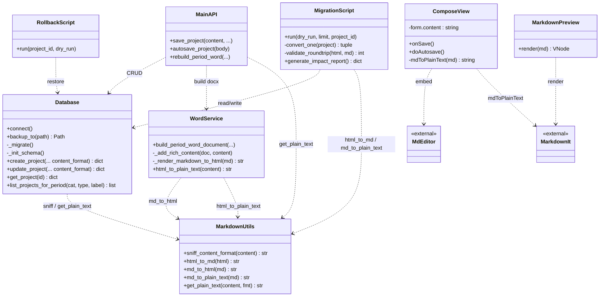
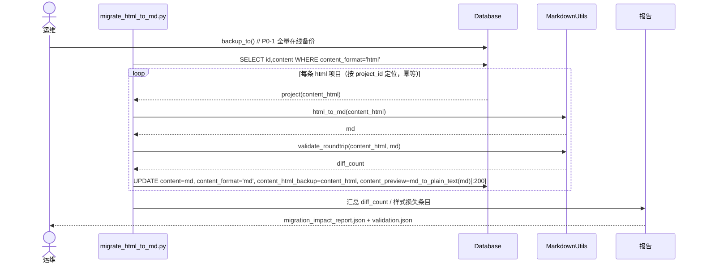
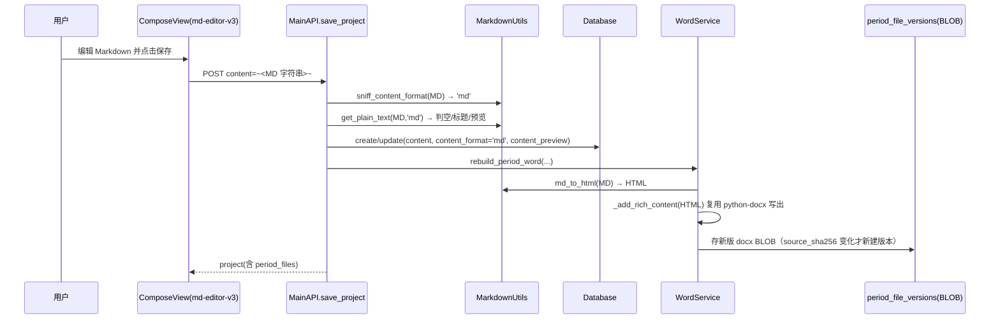
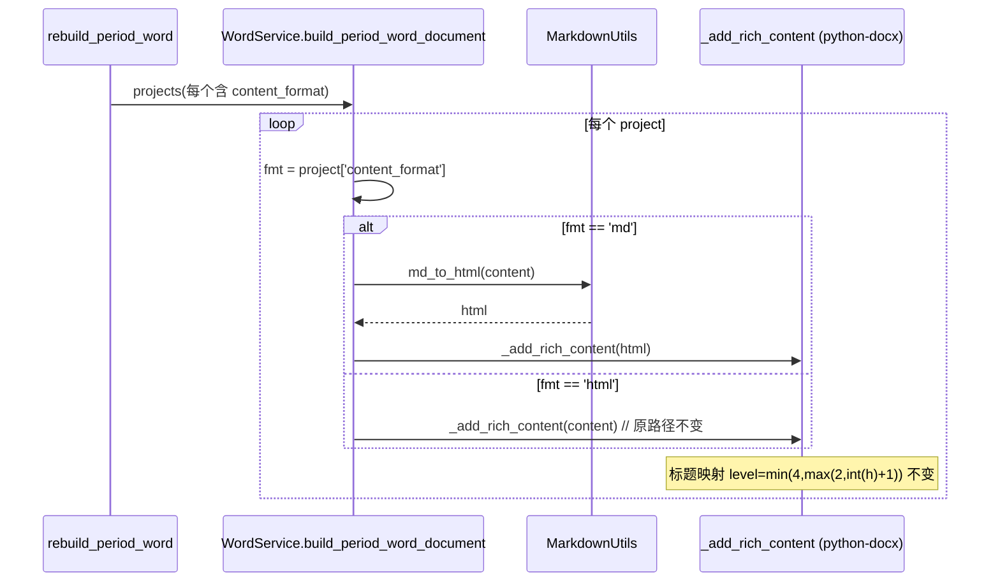
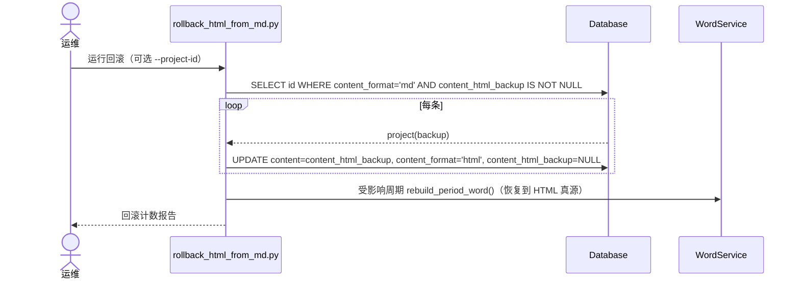

# 系统设计 + 任务分解：内容存储 HTML → Markdown 迁移

> 文档角色：架构设计文档（Architect Deliverable）
> 配套依据：`docs/prd_markdown_migration.md`（产品需求）、`docs/eval_markdown_migration.md`（源码实证与可行性）
> 文档负责人：架构师 高见远（Gao）
> 适用版本：本地文档管理系统 v2（FastAPI + Vue3/ElementPlus + python-docx）
> 状态：设计稿（待团队评审后进入研发）

> **增量设计指针**：用户已拍板「彻底移除 Word、period 文档 Markdown 化、历史 period_file_versions 的 docx BLOB 一并迁 MD」。相关变更（表结构改造、周期 MD 组装、下载/恢复端点改 `.md`、历史 docx→md 选型、任务 T06~T09、基础 T03 作废）详见 **`docs/design_markdown_migration_inc.md`**。本基础文档中 T03（Word 重生成改造）已被增量 T06 取代。

---

## Part A：系统设计

### 1. 实现方案（Implementation Approach）

#### 1.1 核心技术难点

| 难点 | 说明 | 应对 |
|---|---|---|
| 真源语义切换（HTML→MD）且零停机、可回滚 | `projects.content` 由"wangEditor HTML"改为"Markdown 纯文本"，旧数据必须无缝、不丢、可回。 | 引入 `content_format` 分发键 + `content_html_backup` 备份列，双写过渡。 |
| 结构无损转换 | 标题/粗体/斜体/删除线/列表/引用/链接 必须 100% 承载；字体/字号/颜色/对齐 属纯展示样式，按已决议事项**默认丢弃**。 | 迁移用 `markdownify`；导出（Word）用 `mistune` 渲染 MD→HTML 后复用既有 `_RichTextParser`。 |
| Word 重生成必须复用既有 python-docx 写出层 | 现有 `_add_rich_content` 是经实战验证的写出逻辑，重写风险高。 | **改入口、不动写出层**：MD→HTML（mistune）→ `_add_rich_content`，标题映射天然一致。 |
| "不丢内容"的可证明性 | 仅靠肉眼不可信。 | 往返校验：`md→纯文本` == `原 html→纯文本`（集合+顺序一致，diff=0）。 |
| 纯展示样式丢弃但不视为内容丢失 | 需向业务证明损失仅限样式。 | 《迁移影响报告》统计"仅样式损失"条目数供签字。 |

#### 1.2 框架 / 库选型（含理由）

| 用途 | 选型 | 理由 | 备选（不采纳理由） |
|---|---|---|---|
| 迁移 HTML→MD | **`markdownify`** | 轻量、可控、对 wangEditor 输出友好；`<h1>`→`#` 默认保留层级。 | 自研反向输出（成本高、易错，不选）。 |
| 导出 MD→HTML（Word 重生成） | **`mistune`** | 纯 Python、快、渲染标准 MD/GFM 为 HTML，供既有 `_RichTextParser` 复用。 | `markdown`（够用但 mistune 更直接、无副作用）。 |
| 前端编辑器 | **`md-editor-v3`** | Vue3 原生、MIT、分栏实时预览、可定制工具栏、暗黑模式、体积小。 | Cherry Markdown（仅当终用户要求 WYSIWYG 时启用，本次不实施）。 |
| 前端渲染/纯文本提取 | **`markdown-it`** | 项目详情预览 + 前端 `md→纯文本`（字数统计/判空）轻量可靠。 | `marked`（等价，任选；本设计采用 markdown-it）。 |
| 数据库 | 沿用 **SQLite** | 仅加列，零结构变动；`Database.backup_to()` 已支持在线备份。 | — |

> 版本全部锁入 `requirements.txt`（后端）与 `package.json`（前端）。

#### 1.3 架构模式

- **内容真源 + 双写分发**：`content_format` 作为分发键（`'html'`/`'md'`）。读取/导出/Word 重建均按 format 选择解析器；过渡期新旧内容共存、系统可读写。
- **转换层 + 既有写出层组合**：新增 `MarkdownUtils`（sniff / html_to_md / md_to_html / md_to_plain_text），`WordService` 仅改入口（dispatch），不动 python-docx 写出层 —— 符合"改入口不动写出层"原则，降低偏差风险。
- **前端 MVVM（Vue3）**：编辑器组件替换（`ComposeView` 内 wangEditor → md-editor-v3），业务逻辑（autosave / 字数 / 判空 / 预览）逻辑不变，仅输入源由 HTML 改为 MD 字符串。
- **格式嗅探（零 API 契约变更）**：后端 `sniff_content_format(content)` 复用现有判定 `re.search(r"<\s*[a-zA-Z][^>]*>", content)` —— 含块级 HTML 标签→`'html'`，否则→`'md'`。前端无需改 `save_project`/`autosave` 契约。

#### 1.4 关键设计决策（贯穿全篇）

1. **MD→HTML 导出复用现有 `_RichTextParser`**：mistune 把 MD 渲染成标准 HTML → `_add_rich_content` 解析 → python-docx 写出。
2. **标题层级映射天然一致**：wangEditor `<h1>` → markdownify `#` → mistune `<h1>` → `_add_rich_content` 中 `level = min(4, max(2, int(h)+1))` ⇒ h1→H2、h2→H3、h3+→H4，与现状完全闭环一致（满足 P0-7）。
3. **备份列选 `content_html_backup`（同表 TEXT 列，可空）**：较独立表更简单、回滚只需同表 UPDATE；MD-only 新内容该列为 NULL。
4. **历史 Word 版本 BLOB 永不改写**：`period_file_versions` 参与"新建版本"判定（source_sha256 变化才新建），历史快照原样保留（满足 P0-6）。

---

### 2. 文件清单（File List）

| 相对路径 | 类型 | 职责 |
|---|---|---|
| `backend/markdown_utils.py` | **新增** | 格式嗅探、HTML→MD、MD→HTML、MD→纯文本、按 format 取纯文本。 |
| `backend/database.py` | 修改 | `_migrate()` 加 `content_format`(默认'html') 与 `content_html_backup` 列；`create_project`/`update_project` 接收并持久化 `content_format`（及备份写入）。 |
| `backend/word_service.py` | 修改 | `build_period_word_document` 按 `content_format` 分发；新增 `_render_markdown_to_html(md)`；保留 `html_to_plain_text`。 |
| `backend/main.py` | 修改 | `save_project`/`autosave_project` 嗅探并持久化 `content_format`、用 `get_plain_text` 判空/标题/预览；`rebuild_period_word` 透传项目（含 format）。 |
| `scripts/migrate_html_to_md.py` | **新增** | 幂等迁移脚本 + 往返校验 + 报告收尾。 |
| `scripts/rollback_html_from_md.py` | **新增** | 一键回滚脚本（读 backup 写回 HTML 真源）。 |
| `scripts/migration_impact_report.py` | **新增** | 生成《迁移影响报告》（样式损失统计等）。 |
| `web/src/views/ComposeView.vue` | 修改 | wangEditor → md-editor-v3；`form.content` 存 MD；保留 30s 自动保存/字数统计/判空。 |
| `web/src/utils/markdown.ts` | **新增** | 前端 `mdToPlainText`、`renderMarkdown`（字数/判空/预览用）。 |
| `web/src/components/MarkdownPreview.vue` | **新增** | 项目详情/预览页 Markdown 渲染组件（复用 md-editor-v3 预览能力或 markdown-it）。 |
| `requirements.txt` | 修改 | 锁定 `markdownify`、`mistune`。 |
| `web/package.json` | 修改 | 加 `md-editor-v3`、`markdown-it`；移除 `@wangeditor/editor`、`@wangeditor/editor-for-vue`。 |
| `tests/test_markdown_migration.py` | **新增**（T05） | 往返校验、样式损失统计、回滚幂等单测。 |
| `tests/test_word_regen.py` | **新增**（T05） | 新旧 docx 纯文本一致性对比测试。 |
| `docs/qa_checklist.md` | **新增**（T05） | P0 验收核对清单与回滚演练步骤。 |

---

### 3. 数据结构与接口（classDiagram）



**`projects` 表关键列（迁移后）**

| 列 | 类型 | 说明 |
|---|---|---|
| `content` | TEXT NOT NULL | **真源**；HTML 或 Markdown 字符串（语义由 `content_format` 决定）。 |
| `content_format` | TEXT NOT NULL DEFAULT 'html' | 分发键：`'html'` / `'md'`。 |
| `content_html_backup` | TEXT NULL | 迁移前原始 HTML；回滚依据；MD-only 新内容为 NULL。 |
| `content_preview` | TEXT | 纯文本预览（MD 内容由 `md_to_plain_text` 重算）。 |

---

### 4. 程序调用流程（sequenceDiagram）

#### 4.1 迁移 + 校验流程（T02）



#### 4.2 新内容保存（MD 路径，T01 + T04）



#### 4.3 Word 重生成分发（md vs html，T03）



#### 4.4 回滚流程（T02 产出 + T05 演练）



---

### 5. 待明确事项（Anything UNCLEAR）

1. **markdownify 标题层级配置**：需确认 markdownEditor 默认 `<h1>`→`#`（即保留原层级）。如与期望不符，需在 `MarkdownUtils.html_to_md` 中传入自定义 `heading_style="ATX"` 并验证映射闭环。
2. **`content_html_backup` 形态**：本设计采用**同表 TEXT 列（可空）**；备选是独立 `projects_html_backup` 表。若 DB 体积敏感或合规要求隔离，可改表方案（回滚脚本相应调整 JOIN）。
3. **前端预览页归属组件**：PRD 要求"项目详情/预览页引入 Markdown 渲染"，但当前源码未提供详情组件路径。假设为 `web/src/views/ProjectDetail.vue`（或等价），由工程师在 T04 定位并嵌入 `MarkdownPreview.vue`；如不存在则新建。
4. **md-editor-v3 禁用富样式粘贴机制**：需通过编辑器 `editorConfig`（如 `pasteConfig` / 自定义 paste 拦截）在粘贴时归一化（剥离 inline style、font/color/align），转化为纯 Markdown。具体 API 以库版本为准，T04 实现时验证。
5. **`content_format` 是否由前端显式上报**：本设计默认**后端嗅探**（零契约变更）。如后续需要更精确控制（例如粘贴含内联 HTML 的 MD），可扩展 `save_project` 增加可选 `content_format` 表单字段覆盖嗅探结果——非本次必须。
6. **迁移是否触发受影响周期 Word 重建（P1-2）**：本设计将"重生成 docx"列为 P1（迁移后择期），T02 仅改真源与备份；T03 让后续 `rebuild_period_word` 自然产出与 MD 一致的 docx。是否迁移后立即批量重建，待业务确认（影响迁移窗口时长）。

---

## Part B：任务分解

### 6. 依赖包（Required Packages）

**后端（`requirements.txt`，版本锁定）**

```
markdownify==0.13.0     # HTML → Markdown（迁移脚本）
mistune==3.0.2          # Markdown → HTML（Word 重生成复用 _RichTextParser）
```

> 既有 `fastapi / uvicorn / python-docx / python-multipart / aiofiles / pydantic` 保持不变。

**前端（`web/package.json`）**

```
md-editor-v3@^4.0.0     # Vue3 Markdown 编辑器（替换 wangEditor）
markdown-it@^14.1.0    # 预览渲染 + 前端 md→纯文本提取
```

> 移除：`@wangeditor/editor`、`@wangeditor/editor-for-vue`。

---

### 7. 任务列表（有序 + 依赖）

> 五大阶段：**T01 后端迁移安全底座 →（并行）T02 迁移脚本+校验 / T03 Word 重生成改造 / T04 前端编辑器替换 → T05 QA 验证**。
> 并行说明：T02/T03/T04 均只依赖 T01，可并排推进；T05 须等 T02、T03、T04 全部完成（校验先于回滚演练）。

#### T01 — 后端迁移安全底座（双写列 + 备份列 + 格式分发）

- **目标**：建立零停机迁移的"安全底座"——加 `content_format` 双写分发列与 `content_html_backup` 备份列；实现格式嗅探与按 format 的纯文本提取/保存分发。迁移期间系统可读写，新旧内容按 format 正确渲染。
- **涉及文件**：
  - `backend/database.py`（改）
  - `backend/markdown_utils.py`（新）
  - `backend/main.py`（改）
  - `requirements.txt`（改）
- **依赖**：无（根任务，最先做）。
- **优先级**：P0。
- **可并行/串行**：串行根；T02/T03/T04 均依赖它。
- **产出**：
  - schema 迁移：`projects` 新增 `content_format`(默认 'html')、`content_html_backup`(可空)。
  - `MarkdownUtils`：`sniff_content_format` / `html_to_md` / `md_to_html` / `md_to_plain_text` / `get_plain_text`。
  - `save_project`/`autosave_project`：嗅探 format 并持久化、用 `get_plain_text` 判空/标题/预览。
- **验收点**：
  - 启动后 `projects` 含两新列；现有数据 `content_format='html'`。
  - 新内容（无 HTML 标签）保存后 `content_format='md'`，旧 HTML 内容仍为 `'html'`，二者均可正常读取与渲染。
  - `Database.backup_to()` 仍可用（迁移脚本将调用）。

#### T02 — 迁移脚本 + 往返校验 + 回滚脚本 + 影响报告

- **目标**：提供**幂等**迁移脚本（HTML→MD，结构 100% 保留，原 HTML 入备份列）、**往返校验**（md 纯文本 == 原 html 纯文本，diff=0）、**一键回滚脚本**、**《迁移影响报告》**生成逻辑。
- **涉及文件**：
  - `scripts/migrate_html_to_md.py`（新）
  - `scripts/rollback_html_from_md.py`（新）
  - `scripts/migration_impact_report.py`（新）
  - `backend/markdown_utils.py`（依赖 T01 产出，复用）
- **依赖**：T01（需 `content_format` / `content_html_backup` 列与 `MarkdownUtils`）。
- **优先级**：P0（迁移、校验、回滚）/ P1（影响报告）。
- **可并行/串行**：与 T03、T04 **并行**；其"校验"必须先于 T05 的"回滚演练"。
- **产出**：
  - `migrate_html_to_md.py`：遍历 `content_format='html'`，`html_to_md` 转换，写 `content` / `content_format='md'` / `content_html_backup` / 重算 `content_preview`；输出 `validation.json`。
  - `rollback_html_from_md.py`：读 `content_html_backup` 写回 `content` + `content_format='html'`。
  - `migration_impact_report.py`：输出 `docs/migration_impact_report.json`。
- **验收点**：
  - **幂等**：重跑安全（format='md' 行被跳过）；支持 `--dry-run`/`--limit`/`--project-id`；开头调用 `backup_to()`。
  - **往返校验通过率 100%**：全量 diff_count=0。
  - **回滚脚本**：任意 project 可还原至 HTML 真源（且 MD-only 新内容不受影响）。
  - **影响报告**：含 `style_only_loss_count` 供业务签字。

#### T03 — Word 重生成改造（读 Markdown 真源）

- **目标**：`rebuild_period_word` 改为读取 Markdown 真源重新生成 docx，复用既有 `_add_rich_content` 写出层；标题层级映射保持一致；历史 Word 版本 BLOB 永不改写。
- **涉及文件**：
  - `backend/word_service.py`（改）
  - `backend/markdown_utils.py`（依赖 T01，复用 `md_to_html`）
  - `backend/main.py`（改：透传项目含 format 给 `build_period_word_document`）
- **依赖**：T01（需 `md_to_html` 与 format 分发 seam）。
- **优先级**：P0。
- **可并行/串行**：与 T02、T04 **并行**。
- **产出**：`build_period_word_document` 按 `project['content_format']` 分发——md 走 `md_to_html`→`_add_rich_content`；html 走原路径。
- **验收点**：
  - 基于 MD 重新生成的 docx 与迁移前 docx **纯文本内容一致**（样式差异除外）。
  - 标题映射 h1→H2、h2→H3、h3+→H4 与现状一致。
  - `period_file_versions` BLOB 条数迁移前后一致，旧 docx 仍可下载/恢复。

#### T04 — 前端编辑器替换（md-editor-v3）

- **目标**：`ComposeView.vue` 用 md-editor-v3 替换 wangEditor，`form.content` 直接存 Markdown；保留 30s 自动保存、字数统计、判空（改走 md→纯文本提取）；引入 Markdown 预览；禁用富样式粘贴。
- **涉及文件**：
  - `web/src/views/ComposeView.vue`（改）
  - `web/src/utils/markdown.ts`（新）
  - `web/src/components/MarkdownPreview.vue`（新）
  - `web/package.json`（改）
- **依赖**：T01（后端能接收并正确嗅探 MD 内容；`content_format` 默认写 'md'）。
- **优先级**：P0（编辑器替换、能力延续、预览）。
- **可并行/串行**：与 T02、T03 **并行**。
- **产出**：分栏编辑器（左编辑/右预览）；`mdToPlainText` 用于字数/判空；预览组件；移除 wangEditor 依赖。
- **验收点**：
  - 编辑器为 md-editor-v3，`form.content` 输出为 Markdown 字符串。
  - 30s 自动保存、字数统计、判空行为不变。
  - 项目详情/预览页正确渲染 Markdown。
  - 富样式粘贴被禁用/归一化。

#### T05 — QA 验证（验收 + 回滚演练）

- **目标**：端到端验证 P0 全部验收标准；执行回滚演练；产出《迁移影响报告》业务签字与 QA 核对清单。
- **涉及文件**：
  - `tests/test_markdown_migration.py`（新）
  - `tests/test_word_regen.py`（新）
  - `docs/qa_checklist.md`（新）
  - `docs/migration_impact_report.json`（T02 生成，此处复核）
- **依赖**：T02、T03、T04（全部完成）；其中"校验"依赖 T02、"回滚演练"依赖 T02 回滚脚本。
- **优先级**：P0（放行门槛）。
- **可并行/串行**：**串行收尾**，须等 T02/T03/T04。
- **产出**：QA 报告、回滚演练结果、P0 验收映射核对。
- **验收点**：满足 §7.1 全部维度 + §7.2 放行门槛（P0-1~P0-12 完成、往返校验 100%、影响报告已确认、回滚演练成功）。

---

#### 7.1 幂等 & 往返校验实现要点（T02 核心）

**幂等（idempotent）**
- 仅处理 `content_format='html'` 行；转换后写 `content_format='md'` → 重跑自然跳过已迁移行。
- 以 `project_id` 定位，单条独立事务；分批提交（如每 200 条一提交），失败可续跑。
- 运行前强制 `Database.backup_to()` 全量备份；支持 `--dry-run`（只统计不写）、`--limit N`、`--project-id ID` 灰度。
- 同一行重复处理：先比对 `content_html_backup` 已存在则跳过，避免重复转换。

**往返校验（round-trip）**
- 定义：`original_plain = html_to_plain_text(content_html_backup)`（块列表）；`md_plain = md_to_plain_text(md)`（先 `mistune` 渲染成 HTML，再 `html_to_plain_text`，得到**同一口径**的块列表）。
- 比较：`original_plain == md_plain`（文本集合与顺序一致）；`diff_count = 0` 通过该条。
- 任一条 `diff_count > 0` → 记入 `validation.json` 的 `failures`（含 project_id、差异块），整体通过率 = `passed / total`，要求 **100%**。
- 说明：因 `md_plain` 与原 html 走同一纯文本提取口径，比较公平；结构性元素（标题/粗体/斜体/删除线/列表/引用/链接）在 markdownify→mistune 闭环中文本级无损。

#### 7.2 回滚脚本设计（rollback_html_from_md.py）

- **选取**：`SELECT id, content_html_backup WHERE content_format='md' AND content_html_backup IS NOT NULL`。
- **写回**：`UPDATE content = content_html_backup, content_format = 'html', content_html_backup = NULL`。
- **Word 恢复**：对受影响 `(category_id, period_type, period_label)` 调 `rebuild_period_word()`，使 docx 回到 HTML 真源。
- **幂等/安全**：无 `content_html_backup` 的行（MD-only 新内容）**不回滚**；支持 `--project-id` 单条、`--dry-run`；运行前同样全量备份。
- **可逆闭环**：回滚后 `content_format='html'`，可再次重跑 `migrate_html_to_md.py` 重新迁移——形成可逆闭环，满足 P0-5。

#### 7.3 《迁移影响报告》生成逻辑（migration_impact_report.py）

统计维度（输出 `docs/migration_impact_report.json`）：

| 字段 | 含义 |
|---|---|
| `total_projects` | 项目总数 |
| `migrated` | 已转 MD 数 |
| `failed` | 转换/校验失败数 |
| `roundtrip_passed` / `roundtrip_failed` | 往返校验通过/失败数 |
| `style_only_loss_count` | **仅样式损失条目数**（业务签字依据） |
| `style_loss_samples` | 前 N 条命中样式损失的 project_id + 命中样式类型 |

**"仅样式损失"判定**：扫描 `content_html_backup` 是否含纯展示样式特征（正则/特征）：
- `font-family` / `font-size` / `color` / `text-align`
- `<span style=...>` / `<font>` / `style=` 含上述属性

命中任一即计入 `style_only_loss_count`。该数字代表"被丢弃的纯排版噪音条数"，供业务确认"非内容丢失、可接受"（满足 P1-1）。

---

### 8. 共享知识（Shared Knowledge）

- **格式分发键**：全系统以 `projects.content_format`（`'html'`/`'md'`）为唯一分发依据；读取/导出/Word 重建均先读 format。
- **纯文本提取口径统一**：`html_to_plain_text`（html）与 `md_to_plain_text`（md，经 mistune→html→strip）产出同构块列表，保证往返校验公平。
- **标题映射恒定**：`_add_rich_content` 中 `level = min(4, max(2, int(h)+1))` 不得改动；mistune 输出 `<h1>`..`<h6>` 与原 wangEditor 一致。
- **历史 Word BLOB 只读**：`period_file_versions` 永不 DELETE/改写历史；仅当 `source_sha256` 变化才追加新版本。
- **备份约定**：所有写库的迁移/回滚脚本运行前必须 `Database.backup_to()`；备份落 `data/backups/app_*.db`。
- **零契约变更**：前端 `save_project`/`autosave` 仍传 `content` 字符串；后端嗅探 format，前端无需改 API。
- **样式默认丢弃**：字体/字号/颜色/对齐属纯展示，按已决议事项默认不保留；如业务坚持保留颜色，采用"MD 正文 + 内联 `<span style="color:">`"（P2-1，本次不实施）。
- **编码/时区**：内容统一 UTF-8；时间沿用 `Database._now()` 本地时间（`%Y-%m-%d %H:%M:%S`）。

---

### 9. 任务依赖图（Task Dependency Graph）

```mermaid
graph TD
    T01[T01 后端迁移安全底座<br/>双写列+备份列+格式分发]
    T02[T02 迁移脚本+校验<br/>+回滚+影响报告]
    T03[T03 Word重生成改造<br/>读MD真源]
    T04[T04 前端编辑器替换<br/>md-editor-v3]
    T05[T05 QA验证<br/>验收+回滚演练]

    T01 --> T02
    T01 --> T03
    T01 --> T04
    T02 --> T05
    T03 --> T05
    T04 --> T05

    classDef root fill:#dbeafe,stroke:#1e40af;
    classDef para fill:#dcfce7,stroke:#166534;
    classDef end fill:#fef9c3,stroke:#a16207;
    class T01 root;
    class T02,T03,T04 para;
    class T05 end;
```

**并行/串行结论**
- T01 必须最先（串行根）。
- T02、T03、T04 在 T01 之后**可并行**。
- T05 必须等 T02+T03+T04 完成（串行收尾）；其中"校验"隐含先于"回滚演练"。

---

### 附录：P0 验收标准落地映射

| 验收项 | 落地设计 / 任务 |
|---|---|
| P0-1 全量在线备份 | T02 脚本开头 `Database.backup_to()` → `data/backups/app_*.db`；T05 核对可还原。 |
| P0-2 `content_format` 双写列 | T01：`Database._migrate` 加列（默认 'html'）+ 后端按 format 分发。 |
| P0-3 幂等迁移脚本 | T02：`migrate_html_to_md.py`（format 守卫 + project_id 定位 + 分批事务）。 |
| P0-4 往返校验 100% | T02：`validate_roundtrip` 比较 `md→纯文本` 与 `原 html→纯文本`，diff=0。 |
| P0-5 原 HTML 可回滚 | T01 加 `content_html_backup` 列 + T02 写备份 + T02 回滚脚本 + T05 演练。 |
| P0-6 历史 Word 版本永久保留 | 设计约束：`period_file_versions` BLOB 不改写；T03 仅追加新版本；T05 比对条数。 |
| P0-7 标题层级映射一致 | T03 复用 `_add_rich_content` 映射（mistune `#`→`<h1>`→H2 闭环）。 |
| P0-8 前端换编辑器 | T04：md-editor-v3 替换 wangEditor，`form.content` 存 MD。 |
| P0-9 既有能力延续 | T04：30s 自动保存 + 字数统计 + 判空（改走 `mdToPlainText`）。 |
| P0-10 预览渲染 | T04：`MarkdownPreview.vue` 渲染 MD。 |
| P0-11 Word 重生成读 Markdown | T03：`rebuild_period_word` 读 MD 真源经 mistune→`_add_rich_content`。 |
| P0-12 依赖锁定 | T01 `requirements.txt`（markdownify/mistune）+ T04 `package.json`（md-editor-v3/markdown-it）。 |

---

*附：本设计基于对 `backend/database.py`、`backend/word_service.py`、`backend/main.py`、`web/src/views/ComposeView.vue`、`requirements.txt`、`web/package.json` 的源码实证，以及 PRD 与可行性评估的已决议事项。*
