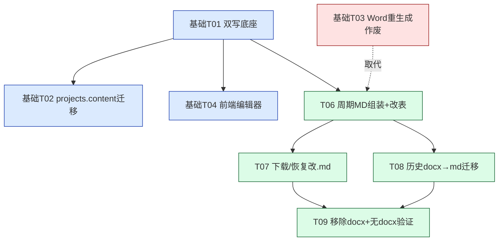
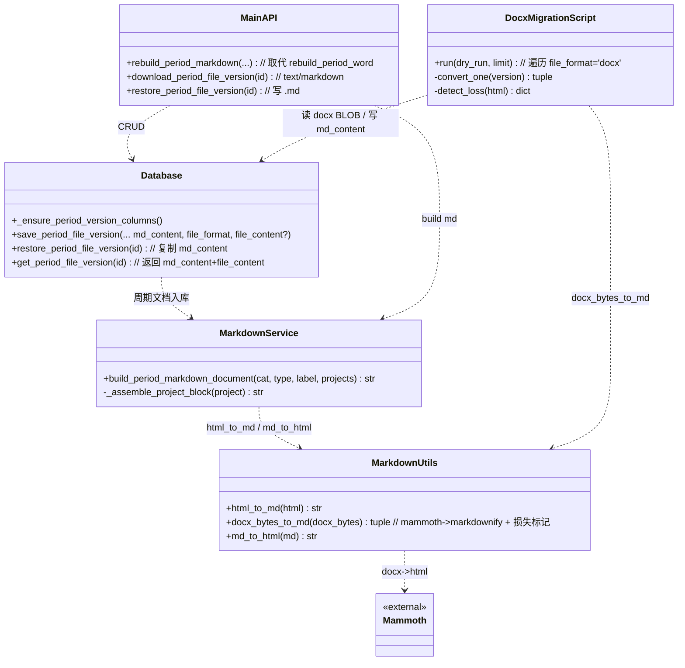
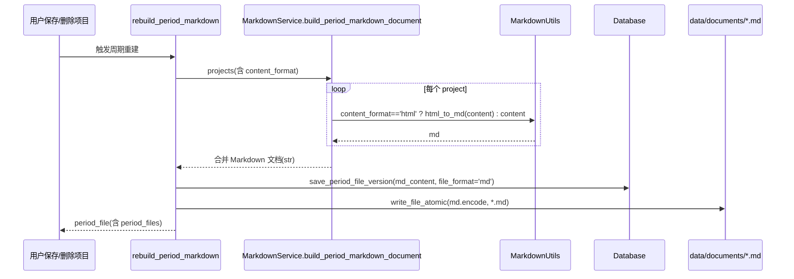
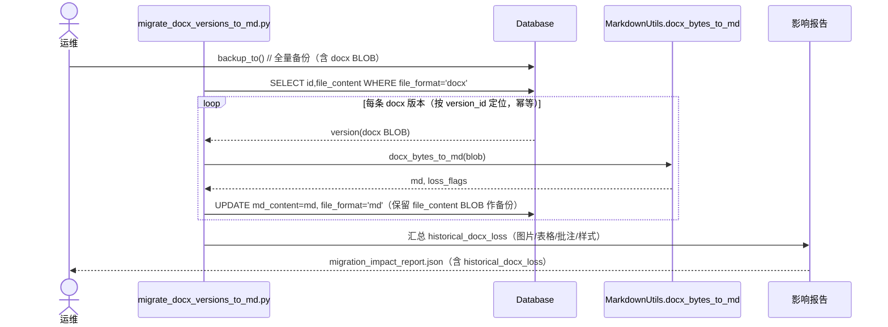
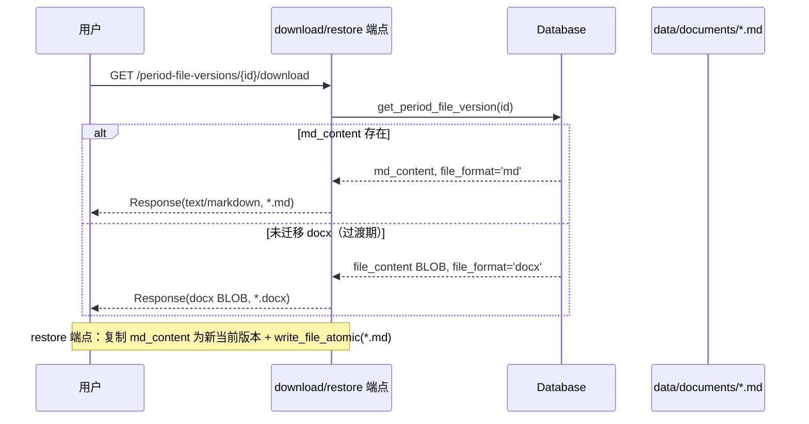

# 增量架构设计：移除 Word 全链路 + 历史 period_file_versions 统一迁为 Markdown

> 文档角色：增量架构设计（Architect Deliverable，仅描述相对基础设计 `docs/design_markdown_migration.md` 的**变更部分**）
> 配套依据：`docs/prd_markdown_migration_inc.md`（增量 PRD，已落实用户拍板决策）
> 基础设计：`docs/design_markdown_migration.md`（内容真源 HTML→MD、双写列、前端编辑器替换等维持不变）
> 文档负责人：架构师 高见远（Gao）
> 状态：设计稿（待团队评审后进入研发）

---

## 0. 与基础设计的关系

- 本增量设计**取代**基础设计中与 Word 相关的全部内容：基础设计 **T03（Word 重生成改造，读 MD 真源生成 docx）即行作废**，改由本设计的 **T06（周期文档以 Markdown 组装）** 承接。
- 基础设计 T01（双写列/备份列/格式分发）、T02（projects.content HTML→MD 迁移+校验+回滚）、T04（前端编辑器替换）、T05（QA 验证）**维持不变**，但 T02 的《迁移影响报告》与 T05 的验收清单需**扩展**（见 §7 / §8）。
- 本增量新增任务：**T06 / T07 / T08 / T09**（见 §6），全部承接"彻底移除 Word、period 文档 Markdown 化、历史 docx BLOB 统一迁 MD"。

---

## 1. 变更范围（来自增量 PRD）

| 维度 | 基础设计 | 本增量 |
|---|---|---|
| Word 角色 | 派生产物，仍生成/存储 `.docx`（T03 重生成 docx） | **彻底移除**：不再生成/存储/导出 `.docx` |
| 周期文档落盘 | `data/documents/*.docx` | `data/documents/*.md` |
| `period_file_versions` 存储 | `file_content` BLOB（docx） | **Markdown 文本列 + `file_format` 标识**；历史 docx BLOB 一并迁 MD |
| 下载/恢复端点 | 服务 `.docx` | 服务 `.md`（`text/markdown`） |
| `python-docx` | 必选（MD→docx 导出） | **降级/移除**（不再需要写出；docx→md 由 mammoth 完成） |
| 验收核心 | docx 内容与历史一致 | `.md` 内容正确、历史 docx→md 可执行且标注损失、下载得 `.md`、全链路无 `.docx` |

---

## 2. `period_file_versions` 表结构改造

### 2.1 目标

- 存 Markdown 文本（替代 docx BLOB），新增 `file_format` 标识（`'docx'`/`'md'`）支持迁移期双写过渡与回滚；
- **条目与历史版本一一对应**（docx BLOB → md 文本原地转换，不新增行）；
- 覆盖**全新库**（`_init_schema`）与**旧库**（`_migrate` / 新增 `_ensure_period_version_columns`）两种演进路径。

### 2.2 推荐方案：原地双列 + `file_format`（不动原行）

保留 `file_content BLOB` 作为**历史 docx 回滚备份**，新增 `md_content TEXT` 存 Markdown 文本，新增 `file_format` 作分发键。原地转换保证条目数 1:1，满足 P0-14。

#### 2.2.1 全新库（`_init_schema` 的 CREATE 改为）

```sql
CREATE TABLE IF NOT EXISTS period_file_versions (
    id INTEGER PRIMARY KEY AUTOINCREMENT,
    period_file_id INTEGER NOT NULL,
    version_no INTEGER NOT NULL,
    file_content BLOB,                       -- 仅保留为可选二进制位（迁移后不再写入 docx）
    md_content TEXT NOT NULL DEFAULT '',     -- Markdown 文本（真源内容列）
    file_format TEXT NOT NULL DEFAULT 'md',  -- 'docx' | 'md'
    file_size INTEGER NOT NULL DEFAULT 0,    -- docx: 字节长; md: UTF-8 字节长
    file_sha256 TEXT NOT NULL DEFAULT '',    -- docx: BLOB sha256; md: 文本 sha256
    source_sha256 TEXT NOT NULL DEFAULT '',
    project_count INTEGER DEFAULT 0,
    change_reason TEXT DEFAULT '',
    source_snapshot_json TEXT DEFAULT '',
    created_at TEXT NOT NULL,
    UNIQUE(period_file_id, version_no),
    FOREIGN KEY (period_file_id) REFERENCES period_files(id) ON DELETE CASCADE
);
```

#### 2.2.2 旧库演进（`database.py` 新增 `_ensure_period_version_columns()`，由 `__init__` 调用）

```python
def _ensure_period_version_columns(self) -> None:
    with self.connect() as conn:
        cols = {r["name"] for r in conn.execute(
            "PRAGMA table_info(period_file_versions)").fetchall()}
        if "file_format" not in cols:
            conn.execute(
                "ALTER TABLE period_file_versions "
                "ADD COLUMN file_format TEXT NOT NULL DEFAULT 'docx'")
        if "md_content" not in cols:
            conn.execute(
                "ALTER TABLE period_file_versions ADD COLUMN md_content TEXT")
        # 旧数据统一标记为 docx 真源
        conn.execute(
            "UPDATE period_file_versions SET file_format='docx' "
            "WHERE file_format IS NULL OR file_format=''")
```

> SQLite 不支持 `ALTER COLUMN` 改类型，故**新增列**而非改 `file_content` 类型；过渡期两列并存，T09 稳定后可选清理（DROP `file_content` 或将 `md_content` 重命名为 `file_content`）。

### 2.3 关联改动（`period_files` 表）

- `period_files.word_filename` **列名保留不变**（避免表重建），但其值由 `*.docx` 改为 `*.md`；`relative_path` 同步改为 `.md` 路径。T08 迁移时统一把现有 `word_filename`/`relative_path` 的扩展名改写；新周期由 T06 直接生成 `.md`。
- `save_period_file_version(...)` 入参调整：新增 `md_content`、`file_format`（默认 `'md'`），`file_content` 改为可选（仅历史备份/迁移期填）；`file_size` 由 `len(md_content.encode('utf-8'))` 推导。
- `restore_period_file_version(...)` 改为**复制 `md_content` + `file_format`**（而非 BLOB），写本地 `.md`、标记 synced。

---

## 3. 周期文档生成重写（Markdown 组装）

### 3.1 替换关系

- 废弃 `build_period_word_document`（python-docx）；新增 **`build_period_markdown_document(...)`** 返回 Markdown 字符串。
- 废弃 `rebuild_period_word`；新增 **`rebuild_period_markdown(...)`**：组装 MD → 落盘 `data/documents/<分类>/by_week|month|quarter/<周期>/<分类>_<type>_<label>.md` → 写 `period_file_versions.md_content`（含 `file_format='md'`）。
- `main.py` 中所有 `rebuild_period_word` 调用方（保存/删除项目、restore、sync、download、upgrade 收录等，约 8 处）统一改为 `rebuild_period_markdown`；本地写文件由 `write_docx_bytes_atomic` 改为通用 `write_file_atomic(content: bytes, output)`。

### 3.2 合并 Markdown 章节结构

`build_period_markdown_document(category_path_names, period_type, period_label, projects) -> str`：

```markdown
# {分类路径} · {周期中文}报 {周期标签}

> 分类：{分类路径}  |  周期：{周期中文} {周期标签}  |  项目数：{N}

## 1. {项目标题}
**创建**：{created_at}  **更新**：{updated_at}  **附件**：{名1、名2}

{项目正文 Markdown}

（项目正文取自 projects.content；若 content_format='html' 经 markdown_utils.html_to_md 转换；若 'md' 原样拼接）

---

## 2. {项目标题}
...
```

要点：
- 文档标题 `#`；每个项目 `## {序号}. {标题}`；项目之间 `---` 分隔。
- 项目正文**原样拼接**（保证与单项目内容往返一致）；若项目 content 为 HTML，调用 `markdown_utils.html_to_md` 转 MD 后再拼（与 `projects.content` 迁移共用同一管线，保真一致）。
- 元信息行（创建/更新/附件）沿用原 docx 版式语义，改为 Markdown 引用/加粗表达。
- **标题层级备注（可选）**：如担心项目正文 `#` 与文档 `#` 同级，可在拼接时对项目正文做一次"标题降一级"归一化（项目 `##`→`###` 等）；默认**不降**，以保真优先，T06 实现时由工程师按渲染效果取舍。

---

## 4. 下载 / 恢复端点改造

### 4.1 端点返回结构

`GET /api/period-file-versions/{version_id}/download`：

- 读取 `version`；**优先 `md_content`**，缺失（未迁移的历史 docx）则回退 `file_content` BLOB。
- `file_format == 'md'`（主流）：
  ```python
  return Response(
      content=version["md_content"].encode("utf-8"),
      media_type="text/markdown; charset=utf-8",
      headers={"Content-Disposition":
               f"attachment; filename*=UTF-8''{stem}_V{no}.md"},
  )
  ```
- `file_format == 'docx'`（迁移前/未迁）：仍返回 docx BLOB（`application/vnd.openxmlformats-officedocument.wordprocessingml.document`，`*.docx`），保证过渡期可读。

`POST /api/period-file-versions/{version_id}/restore`：

- 调 `db.restore_period_file_version(version_id)`（复制 `md_content` + `file_format='md'` 为新当前版本）；
- 本地写 `write_file_atomic(bytes(md_content, 'utf-8'), output)`（输出 `.md`），`mark_period_file_sync('synced')`；
- 删除对 `write_docx_bytes_atomic` 的依赖。

### 4.2 前端消费方式变化

- 下载入口：文件名后缀由 `.docx`→`.md`，图标/文案由"Word"改为"Markdown"；其余基于 `Content-Disposition` 派生文件名、触发浏览器下载的逻辑**不变**（端点已带正确 `filename*.md` 与 `text/markdown`）。
- 预览/恢复：历史版本列表组件（待 T07 定位，假设 `web/src/components/PeriodFileVersions.vue` 或等价）移除"Word"专属提示，改为"Markdown"；若前端曾按 `media_type` 判断 docx 做特殊渲染，改为按 `.md` 走 Markdown 预览。
- **无需新增前端依赖**（`md-editor-v3`/`markdown-it` 已在基础 T04 引入）。

---

## 5. 历史 docx→md 迁移方案（核心待定项）

### 5.1 选型论证

| 方案 | 做法 | 优点 | 缺点 | 结论 |
|---|---|---|---|---|
| **A** | `python-docx` 遍历段落/标题/列表/表格手动拼 MD | 仅用既有库；完全可控 | 表格/图片极难、代码量大、保真低、易错 | ❌ 不推荐 |
| **B** | `mammoth` 把 docx→HTML，再 `markdownify` 转 MD | 结构保真高（标题/列表/表格/链接/粗斜体）、代码量少、mammoth 成熟 MIT 纯 Python、复用既有 markdownify 管线；且本系统 docx 由**自身 python-docx 生成**，结构规整，还原度高 | 新增 `mammoth` 依赖；图片/复杂构造仍需标注损失 | ✅ **推荐** |
| **C** | pandoc / docx2md | pandoc 非 Python 库（外部二进制，不适合打包）；docx2md 维护弱 | 引入外部运行时约束 | ❌ 不推荐 |

**推荐方案 B（mammoth + markdownify）**。理由：
1. **保真优先、代码最少**：mammoth 将 docx 还原为语义 HTML，markdownify 转 MD，覆盖标题/列表/表格/粗斜体/删除线/链接；远优于手搓（方案 A）。
2. **复用既有管线**：`markdownify` 已在 `requirements.txt`（projects.content HTML→MD 用），docx→html→md 与 projects 迁移走同一条 HTML→MD 路径，口径一致。
3. **本系统 docx 自生成、结构规整**：历史 docx 均由 `_add_rich_content` 写出，无复杂排版，mammoth 还原度高，往返损失可控。
4. `python-docx` 由此**完全退出运行时**（docx→md 由 mammoth 完成，不再需要其写出），与 PRD"降级/移除"一致。

### 5.2 有损点标注（进《迁移影响报告》）

`mammoth.convert_to_html(...)` 会返回 `messages`（含不支持特性的警告），结合 HTML 扫描即可标注：

| 损失类型 | 检测 | 说明 |
|---|---|---|
| 图片/嵌入对象 | mammoth messages 含 image，或 HTML 含 `` | MD 无等价，**默认丢弃**（与决议 1 一致），标注条数 |
| 复杂/合并单元格表格 | HTML 含 `<table>`（尤其 `colspan`/`rowspan`） | GFM 表格不支合并单元格，降级为普通表格或文本，标注 |
| 文本框/脚注/批注/修订 | mammoth messages 含相关警告 | 无 MD 等价，丢弃并标注 |
| 纯展示样式（字体/字号/颜色/对齐） | 同基础迁移 | 已决议丢弃，计入"仅样式损失"（与 projects 迁移合并统计） |
| 页眉/页脚/分页 | mammoth 默认忽略 | 标注 |

报告新增字段 `historical_docx_loss`：`total_docx_versions`、`converted`、`has_image_count`、`has_table_count`、`has_comment_count`、`style_loss_count`、`samples`（前 N 条 version_id + 命中类型），供业务签字确认"历史 docx 损失非内容丢失"。

### 5.3 依赖（见 §6）

- 新增 **`mammoth==1.8.0`**（docx→HTML，以 POC 验证可用版本为准）。
- 保留 **`markdownify==0.13.0`**（HTML→MD 复用）。
- **移除 `python-docx`**（运行时不再需要；可留注释作可选）。
- **`mistune` 不再需要**（原 MD→docx 导出用，Word 移除后失效），从必选移除（可选/注释）。

---

## 6. 依赖调整

`requirements.txt`（增量变更）：

```
# 移除：python-docx（Word 导出已彻底移除；docx→md 由 mammoth 完成）
# 可选/移除：mistune（原 MD→docx 导出用，Word 移除后不再需要）
markdownify==0.13.0     # HTML → Markdown（projects.content 迁移 + docx→html→md 复用）
mammoth==1.8.0          # 历史 .docx BLOB → HTML → Markdown（迁移期一次性使用）
```

前端 `web/package.json`：**无变更**（md-editor-v3 / markdown-it 已在基础 T04 引入，本增量不再加依赖）。

---

## 7. 任务分解（增量）

> 依赖关系：基础 T01 已完成双写底座；本增量 T06~T09 在 T01 之后。基础 T02（projects.content 迁移）、T04（前端编辑器）与 T06 可**并行**；T03 作废。

### T06 — period_file_versions 改表 + 周期文档 Markdown 组装（取代基础 T03）

- **目标**：`period_file_versions` 加 `file_format`/`md_content` 列（保留 `file_content` BLOB 作回滚备份）；用 `build_period_markdown_document` + `rebuild_period_markdown` 取代 `build_period_word_document`/`rebuild_period_word`，落盘 `.md` 并写 `md_content`；`period_files.word_filename`/`relative_path` 改 `.md`；移除 docx 写出。
- **涉及文件**：
  - `backend/database.py`（改：`_init_schema` period_file_versions CREATE、`_ensure_period_version_columns` 新增、`save_period_file_version` 写 md、`restore_period_file_version` 复制 md、`get_period_file_version` 返回 md）
  - `backend/word_service.py`（改：新增 `build_period_markdown_document`；标记/移除 `build_period_word_document` 与 python-docx 写出死代码）
  - `backend/main.py`（改：`rebuild_period_word`→`rebuild_period_markdown`、约 8 处调用方、本地写改为 `write_file_atomic`、移除 `write_docx_bytes_atomic` 调用、导入清理）
  - `requirements.txt`（改：python-docx 移除/注释、mistune 移除/注释）
- **依赖**：基础 T01（projects 已有 `content_format`）。
- **优先级**：P0（P0-11 / P0-14 落地）。
- **可并行/串行**：与基础 T02、T04 **并行**；**取代基础 T03**（T03 作废）。
- **验收点**：新周期文档以 `.md` 落盘且 `md_content` 入库；`period_file_versions` 新行 `file_format='md'`、`md_content` 非空；`period_files` 文件名 `.md`；系统不再写出 `.docx`。

### T07 — 下载/恢复端点改为服务 `.md`

- **目标**：`/api/period-file-versions/{id}/download` 与 `/restore` 返回 `text/markdown` 的 `.md`（优先 `md_content`，未迁移 docx 回退 BLOB）；前端下载/恢复入口文案图标改 Markdown。
- **涉及文件**：
  - `backend/main.py`（改：download/restore 端点返回结构与 media_type）
  - `web/src/components/PeriodFileVersions.vue`（或等价，待定位）（改：文案/图标/预览由 Word→Markdown）
  - `web/package.json`（不改）
- **依赖**：T06（端点服务 `md_content`）。
- **优先级**：P0（P0-13）。
- **可并行/串行**：与 T08 **并行**（均在 T06 后）；端点代码需兼容 `file_format` 分支。
- **验收点**：端点返回 `text/markdown`、文件名 `*.md`；恢复后本地 `.md` 与数据库当前版本一致；前端下载得 `.md` 且预览正确。

### T08 — 历史 docx→md 迁移脚本（mammoth + markdownify）

- **目标**：**幂等**转换 `period_file_versions` 全部 `file_format='docx'` 的 BLOB 为 Markdown（`md_content`），标记 `file_format='md'`，保留 `file_content` BLOB 作回滚；标注损失（图片/表格/批注/样式）进《迁移影响报告》。
- **涉及文件**：
  - `scripts/migrate_docx_versions_to_md.py`（新）
  - `backend/markdown_utils.py`（改：新增 `docx_bytes_to_md(docx_bytes)` = mammoth→markdownify + 损失检测；复用 `html_to_md` 口径）
  - `scripts/migration_impact_report.py`（改：扩展 `historical_docx_loss` 统计）
  - `requirements.txt`（改：加 `mammoth`）
- **依赖**：T06（需 `file_format`/`md_content` 列）。
- **优先级**：P0（P0-6 重写）。
- **可并行/串行**：与 T07 **并行**（均在 T06 后）。
- **验收点**：全量 docx 版本已转 MD，`file_format` 全为 `'md'`，条目数 1:1 不变；`md_content` 非空；迁移前 `file_content` BLOB 保留可回滚；报告含 `historical_docx_loss` 统计。

### T09 — 移除/禁用 docx 生成路径 + 全链路无 `.docx` 验证

- **目标**：删除/禁用所有 `.docx` 写出与 `write_docx_bytes_atomic`；清理 `word_service.py` python-docx 死代码；归档历史本地 `.docx`（移至 `data/documents/_legacy_docx/`，不对外服务）；提供"全链路无 `.docx`"验证工具与清单。
- **涉及文件**：
  - `backend/word_service.py`（改：彻底移除 python-docx 相关代码/导入）
  - `backend/main.py`（改：确认无 docx 写出；`write_docx_bytes_atomic` 删除或仅迁移工具用）
  - `scripts/verify_no_docx.py`（新）或扩展 `docs/qa_checklist.md`
  - `data/documents/`（归档脚本：移动历史 `.docx` 至 `_legacy_docx/`）
  - `requirements.txt`（最终确定移除 python-docx）
- **依赖**：T06、T07、T08（docx 路径已替换、历史已迁）。
- **优先级**：P0（放行门槛"全链路无 `.docx`"）。
- **可并行/串行**：**串行收尾**，须等 T06/T07/T08。
- **验收点**：代码无 `.docx` 写出/`python-docx` 运行依赖；`data/documents/` 无新生成 `.docx`；验证脚本通过（见 §8）。

### 增量任务依赖图



**并行结论**：T06 与基础 T02/T04 并行；T07 与 T08 在 T06 后并行；T09 串行收尾。基础 T03 作废，由 T06 取代。

---

## 8. 验收映射更新 + "全链路无 `.docx`" 验证

### 8.1 P0 验收映射（增量部分）

| 验收项（增量 PRD） | 落地设计 / 任务 |
|---|---|
| P0-6（重写）历史 docx 一并迁为 MD（全量统一） | T08（mammoth→markdownify 原地转换）+ T09（归档旧 docx）；有损标注进报告 |
| P0-11（重写）周期文档以 Markdown 组装落盘/入库 | T06（`build_period_markdown_document` + `rebuild_period_markdown`，落 `.md` 写 `md_content`） |
| P0-13 下载/恢复端点服务 `.md` | T07（端点返回 `text/markdown`、`*.md`；前端入口改 Markdown） |
| P0-14 `period_file_versions` 结构适配 | T06（`file_format` + `md_content` 列；条目 1:1 对应） |
| P0-12（调整）依赖 | T06/T09：`python-docx` 移除，`mistune` 移除；T08：`mammoth` 新增；`markdownify` 保留 |
| P0-5（扩展）历史 docx 备份可回滚 | T06 保留 `file_content` BLOB 作回滚备份；T08 迁移；回滚脚本复用 `content_html_backup` 思路扩展（见待明确 6） |
| P1-1（扩展）影响报告新增"历史 docx 损失" | T08 + `migration_impact_report.py` 扩展 `historical_docx_loss` |
| P1-2（重写）受影响周期以 MD 重建 | T06 `rebuild_period_markdown` |

### 8.2 "全链路无 `.docx`" 验证方式（T09 / T05 扩展）

1. **代码层**：`grep -rn "\.docx" backend/` 与 `write_docx_bytes_atomic`/`build_period_word_document` 调用为空；`requirements.txt` 无 `python-docx`（或仅注释可选）；无 `import docx`。
2. **数据层**：`SELECT COUNT(*) FROM period_file_versions WHERE file_format != 'md' OR md_content IS NULL OR md_content = ''` = 0；`period_files.word_filename`/`relative_path` 均以 `.md` 结尾。
3. **文件系统**：`find data/documents -name '*.docx'` 仅含 `_legacy_docx/` 归档项（不对外服务），无应用新生成 `.docx`。
4. **端点层**：`/download` 与 `/restore` 返回 `media_type` 含 `text/markdown`、文件名 `*.md`，无任何 `application/...wordprocessingml` 响应。
5. **端到端（T05）**：跑"保存项目 → 重建周期 → 下载版本 → 恢复版本"，确认所有产物均为 `.md` 且可打开/恢复。

`scripts/verify_no_docx.py` 将上述 1–4 自动化为断言，T09 与 T05 复用。

---

## 9. 待明确事项（增量）

1. **mammoth 还原保真度**：需 POC 抽样（3–5 个历史 docx 跑 mammoth→markdownify）人工核对标题/列表/表格，确认方案 B 达标后再全量。
2. **历史本地 `.docx` 处置**：归档（`_legacy_docx/`）vs 直接删除。建议先归档、稳定后删除（与基础 P2-3 一致）。
3. **`period_files.word_filename` 列名**：语义过时（仍叫 word_filename）但不重命名（避免表重建），仅改值为 `.md`；P2 清理时再 rename。
4. **前端历史版本组件**：下载/恢复组件具体文件未定位，假设 `web/src/components/PeriodFileVersions.vue` 或等价，由 T07 工程师定位。
5. **docx 中图片处理**：mammoth 默认丢弃或内联 base64；建议**丢弃**并在报告标注（与决议 1 一致），不向 MD 引入二进制。
6. **docx 回滚脚本**：基础 T02 已有 `rollback_html_from_md.py`（projects 级）。历史 docx 回滚可复用 `file_content` BLOB 写回 `md_content` + `file_format='docx'`；是否单独脚本或并入待定，T09 细化。
7. **mammoth 运行时去留**：迁移为一次性工具，稳定后是否从 runtime 移除（仅留注释）。建议先保留可选，稳定后清理。

---

## 附录：增量类图与时序图

### 附录 A. 类图（增量变更，mermaid）



### 附录 B. 时序图（增量，mermaid）

#### B.1 周期文档 Markdown 组装 + 落盘（T06）



#### B.2 历史 docx→md 迁移（T08）



#### B.3 下载/恢复端点服务 .md（T07）


