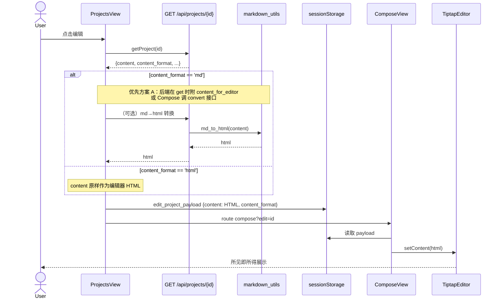
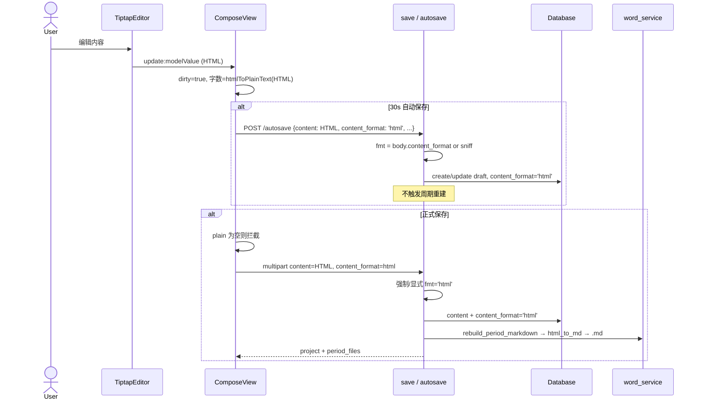
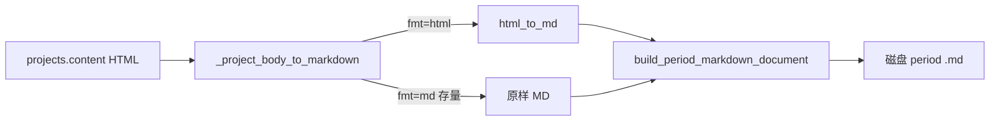
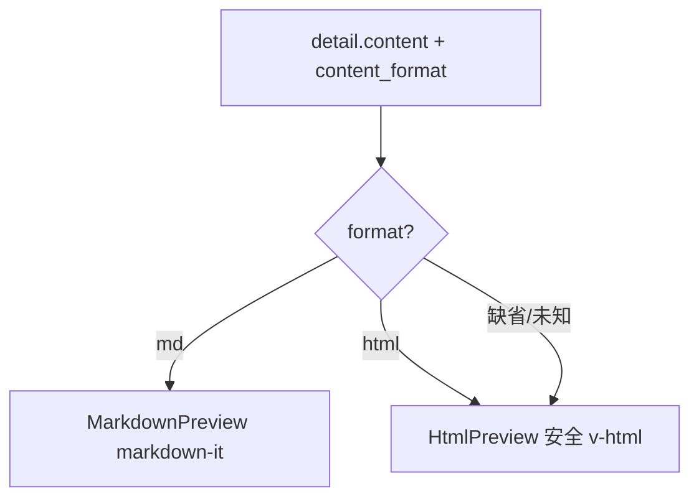
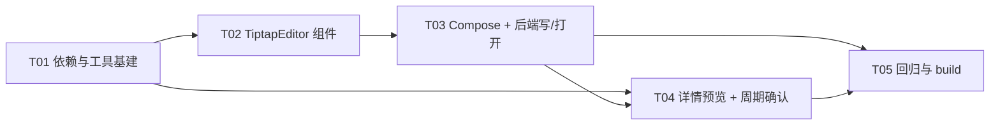

# 系统设计：项目编辑页编辑器重构为 Tiptap（增量）

> 文档角色：系统架构设计 + 有序任务分解（架构/实现层）  
> 文档负责人：架构师 高见远（Gao）  
> 关联 PRD：`docs/prd_tiptap_editor_inc.md`  
> 关键决议：DB 真源 HTML / 历史 MD 懒转换 / 周期继续 Markdown / 移除 md-editor-v3 / 无纯展示样式  
> 技术栈：前端 Vue3 + Element Plus + Tiptap；后端 FastAPI + SQLite（不切换脚手架）

---

## 1. 实现方案概述

### 1.1 目标

将 `ComposeView` 的正文编辑器从 **md-editor-v3**（Markdown 源码编辑）切换为 **Tiptap**（所见即所得）。库内项目正文以 **HTML** 为真源（`projects.content` + `content_format='html'`）；周期汇总磁盘文件**继续 Markdown**，经既有 `html_to_md` 管线产出。

### 1.2 核心技术挑战

| # | 难点 | 策略 |
|---|---|---|
| C1 | 历史 `content_format='md'` 打开后仍要可编辑 | **打开时后端 MD→HTML 懒转换**（`md_to_html`），写入会话内存后喂 Tiptap；用户保存后升格 `html` |
| C2 | 写路径格式误判 | 保存/自动保存**显式** `content_format=html`，`sniff_content_format` 仅作兜底不再主导写路径 |
| C3 | 字数 / 空校验口径 | 前端对 HTML 走 DOM 文本剥离；后端继续 `get_plain_text(content, 'html')`，口径对齐 |
| C4 | 详情页 HTML 目前用 `<pre>` 甩标签 | 安全 HTML 渲染组件（白名单 + 去除脚本）替换 `pre` 分支 |
| C5 | 移除 md-editor-v3 不残留 | 删除依赖、样式引入、Compose 专用壳样式；`markdown-it` 与 `MarkdownPreview` **保留**（存量 MD 预览/工具） |
| C6 | Tiptap 与表单集成 | 封装 `TiptapEditor.vue`（v-model: HTML 字符串），工具栏/预览/全屏内聚；Compose 只关心 HTML 字符串 |

### 1.3 架构模式

- **前端**：组件化 WYSIWYG；`ComposeView`（容器） + `TiptapEditor`（编辑器） + 既有表单/API
- **后端**：薄契约扩展（Form / JSON 增加可选 `content_format`）；打开路径按 format 转换；周期链路复用不动
- **存储**：**单真源 HTML**（本期不做 Tiptap JSON 双写）

### 1.4 端到端原则（硬约束）

1. 写路径：`content = editor.getHTML()`，`content_format = 'html'`
2. 读路径：`html` → 直接 `setContent`；`md` → `md_to_html` → `setContent`
3. 周期：`html_to_md(content)` → `build_period_markdown_document` → 磁盘 `.md`
4. 无字体/字号/颜色/对齐；无编辑器内图片/表格
5. 主题主色 `#4f46e5`

---

## 2. 框架选型与依赖变更

### 2.1 前端 npm

**新增：**

```
@tiptap/vue-3
@tiptap/pm
@tiptap/starter-kit
@tiptap/extension-placeholder   # 可选，提升空编辑体验
@tiptap/extension-underline     # 若当前 starter-kit 版本未内置 Underline，则显式安装
@tiptap/extension-link          # 若 starter-kit 未内置 Link（或需自定义 openOnClick），则显式安装
```

> 安装时以实际 `@tiptap/starter-kit` 导出为准：v2 常需单独装 underline/link；v3 文档称部分已内置。实现 T02 时 **import 验证一次**，缺哪个补哪个。  
> 推荐命令（按 PRD 官方最小集 + 保险扩展）：
>
> ```bash
> cd web
> npm install @tiptap/vue-3 @tiptap/pm @tiptap/starter-kit \
>   @tiptap/extension-placeholder @tiptap/extension-underline @tiptap/extension-link
> npm uninstall md-editor-v3
> ```

**移除：**

| 包 | 原因 |
|---|---|
| `md-editor-v3` | 双编辑器收敛，P0-10 |

**保留：**

| 包 | 原因 |
|---|---|
| `markdown-it` | `MarkdownPreview` / `renderMarkdown` / 存量 MD 详情；前端 `htmlToPlainText` 也可不依赖它 |
| `element-plus` / `vue` / `vue-router` / `axios` | 不变 |

### 2.2 后端 Python

**无新依赖。** 已有：

- `mistune` → `md_to_html`（打开历史 MD）
- `markdownify` → `html_to_md`（周期汇总）
- `word_service.html_to_plain_text` → 字数/预览/判空

### 2.3 Tiptap 扩展映射（工具栏 ↔ 扩展）

| 工具栏 | Tiptap 来源 | 备注 |
|---|---|---|
| 粗体 / 斜体 / 删除线 | StarterKit | Bold / Italic / Strike |
| 下划线 | Underline 扩展 | 独立或内置，需验证 |
| 标题 H1–H3 | StarterKit Heading | `levels: [1,2,3]`（可选到 6） |
| 引用 | Blockquote | StarterKit |
| 有序/无序列表 | OrderedList / BulletList / ListItem | StarterKit |
| 行内代码 / 代码块 | Code / CodeBlock | StarterKit |
| 链接 | Link | `openOnClick: false` 编辑态；空 href 拦截 |
| 撤销 / 重做 | History | StarterKit |
| 占位符 | Placeholder | 可选 |
| 预览 / 全屏 | **自研 UI**（非 extension） | 切换只读 HTML / 全屏 class |

**明确不装：** TextAlign、Color、FontFamily、Highlight、Table、Image、Mention。

### 2.4 Persistence

- 推荐官方 JSON 本期**不采用**
- 采用：`editor.getHTML()` / `editor.commands.setContent(html, false)`
- `form.content` 类型从「Markdown 字符串」变为「**HTML 字符串**」

---

## 3. 文件列表及相对路径

### 3.1 新增

| 路径 | 说明 |
|---|---|
| `web/src/components/TiptapEditor.vue` | Tiptap 编辑器组件（工具栏 + 编辑区 + 预览 + 全屏） |
| `web/src/components/HtmlPreview.vue` | 详情/只读安全 HTML 渲染（白名单剥离） |
| `web/src/utils/html.ts` | `htmlToPlainText`、可选 `sanitizeHtml` 轻量白名单 |

### 3.2 修改

| 路径 | 变更要点 |
|---|---|
| `web/package.json` | 增 Tiptap 相关；删 `md-editor-v3` |
| `web/package-lock.json` | 随 npm 变更 |
| `web/src/views/ComposeView.vue` | 换编辑器；字数改 HTML；保存提交 format；打开时消费转换后 HTML；文案更新 |
| `web/src/views/ProjectsView.vue` | 详情：`html` 走 `HtmlPreview`；`md` 仍 `MarkdownPreview`；edit payload 带 `content_format` |
| `web/src/api/index.js` | 可选：`convertMdToHtml`；autosave body 增加 `content_format` |
| `web/src/utils/markdown.ts` | 保留 MD 工具；**Compose 不再依赖** `mdToPlainText` |
| `backend/main.py` | save/autosave 显式 `content_format=html`；get project 可对 md 附带/直接返回 `content_html` 或提供转换 API |
| `backend/markdown_utils.py` | 若需导出轻量 sanitize 辅助可加（默认不必）；`md_to_html` 已可用 |

### 3.3 原则上不动

| 路径 | 原因 |
|---|---|
| `backend/word_service.py` | `_project_body_to_markdown` 已按 format 分支 + `html_to_md`，HTML 真源直接兼容 |
| `backend/database.py` | 已有 `content_format` / `content_html_backup` 列与 create/update 参数 |
| `web/src/components/MarkdownPreview.vue` | 存量 MD 详情过渡保留 |

### 3.4 不新建（本期）

- 无 DB 迁移脚本强制 MD→HTML 全量
- 无 `content_json` 列
- 无独立后端 Word/表格相关改造

---

## 4. 数据流

### 4.1 总览

```mermaid
flowchart TB
  subgraph UI[前端]
    CV[ComposeView]
    TE[TiptapEditor]
    PV[ProjectsView 详情]
    HP[HtmlPreview]
    MP[MarkdownPreview]
    CV -->|v-model HTML| TE
    PV -->|format=html| HP
    PV -->|format=md| MP
  end

  subgraph API[后端 FastAPI]
    SAVE["POST /api/projects<br/>content + content_format=html"]
    AUTO["POST /api/projects/autosave<br/>content + content_format=html"]
    GET["GET /api/projects/{id}"]
    CVT["GET/POST 打开转换<br/>md→html（懒）"]
    REBUILD[rebuild_period_markdown]
  end

  subgraph DB[(SQLite projects)]
    COL["content TEXT<br/>content_format html|md"]
  end

  subgraph DISK[磁盘周期文件]
    MDFILE[".md 周期汇总"]
  end

  TE -->|getHTML| CV
  CV --> SAVE
  CV --> AUTO
  SAVE --> COL
  AUTO --> COL
  SAVE --> REBUILD
  REBUILD -->|html_to_md| MDFILE
  GET --> PV
  GET --> CV
  CVT --> CV
```

### 4.2 打开（编辑）



**决议落地（打开转换执行侧）：方案 A — 后端转换。**

- **推荐实现**：`GET /api/projects/{id}` 响应新增只读字段 `content_for_editor`：
  - `format=='md'` → `md_to_html(content)`
  - `format=='html'` → 等于 `content`
  - 原始 `content` / `content_format` 保持不变（未保存前库内仍为 md）
- **备选**：`POST /api/content/md-to-html` body `{markdown}` → `{html}`，Compose 打开时自调。
- 转换失败：HTTP 4xx/5xx + 可读文案；前端 `ElMessage.error`，**不静默清空**（保留原 content 只读展示或阻止进入编辑）。

> 前端不引入第二套 MD 引擎做打开转换，避免与 mistune 口径偏差（对齐 PRD D7）。

### 4.3 保存 / 自动保存



### 4.4 周期汇总



**结论：** `word_service` **默认无需改代码**；确认 `fmt` 取自 DB 且 html 分支调用 `html_to_md` 即可（现状已满足）。T06 做验证与必要时微调（标题层级、空 body）。

### 4.5 详情预览



---

## 5. 接口变更

### 5.1 正式保存 `POST /api/projects`

| 字段 | 变更 |
|---|---|
| `content` | 语义变为 **HTML**（字符串） |
| `content_format` | **新增** Form 可选字段；前端传 `html`；服务端优先采用，合法值 `html`/`md`；非法或空则 `sniff` 兜底 |
| 其他 | `category_id` / `title` / `time_modes` / `project_id` / `client_save_token` / `files` 不变 |

服务端伪代码：

```python
fmt_in = (content_format or "").strip().lower()
if fmt_in in ("html", "md"):
    fmt = fmt_in
else:
    fmt = sniff_content_format(content)
# 产品写路径：Tiptap 客户端应始终传 html；此处信任显式值
plain = get_plain_text(content, fmt).strip()
...
db.create/update(..., content_format=fmt)
```

### 5.2 自动保存 `POST /api/projects/autosave`

| 字段 | 变更 |
|---|---|
| `ProjectDraftSave.content_format` | **新增** `Optional[str] = None` |
| 逻辑 | 同 save：优先显式，否则 sniff；Tiptap 前端固定传 `"html"` |

### 5.3 项目详情 `GET /api/projects/{id}`

| 字段 | 变更 |
|---|---|
| `content` | 不变（库内真源） |
| `content_format` | 已有 |
| `content_for_editor` | **新增**（推荐）：始终为可直接 `setContent` 的 HTML |

```python
raw = project["content"] or ""
fmt = (project.get("content_format") or "html").lower()
if fmt == "md":
    project["content_for_editor"] = md_to_html(raw)
else:
    project["content_for_editor"] = raw
```

> 懒转换**不写库**；仅在用户保存/autosave 后 `content_format` 升格为 `html`。

### 5.4 可选独立转换 API

```
POST /api/content/md-to-html
Body: { "markdown": "..." }
Resp: { "html": "..." }
```

仅当不想污染 getProject 响应时使用；**二选一即可，推荐 5.3 内嵌字段，少一次 RTT**。

### 5.5 不变的接口

- 周期 open/download/rebuild
- 分类 / 附件 / 工作面板
- 删除项目后的周期重建

---

## 6. 前端 Tiptap 组件结构设计

### 6.1 组件树

```
ComposeView.vue
├── 表单字段（标题/分类/周期/附件）——保持
├── TiptapEditor.vue          ← v-model = form.content (HTML)
│   ├── Toolbar
│   │   ├── 行内：B I U S Code
│   │   ├── 块：H1–H3 Quote UL OL CodeBlock
│   │   ├── 插入：Link
│   │   ├── 历史：Undo Redo
│   │   └── 视图：Preview Fullscreen
│   ├── EditorContent（编辑态）
│   └── HtmlPreview 区域（预览态只读，可内联复用）
├── content-meta（字数 + 提示）
└── 保存操作区
```

### 6.2 `TiptapEditor.vue` 契约

```ts
// props
modelValue: string          // HTML
placeholder?: string
editable?: boolean          // 默认 true
// emits
'update:modelValue': (html: string) => void
'change': () => void        // 供 markDirty
```

内部要点：

1. `useEditor({ extensions, content: modelValue, onUpdate: ({ editor }) => emit HTML })`
2. `watch(modelValue)`：外部重置/加载时 `setContent`（避免光标跳动：仅当规范化后与当前 `getHTML()` 不同再设）
3. `onBeforeUnmount` → `editor.destroy()`
4. Link：`setLink` 弹 `window.prompt` 或 Element `ElMessageBox.prompt`；空/仅空白 → `unsetLink`；校验 `https?:` 或相对路径策略（建议允许 http(s)/mailto/#/相对，禁止 `javascript:`）
5. Preview：本地 `isPreview`，隐藏 EditorContent，展示 sanitize 后的 HTML
6. Fullscreen：根节点 class + `position: fixed; inset: 0; z-index`；Esc 退出

### 6.3 工具栏实现建议

- 使用原生 `button` + scoped CSS，**不强制**再引一套 toolbar 库，降低包体积与风格冲突
- `isActive('bold')` 等驱动激活态；激活色 `#4f46e5`
- Heading：下拉或 H1/H2/H3 三按钮
- 禁用：`editor?.can().chain().focus().toggleBold().run()` 风格

### 6.4 ComposeView 接入要点

| 原逻辑 | 新逻辑 |
|---|---|
| `import { MdEditor } from 'md-editor-v3'` | `import TiptapEditor from '../components/TiptapEditor.vue'` |
| `mdToPlainText(form.content)` | `htmlToPlainText(form.content)`（`utils/html.ts`） |
| `v-model="form.content"` Markdown | `v-model="form.content"` HTML |
| 标签「项目内容（Markdown）」 | 「项目内容」或「项目内容（富文本）」 |
| 按钮「正式保存到 Markdown」 | 「正式保存」（周期仍是 MD，但对用户强调的是项目入库） |
| `loadEditPayload` 直接 `p.content` | 优先 `p.content_for_editor \|\| p.content`；记录 `p.content_format` 仅调试可忽略 |
| autosave/save body | 附加 `content_format: 'html'`（FormData / JSON） |
| `.md-editor-shell` 样式 | 改名为 `.tiptap-editor-shell`，焦点环 `#4f46e5` |

### 6.5 `HtmlPreview.vue`

- props: `content: string`（HTML）
- 渲染前 `sanitizeHtml`：允许标签白名单见 §9；剥离 `script`/`on*`/`style` 中的表达式（本期可用轻量 DOM 解析，不必强上 DOMPurify 除非安全评审要求）
- 样式复用/对齐 `MarkdownPreview` 的标题/列表/引用/代码外观，链接色 `#4f46e5`

### 6.6 `utils/html.ts`

```ts
export function htmlToPlainText(html: string): string {
  const div = document.createElement('div')
  div.innerHTML = html || ''
  return (div.textContent || '')
    .replace(/\u00a0/g, ' ')
    .replace(/\n{3,}/g, '\n\n')
    .trim()
}

// 可选：标签白名单 sanitize，供 HtmlPreview / 预览态
export function sanitizeHtml(html: string): string { /* ... */ }
```

---

## 7. 历史兼容策略细节

| 场景 | 打开 | 编辑中 | 保存后 |
|---|---|---|---|
| 新项目 | 空 HTML | Tiptap | `content=HTML`, `format=html` |
| 历史 `html`（含早期 wangEditor） | `setContent(html)` | 可能残留 font/span；工具栏不提供再编辑这些样式 | 仍写 HTML；纯展示样式可随编辑自然丢失，**可接受** |
| 历史 `md` | `md_to_html` → setContent | 语义结构可编辑 | **升格** `format=html`，content 换 HTML |
| 从未再编辑的 `md` 存量 | 详情仍 MarkdownPreview | — | 库内保持 md |
| `content_html_backup` | 不展示、不清理 | — | 不提供回滚产品入口 |
| 周期文件 | — | — | 始终 `.md`；html 项目走 `html_to_md` |
| 附件 | 与编辑器解耦 | 既有 FormData | 不变 |

**风险与缓解：**

| 风险 | 缓解 |
|---|---|
| mistune 与历史 MD 方言差异 | 仅标题/列表/强调/链接/代码；接受边界损失；失败提示 |
| wangEditor 残留 style | Tiptap schema 会丢弃未知 mark；保存后更干净 |
| 嗅探把残缺 HTML 判成 md | 写路径强制/显式 `html` |
| 详情 pre 甩标签 | HtmlPreview 强制替换 |
| 双编辑器 CSS 污染 | uninstall + 删除 import |

---

## 8. 有序任务列表

> **约束**：按功能模块聚合；≤ 5 个实现任务 + 独立验证任务合并进最后一项；T01 含基础设施。  
> **优先级**：P0 必须；任务内文件 ≥ 3 个相关变更面。

### T01 — 依赖与工具基建

| 项 | 内容 |
|---|---|
| **Task ID** | T01 |
| **优先级** | P0 |
| **依赖** | 无 |
| **目标** | 安装 Tiptap、移除 md-editor-v3、补齐 HTML 纯文本与预览工具，为组件开发铺路 |
| **涉及文件** | `web/package.json`、`web/package-lock.json`、`web/src/utils/html.ts`（新建）、可顺带骨架 `web/src/components/HtmlPreview.vue`（新建，可先最小实现） |
| **验收** | `npm ls md-editor-v3` 无；Tiptap 包可 resolve；`htmlToPlainText('<p>ab</p>')==='ab'` |

### T02 — TiptapEditor 组件（工具栏 + 编辑区 + 预览/全屏 + 主题）

| 项 | 内容 |
|---|---|
| **Task ID** | T02 |
| **优先级** | P0（含 P1 视觉/预览/全屏） |
| **依赖** | T01 |
| **目标** | 交付可独立使用的 `TiptapEditor`：P0 工具栏能力、HTML v-model、预览、全屏、主题色 |
| **涉及文件** | `web/src/components/TiptapEditor.vue`（新建）、`web/src/utils/html.ts`（sanitize 复用）、`web/src/components/HtmlPreview.vue`（预览态复用完善） |
| **验收** | 工具栏项可用；`getHTML` 含语义标签；无 font/color/align 入口；激活态/焦点 `#4f46e5`；Esc 退出全屏 |

### T03 — ComposeView 接入 + 后端写路径显式 HTML + 打开懒转换

| 项 | 内容 |
|---|---|
| **Task ID** | T03 |
| **优先级** | P0 |
| **依赖** | T02 |
| **目标** | Compose 唯一编辑器为 Tiptap；保存/自动保存写 `html`；打开 MD 走后端转 HTML；字数/空校验切 HTML |
| **涉及文件** | `web/src/views/ComposeView.vue`、`web/src/api/index.js`、`web/src/views/ProjectsView.vue`（edit payload 使用 `content_for_editor`）、`backend/main.py`（save/autosave/getProject）、必要时 `backend/markdown_utils.py`（仅 import 复用） |
| **验收** | 新建保存库内 HTML+format；历史 MD 打开可见、保存升格；30s 草稿；空正文拦截；无 MdEditor 引用 |

### T04 — 详情安全 HTML 预览 + 周期链路确认

| 项 | 内容 |
|---|---|
| **Task ID** | T04 |
| **优先级** | P0 |
| **依赖** | T01（HtmlPreview）；与 T03 可部分并行，但端到端需 T03 产出 HTML 数据 |
| **目标** | ProjectsView 详情 html 可读；md 存量仍 MarkdownPreview；确认周期 `_project_body_to_markdown` → `html_to_md` 无回归 |
| **涉及文件** | `web/src/views/ProjectsView.vue`、`web/src/components/HtmlPreview.vue`、`backend/word_service.py`（只读确认/极小修正）、`backend/main.py`（rebuild 路径冒烟） |
| **验收** | HTML 详情无 raw 标签堆叠；MD 详情仍正常；保存后周期 `.md` 含标题/列表/强调等语义 |

### T05 — 回归、构建与收尾清理

| 项 | 内容 |
|---|---|
| **Task ID** | T05 |
| **优先级** | P0 |
| **依赖** | T03、T04 |
| **目标** | 全链路手测；`web` production build；扫残留 md-editor；文案与空状态；修复阻断 bug |
| **涉及文件** | 上述全部触达面 + 构建配置若需；文档无强制更新 |
| **验收** | `npm run build` 成功；PRD §7 验收 1–12 可勾选；Out of Scope 未误做 |

### 任务顺序与依赖图



### 与 PRD 推荐切分对照

| PRD 参考 | 本设计归并 |
|---|---|
| T01 安装 / 移除 md-editor | → **T01** |
| T02 新建 TiptapEditor | → **T02** |
| T03 改造 ComposeView | → **T03**（前端部分） |
| T04 后端 html 写路径 + MD 打开 | → **T03**（后端部分，与 Compose 同交付以免契约分裂） |
| T05 ProjectsView 预览 | → **T04** |
| T06 周期 html_to_md | → **T04** |
| T07 测试 build | → **T05** |

---

## 9. 共享约定（Shared Knowledge）

### 9.1 存储

- `projects.content`：**HTML 字符串**为写后真源
- `projects.content_format`：写路径 **`html`**；存量可读 `md`
- 本期 **无** `content_json`
- `content_html_backup`：只读遗留，不清理、不做产品回滚

### 9.2 前后端口径

| 能力 | 前端 | 后端 |
|---|---|---|
| 纯文本/字数 | `htmlToPlainText` | `get_plain_text(content, 'html')` → `html_to_plain_text` |
| MD 纯文本（存量） | `mdToPlainText`（仅预览工具链） | `get_plain_text(..., 'md')` |
| MD→HTML | 不在前端打开路径做 | `md_to_html`（mistune） |
| HTML→MD | 不做 | `html_to_md`（markdownify） |

### 9.3 HTML 标签白名单（Tiptap 产出 + 预览允许）

```
p, br, strong, b, em, i, u, s, del, strike,
h1, h2, h3, h4, h5, h6,
ul, ol, li,
blockquote,
pre, code,
a[href,title,target,rel],
span（预览可剥离无 class 的空 span）
```

**禁止：** `script`, `iframe`, `object`, `embed`, `form`, `input`, `img`, `table`（及事件属性 `on*`）、`javascript:` URL。

### 9.4 主题与 UI

- 主色 / 激活 / 链接 / 焦点环：**`#4f46e5`**
- 编辑区高度约 **480px**（对齐原 md-editor-shell）
- 圆角 12px；白底；代码块浅灰底 `#f1f5f9`

### 9.5 业务规则（保持）

- 正式保存：纯文本空 → 「请先粘贴或输入项目内容」
- 自动保存：无标题且无正文 → skip；间隔默认 30s
- 附件：FormData，与编辑器无关
- 周期磁盘：**Markdown only**

### 9.6 API 响应/请求习惯

- 既有风格：JSON camel 不强制；项目 API 多为 snake_case
- autosave 响应：`{ ok, project, mode }` / `{ skipped }`
- 错误：HTTP + 中文 `detail`

### 9.7 Git / 实现注意

- 前端工作目录：`web/`
- 后端包：`backend/`
- 不在本增量改移动端、不改周期文件扩展名

---

## 10. 待明确事项

**无阻塞项。** 以下为已在本文写死的实现选择（供开发直接执行）：

| 项 | 选择 |
|---|---|
| MD→HTML 执行侧 | 后端；`getProject` 增加 `content_for_editor` |
| 显式 format 字段 | save Form + autosave JSON 均传 `content_format=html` |
| 安全 HTML | 轻量白名单 sanitize；若后续审计要求再加 DOMPurify |
| StarterKit 是否含 underline/link | T02 安装后 import 验证，缺则补扩展包 |
| 保存按钮文案 | 改为「正式保存」（避免误导「只存 MD」） |

---

## 11. 验收对照（实现完成后勾选）

| # | 标准 | 对应任务 |
|---|---|---|
| 1 | Compose 仅 Tiptap，P0 工具栏可用 | T02/T03 |
| 2 | 新建保存 HTML + format=html | T03 |
| 3 | 历史 MD 打开可见，保存升格 | T03 |
| 4 | 历史 HTML 直开可编辑 | T03 |
| 5 | 30s 自动保存 | T03 |
| 6 | 空校验 / 字数纯文本 | T01/T03 |
| 7 | 附件不受影响 | T03 |
| 8 | 周期仍为 MD 且有语义 | T04 |
| 9 | 详情 HTML 可读，MD 可预览 | T04 |
| 10 | 无 md-editor-v3 | T01/T05 |
| 11 | 主题 #4f46e5 | T02 |
| 12 | 无字体色对齐/无表图/无周期改 HTML | 全过程 |

---

**文档结束。**
