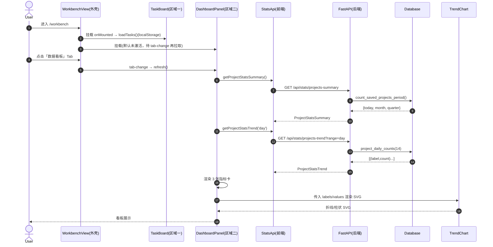
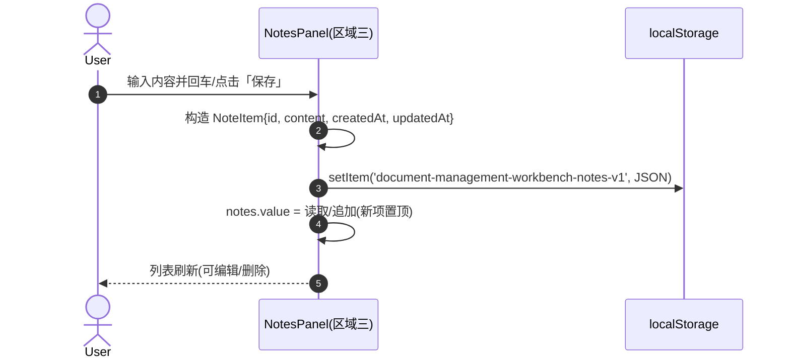
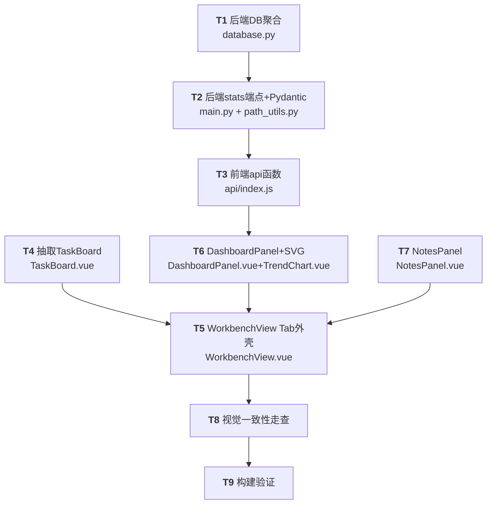
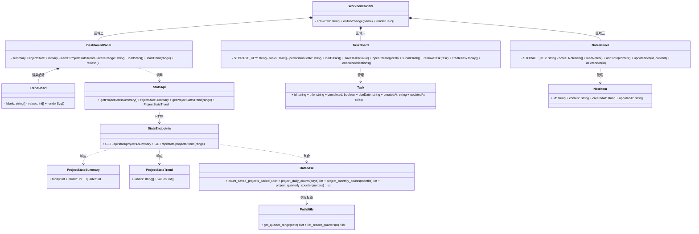

# 工作面板三选项卡重构 · 系统架构设计 + 任务分解

> 面向对象：工程师（实现）。本文档聚焦**可直接落地**的粒度，覆盖 PRD R1–R12 中明确纳入本次增量的范围（R10–R12 为可选，列为后续，不阻塞本迭代）。
> 复用既有代码，不破坏现有行为；不新增任何前端/后端依赖。

---

## 1. 实现方案与框架选型

### 1.1 核心难点

| 难点 | 说明 | 对策 |
|------|------|------|
| **回归风险高** | `WorkbenchView.vue` 约 601 行，内含全部待办逻辑（hero、4 卡、搜索、过滤器、列表、对话框、日历、提醒中心），重构为三 Tab 易破坏 R2「零回归」 | **抽取而非重写**：把待办整块抽成 `TaskBoard.vue`，`WorkbenchView` 退化为「hero 全局头部 + `el-tabs` 外壳」；保留全部既有逻辑与样式 |
| **看板聚合口径** | 需「当日/当月/当季新增」，口径= `status='saved'` 按 `created_at` 归窗；`list_projects()` 默认 `limit=200` 且仅非 draft，**不满足聚合** | **后端聚合**：新增 `Database` 聚合方法 + FastAPI 端点，前端只取结果，不拉全量（规避 200 上限与性能） |
| **趋势图** | 需日/月/季三档趋势 | 主理人拍板：**轻量自绘 SVG**（折线/柱状），**不引入 ECharts**，零新 npm 依赖，配色沿用靛蓝主题 |
| **随心记** | 便捷记录 + CRUD | 主理人拍板：**localStorage**（`document-management-workbench-notes-v1`），零后端改动，与待办一致 |

### 1.2 框架与库选型

- **前端**：沿用 Vue 3 + Vite + Element Plus + Vue Router（hash history）+ Axios。
  - 承载三区域：`el-tabs`（与现有 `el-segmented` 顶部导航同族，视觉一致）。
  - 趋势图：自绘 `<svg>`（在 `TrendChart.vue` 内计算坐标/路径），无第三方库。
- **后端**：沿用 FastAPI + SQLite（`Database` 类）+ Pydantic。聚合用 SQLite 原生日期函数（`date()` / `strftime()`），仅用标准库，无新依赖。
- **架构模式**：组件化组合。`WorkbenchView` 组合 `TaskBoard` / `DashboardPanel` / `NotesPanel`；待办与随心记数据走 localStorage（无后端），看板走「服务端聚合 + 前端展示」。

### 1.3 抽取方式与状态保留策略（关键）

- **`WorkbenchView.vue` 退化**：仅保留①全局 `hero`（问候语 + 「新建待办」「开启系统提醒」按钮）+ ②`el-tabs` 三 Tab 外壳。
- **4 张任务卡归属**：按 Q4「4 张任务卡仅区域一保留」，**随待办逻辑一并移入 `TaskBoard.vue` 顶部**（区域一内），不放在外壳，确保切换到看板/随心记时不可见。
- **`hero` 与 `TaskBoard` 的交互**：hero 的「新建待办」「开启系统提醒」通过 `taskBoardRef`（`<TaskBoard ref="taskBoardRef">`）调用 `TaskBoard` 用 `defineExpose` 暴露的 `createTaskToday()` / `enableNotifications()`；`permissionState` 由 `TaskBoard` 内部维护并一并 `defineExpose`，供 hero 按钮 `v-if="taskBoardRef?.permissionState === 'default'"` 控制显隐。
- **状态保留（满足 R2 + R10）**：`el-tabs` 默认以 `v-show` 常驻挂载三个面板 → 切换 Tab 不丢待办输入/列表、不丢随心记草稿；且 `AppLayout` 已用 `<keep-alive>` 包裹 `router-view` → 切到其他一级路由再回到工作面板也不丢 `WorkbenchView` 实例。
- **看板拉取时机**：`DashboardPanel` 在 `onMounted` 拉一次；`WorkbenchView` 通过 `el-tabs` 的 `@tab-change` 在切到看板时调用其 `refresh()`（经 `defineExpose`）保证数据新鲜；因常驻挂载，不会重复创建组件。

---

## 2. 文件列表（本次新增 / 修改）

> 预估 9 个源文件（≤10），全部复用既有约定，无新增脚手架/配置。

### 前端（5）
| 路径 | 动作 | 说明 |
|------|------|------|
| `web/src/views/WorkbenchView.vue` | **修改** | 退化为 hero（全局头部）+ `el-tabs` 三 Tab 外壳；移除已抽离的待办逻辑/样式，改为挂载 `TaskBoard`/`DashboardPanel`/`NotesPanel` |
| `web/src/components/TaskBoard.vue` | **新增** | 从 `WorkbenchView` 抽出的「区域一·待办事项」：4 张任务卡 + 搜索/过滤器/列表/新建编辑对话框/日历/提醒中心 + 全部既有 `<script setup>` 逻辑与样式；`defineExpose({ createTaskToday, enableNotifications, permissionState })` |
| `web/src/components/DashboardPanel.vue` | **新增** | 「区域二·数据看板」：3 张独立指标卡（当日/当月/当季新增）+ 趋势图切换（day/month/quarter），调用 `StatsApi`；`defineExpose({ refresh })` |
| `web/src/components/NotesPanel.vue` | **新增** | 「区域三·随心记」：便捷输入框 + 列表（新增/查看/编辑/删除），数据存 localStorage |
| `web/src/components/TrendChart.vue` | **新增** | 轻量自绘 SVG 趋势图组件：`props { labels: string[], values: number[] }`，按 `activeRange` 渲染折线或柱状，配色复用靛蓝主题 |

### 后端（4）
| 路径 | 动作 | 说明 |
|------|------|------|
| `backend/database.py` | **修改** | 新增 4 个聚合方法：`count_saved_projects_period()`、`project_daily_counts(days=14)`、`project_monthly_counts(months=6)`、`project_quarterly_counts(quarters=8)` |
| `backend/path_utils.py` | **修改** | 新增 `get_quarter_range(date)`（季度起止+标签）与 `list_recent_quarters(n)`（枚举近 n 个季度标签，用于零填充） |
| `backend/main.py` | **修改** | 新增 Pydantic 模型 `ProjectStatsSummary` / `ProjectStatsTrend`；新增端点 `GET /api/stats/projects-summary`、`GET /api/stats/projects-trend?range=day|month|quarter` |
| `web/src/api/index.js` | **修改** | 新增前端 API 函数 `getProjectStatsSummary()`、`getProjectStatsTrend(range)`（复用 `http.js` 的 axios 包装与拦截器） |

---

## 3. 数据结构与接口

### 3.1 前端 API（复用 `web/src/api/http.js`）

```js
// web/src/api/index.js 新增
export const getProjectStatsSummary = () =>
  http.get('/api/stats/projects-summary')

export const getProjectStatsTrend = (range = 'day') =>
  http.get('/api/stats/projects-trend', { params: { range } })
```

**请求 / 响应 JSON Schema**

```jsonc
// GET /api/stats/projects-summary
// 响应：
{
  "today": 12,     // 当日新增(saved) 项目数
  "month": 138,    // 当月新增
  "quarter": 402   // 当季新增
}

// GET /api/stats/projects-trend?range=day|month|quarter
// 响应：labels 与 values 一一对应，按时间升序（左→右）
{
  "labels": ["08-01","08-02", ... ,"08-14"],   // day: MM-DD；month: YYYY-MM；quarter: YYYY-Qn
  "values": [3, 5, 0, 8, /* ... */, 12]          // 各窗口新增 saved 项目数（无数据补 0）
}
```

### 3.2 随心记 localStorage 结构（新增 key）

- **key**：`document-management-workbench-notes-v1`
- **value**：`NoteItem[]` 的 JSON 数组

```jsonc
[
  {
    "id": "f47ac10b-58cc-4372-a567-0e02b2c3d479", // crypto.randomUUID()
    "content": "和供应商确认交付时间",
    "createdAt": "2026-08-14T09:31:00.000Z",       // 与待办一致用 ISO 字符串
    "updatedAt": "2026-08-14T09:31:00.000Z"
  }
]
```
> 编辑（R7）时更新 `updatedAt`，列表按 `createdAt` 倒序（新置顶）。错误读取时回退空数组并 `ElMessage.warning`（沿用待办异常风格）。

### 3.3 后端 DB 方法签名（`backend/database.py`）

```python
def count_saved_projects_period(self) -> dict[str, int]:
    """返回 {'today': int, 'month': int, 'quarter': int}，仅统计 status='saved'。"""

def project_daily_counts(self, days: int = 14) -> list[tuple[str, int]]:
    """近 days 天每日新增(saved)；返回 [(label 'MM-DD', count), ...] 按日期升序，无数据补 0。"""

def project_monthly_counts(self, months: int = 6) -> list[tuple[str, int]]:
    """近 months 月每月新增；返回 [(label 'YYYY-MM', count), ...] 升序，补 0。"""

def project_quarterly_counts(self, quarters: int = 8) -> list[tuple[str, int]]:
    """近 quarters 季每季新增；返回 [(label 'YYYY-Qn', count), ...] 升序，补 0。"""
```

**聚合口径（SQLite，本地时区）**
- 仅 `status = 'saved'`。
- 当日：`date(created_at) = date('now','localtime')`（`created_at` 存 `'%Y-%m-%d %H:%M:%S'` 本地时间，与 `Database._now()` 一致）。
- 当月：`strftime('%Y-%m', created_at) = strftime('%Y-%m','now','localtime')`。
- 当季：年份 + `(CAST(strftime('%m', created_at) AS INTEGER)-1)/3 + 1` 拼 `'YYYY-Qn'`，与 `get_quarter_range()` 产出标签一致。
- 趋势窗口：先在 Python 端用 `date` / `dateutil` 思路（标准库 `datetime`/`timedelta`）枚举近 N 个标签，再对 `GROUP BY` 结果 **左连接补零**，保证轴标签连续、前后端一致。

### 3.4 后端端点 + Pydantic（`backend/main.py`）

```python
from pydantic import BaseModel

class ProjectStatsSummary(BaseModel):
    today: int
    month: int
    quarter: int

class ProjectStatsTrend(BaseModel):
    labels: list[str]
    values: list[int]

@app.get("/api/stats/projects-summary", response_model=ProjectStatsSummary)
def stats_projects_summary():
    return db.count_saved_projects_period()

@app.get("/api/stats/projects-trend", response_model=ProjectStatsTrend)
def stats_projects_trend(range: str = "day"):
    if range == "month":
        rows = db.project_monthly_counts(6)
    elif range == "quarter":
        rows = db.project_quarterly_counts(8)
    else:
        rows = db.project_daily_counts(14)
    return ProjectStatsTrend(labels=[r[0] for r in rows], values=[r[1] for r in rows])
```
> `range` 非法值回退 `day`；返回统一 `response_model`，与前端 `StatsApi` 契约一致。

### 3.5 后端辅助（`backend/path_utils.py` 新增）

```python
def get_quarter_range(dt: datetime | None = None) -> dict[str, object]:
    """返回 {'year','quarter','label':'YYYY-Qn','start':date,'end':date}。"""

def list_recent_quarters(n: int = 8) -> list[str]:
    """按升序返回近 n 个季度标签 ['YYYY-Qn', ...]，用于趋势零填充。"""
```

### 3.6 类图（Mermaid）

见 `docs/class-diagram.mermaid`（亦内嵌于文末附录）。

---

## 4. 程序调用流程（Mermaid 时序图）

完整三图见 `docs/sequence-diagram.mermaid`，核心两图内嵌如下。

### 4.1 进入工作面板 → 切换看板 → 后端聚合 → 渲染指标卡 + SVG


### 4.2 随心记输入 → 存 localStorage → 列表刷新


---

## 5. 待明确事项（已尽量收敛）

主理人已拍板 Q1–Q4，以下仅列少量需工程师确认/留意点：

1. **「当日」时区口径**：按 `created_at` 本地日期（与存储一致，单机本地部署无歧义）。若未来跨时区部署需统一 UTC，则前后端需同步调整——本次按本地处理。
2. **看板默认 range**：建议默认 `day`（近 14 天），提供 `day/month/quarter` 切换；请工程师确认默认项。
3. **指标卡数量**：Q4 明确「当日/当月/当季新增」3 张，本设计即 3 张（≥3 满足 R3）；如需第 4 张（如「总计」）可随后补充。
4. **随心记编辑（R7）形式**：建议纯文本/多行（`el-input type=textarea`），保持轻量；若需富文本请告知（会引入依赖，与「零新依赖」冲突）。
5. **4 张任务卡位置**：本设计置于 `TaskBoard` 顶部（区域一内），以符合「仅区域一保留」；如主理人希望其浮于 Tab 之上全局可见，需改回外壳——请确认。
6. **数据库索引（可选优化）**：`projects.created_at` 当前无索引；数据量大时聚合建议加 `CREATE INDEX IF NOT EXISTS idx_projects_created_at ON projects(created_at)`（在 `Database._init_schema` 补，或迁移补）。是否允许本次一并加索引请确认。
7. **文案语言**：沿用中文文案，无国际化需求。

---

## 6. 依赖包列表

> **本次不新增任何前端/后端依赖。** 趋势图自绘 SVG；聚合用 SQLite 标准函数 + Python 标准库。

| 包 | 版本（现有） | 用途 | 是否新增 |
|----|------|------|------|
| vue | ^3.5.40 | 前端框架（沿用） | 否 |
| element-plus | ^2.14.3 | UI（`el-tabs`/`el-dialog` 等，沿用） | 否 |
| @element-plus/icons-vue | ^2.3.2 | 图标（沿用） | 否 |
| axios | ^1.19.0 | HTTP（沿用 `http.js`） | 否 |
| fastapi / pydantic | 现有 | 后端端点 + 响应模型（沿用） | 否 |
| sqlite3 / datetime | 标准库 | 聚合查询（沿用） | 否 |

---

## 7. 任务列表（有序、含依赖、按实现顺序）

> 归属成员统一标为**工程师（Engineer）**——本迭代实际落地的开发者角色；团队内由 team-lead 指派具体人员。
> 优先级：P0 = 必做（R1–R5 强相关）；P1 = 重要（R6–R9）。R10–R12 可选，不列入本迭代阻塞项。

| 任务 | 名称 | 源文件（归属） | 依赖 | 优先级 | 对应需求 |
|------|------|------|------|------|------|
| **T1** | 后端 DB 聚合方法 | `backend/database.py` | — | P0 | R3/R8 |
| **T2** | 后端 stats 端点 + Pydantic + path_utils 季度辅助 | `backend/main.py`、`backend/path_utils.py` | T1 | P0 | R3/R8 |
| **T3** | 前端 api 函数 | `web/src/api/index.js` | T2 | P0 | R3/R6 |
| **T4** | 抽取 TaskBoard 组件（待办整块抽离） | `web/src/components/TaskBoard.vue`、`web/src/views/WorkbenchView.vue`（部分删除） | — | P0 | R2 |
| **T5** | WorkbenchView 改 Tab 外壳（hero + el-tabs 组合三面板） | `web/src/views/WorkbenchView.vue` | T4, T6, T7 | P0 | R1/R2 |
| **T6** | DashboardPanel（指标卡 + SVG 趋势） | `web/src/components/DashboardPanel.vue`、`web/src/components/TrendChart.vue` | T3 | P0 | R3/R6 |
| **T7** | NotesPanel（localStorage CRUD） | `web/src/components/NotesPanel.vue` | — | P0 | R4/R7 |
| **T8** | 视觉一致性走查（token/卡片/空态/文案） | 上述全部前端文件 | T5 | P0 | R5/R9 |
| **T9** | 构建验证（`npm run build` + 后端导入冒烟） | 全仓库 | T8 | P0 | R2（回归保障） |

**说明**
- T1/T2/T3 为后端→前端契约链，串行；T4/T7 为纯前端、彼此独立，可与 T1–T3 **并行**启动。
- T5 依赖三个面板组件就绪后统一接线；T6 依赖 T3 的 API 契约。
- T8 走查覆盖 R9 空/异常态：看板无数据→「暂无新增项目数据」空态；随心记空→「还没有随手记，记下第一件小事吧」；接口失败→复用 `toastError`。

### 7.1 任务依赖图（Mermaid）



---

## 8. 共享知识（跨文件约定）

- **靛蓝主题 token**：`--wb-indigo:#4f46e5; --wb-navy:#172554`；副色板 indigo/emerald/amber/rose = `#4f46e5 / #059669 / #d97706 / #dc2626`（与现有 `.metric-indigo|emerald|amber|rose` 一致）。
- **卡片复用规则**：
  - 指标卡复用 `.metric-card` + 四色修饰类（`metric-indigo|metric-emerald|metric-amber|metric-rose`）。区域二新增的 3 张「当日/当月/当季新增」卡沿用此结构与配色（可分别用 indigo/emerald/amber 或统一 indigo，由 T8 走查定）。
  - 区域容器复用 `.workbench-card`（圆角 19px、白底、轻阴影）。
- **localStorage key 命名约定**：前缀 `document-management-workbench-` + 语义 + 版本 `-v1`。
  - 待办（已有）：`document-management-workbench-tasks-v1`
  - 随心记（新增）：`document-management-workbench-notes-v1`
- **日期格式化约定**（前后端一致，避免口径漂移）：
  - 后端 `created_at`：本地时间 `'%Y-%m-%d %H:%M:%S'`（`Database._now()`）。
  - 前端 `dateKey()`：产出 `YYYY-MM-DD`（待办沿用）；展示用 `Intl.DateTimeFormat('zh-CN', …)`。
  - 看板轴标签**由后端返回**（day=`MM-DD`、month=`YYYY-MM`、quarter=`YYYY-Qn`），前端**不重新计算口径**，保证前后端一致。
- **统计口径（唯一真相）**：仅 `status='saved'`；按 `created_at` 本地日期归窗；回溯窗口 日=14 / 月=6 / 季=8（常量集中在 `database.py` 方法默认值与前端面板）。
- **错误处理与空态文案风格**：复用 `web/src/api/http.js` 的 `toastError`（统一 `ElMessage.error`）；空态文案延续现有温和语气（如「这里已经清空了」「暂无即将触发的提醒」），新增：看板空态「暂无新增项目数据」、随心记空态「还没有随手记，记下第一件小事吧」。
- **状态保留**：`el-tabs` 默认 `v-show` 常驻挂载三面板；`AppLayout` 已 `<keep-alive>` 包裹 `router-view` → 切 Tab / 切路由均不丢 WorkbenchView 与子面板状态（满足 R2/R10）。
- **图标**：沿用 `@element-plus/icons-vue`（如 `Plus`/`Bell`/`Calendar` 等）。

---

## 附录：类图（与 `docs/class-diagram.mermaid` 一致）


