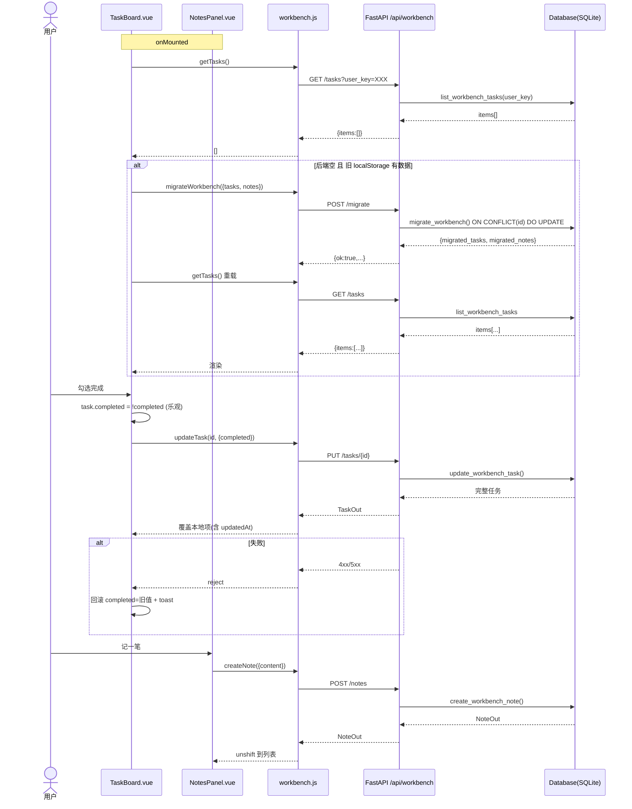

# 工作面板后端持久化（待办 + 随心记）—— 系统架构设计 + 任务分解

> 作者：软件架构师（高见远）
> 目标：将 `TaskBoard.vue`（待办）与 `NotesPanel.vue`（随心记）从前端 localStorage 迁移到后端 SQLite，按 `user_key` 隔离、跨会话/跨用户一致可靠。无登录鉴权。
> 技术栈：沿用既有 **FastAPI + SQLite + Vue 3 (Composition API) + Element Plus + Axios**，零新增依赖。

---

## 一、实现方案与框架选型

### 1.1 总体策略

| 层面 | 复用/新增 | 说明 |
|---|---|---|
| 后端存储 | 复用 `Database`（`backend/database.py`） | 新增 `workbench_tasks` / `workbench_notes` 两张表 + 10 个 CRUD/migrate 方法，沿用 `connect()` 上下文管理器、`dict(row)` 返回、`_now_iso()` 时间戳 |
| 后端接口 | 复用 `main.py` 全局 `db` 单例 + Pydantic v2 `BaseModel` | 新增 `TaskCreate/TaskUpdate/NoteCreate/NoteUpdate/WorkbenchMigrate/TaskOut/NoteOut` 模型与 9 个 `/api/workbench/*` 路由 |
| 前端 API | 新增 `web/src/api/workbench.js` | 复用 `http.js` 的 axios 实例与 `toastError`，统一携带 `user_key` |
| 前端组件 | 改造 `TaskBoard.vue` / `NotesPanel.vue` | 移除 localStorage 主存储，改调 API；保留一次性迁移与提醒内存逻辑 |

### 1.2 字段命名与序列化决策（明确选择）

**决策：后端在 API 边界用 Pydantic 同时接受 camelCase（请求）与吐出 camelCase（响应）；DB 列保持 snake_case；转换由 Pydantic 在边界完成。前端 API 模块零字段映射，直接透传 camelCase 对象。**

理由：
1. 前端组件内部与旧 localStorage 数据均为 camelCase（`dueDate`/`createdAt`/`reminderAt`/`notifiedAt`），若后端要求 snake_case，则每个组件都要写转换函数，改造量大且易错。
2. 采用 Pydantic `Field(alias="dueDate")` + `ConfigDict(populate_by_name=True)` + 字段名用 snake_case：
   - **请求体**：前端直接 `JSON.stringify` camelCase 对象即可被解析（`populate_by_name` 允许 camelCase 别名入参）。
   - `model_dump(by_alias=False)` 得到 snake_case 字段名，正好直接 `**` 展开传给 DB 方法。
   - **响应体**：FastAPI `response_model_by_alias` 默认为 `True`，以 camelCase alias 输出，前端无需再转。
3. DB 列仍用 snake_case（`due_date`/`reminder_at`/...），与项目其余表一致，便于维护与未来补列迁移。

> ⚠️ 关键约束：Pydantic 模型**字段名必须用 snake_case**、**alias 用 camelCase**。例如 `due_date: str = Field(default="", alias="dueDate")`。若字段名写成 `dueDate`，则 `by_alias=False` 仍得到 `dueDate`，无法映射 DB 形参。

`user_key` 作为**查询参数（query）**，命名保持 `user_key`（无驼峰），贯穿前后端。

### 1.3 时间字段格式

- 全系统统一 **ISO 8601 字符串**（`YYYY-MM-DDTHH:mm:ss`，本地时区；前端 `toISOString()` 产生的 `Z` 后缀也原样存储，各字段独立解析、互不比较）。
- `created_at` / `updated_at`：**客户端传入值优先（迁移保真），缺失时服务端 `datetime.now().isoformat(timespec="seconds")` 兜底**。
- 既有 SQLite 表用 `%Y-%m-%d %H:%M:%S`（本地），新表用 ISO 8601，二者互不混用，仅工作面板内部一致即可。

---

## 二、数据模型 / 数据库表结构

### 2.1 建表 SQL（追加到 `Database._init_schema` 的 `executescript` 之后）

```sql
CREATE TABLE IF NOT EXISTS workbench_tasks (
    id          TEXT    NOT NULL,
    user_key    TEXT    NOT NULL DEFAULT 'default',
    title       TEXT    NOT NULL,
    notes       TEXT    NOT NULL DEFAULT '',
    priority    TEXT    NOT NULL DEFAULT 'medium',
    due_date    TEXT    NOT NULL DEFAULT '',
    due_time    TEXT    NOT NULL DEFAULT '',
    reminder_at TEXT    NOT NULL DEFAULT '',
    completed   INTEGER NOT NULL DEFAULT 0,
    notified_at TEXT    NOT NULL DEFAULT '',
    created_at  TEXT    NOT NULL,
    updated_at  TEXT    NOT NULL,
    PRIMARY KEY (id),
    CHECK (priority IN ('high', 'medium', 'low')),
    CHECK (completed IN (0, 1))
);

CREATE TABLE IF NOT EXISTS workbench_notes (
    id          TEXT    NOT NULL,
    user_key    TEXT    NOT NULL DEFAULT 'default',
    content     TEXT    NOT NULL DEFAULT '',
    created_at  TEXT    NOT NULL,
    updated_at  TEXT    NOT NULL,
    PRIMARY KEY (id)
);

CREATE INDEX IF NOT EXISTS idx_workbench_tasks_user ON workbench_tasks(user_key);
CREATE INDEX IF NOT EXISTS idx_workbench_notes_user ON workbench_notes(user_key);
```

> 说明：`id` 为 UUID 字符串主键（全局唯一），因此 `migrate` 的 `ON CONFLICT(id) DO UPDATE` 即可保证幂等；`UNIQUE(user_key, id)` 无需额外声明。`user_key` 仍写入每行并在 `WHERE`/`ORDER BY` 中参与，便于隔离与未来按用户分区。

### 2.2 字段映射表（前端 camelCase ↔ 后端列）

**待办 `workbench_tasks`：**

| 前端字段 | 类型 | 后端列 | 约束 | 说明 |
|---|---|---|---|---|
| id | string(UUID) | `id` (TEXT PK) | 必填(客户端生成) | `crypto.randomUUID()` |
| user_key | string | `user_key` | 缺省 `'default'` | query 参数 |
| title | string | `title` | NOT NULL, ≤80 | 必填 |
| notes | string | `notes` | 默认 `''` | |
| priority | `'high'\|'medium'\|'low'` | `priority` | 默认 `'medium'` | CHECK 约束 |
| dueDate | `'YYYY-MM-DD'` | `due_date` | 默认 `''` | |
| dueTime | `'HH:mm'\|''` | `due_time` | 默认 `''` | |
| reminderAt | `'YYYY-MM-DDTHH:mm:ss'\|''` | `reminder_at` | 默认 `''` | |
| completed | boolean | `completed` (INT 0/1) | 默认 0 | API 以 JSON bool 收发 |
| notifiedAt | `''\|ISO` | `notified_at` | 默认 `''` | 提醒去重 |
| createdAt | ISO | `created_at` | NOT NULL | 客户端优先，缺省服务端 |
| updatedAt | ISO | `updated_at` | NOT NULL | 同上 |

**笔记 `workbench_notes`：**

| 前端字段 | 类型 | 后端列 | 约束 | 说明 |
|---|---|---|---|---|
| id | string(UUID) | `id` (TEXT PK) | 必填(客户端生成) | |
| user_key | string | `user_key` | 缺省 `'default'` | query 参数 |
| content | string(≤500) | `content` | NOT NULL | 必填 |
| createdAt | ISO | `created_at` | NOT NULL | 客户端优先 |
| updatedAt | ISO | `updated_at` | NOT NULL | 同上 |

### 2.3 索引

- `idx_workbench_tasks_user(user_key)`、`idx_workbench_notes_user(user_key)`：支撑按 `user_key` 隔离的高频 `SELECT` 列表查询。

---

## 三、API 接口设计

### 3.1 公共约定

- 路径前缀 `/api/workbench`。
- 除 `migrate` 外，所有写/读路由均带 `user_key` query 参数（缺省 `'default'`）。
- 鉴权：无；隔离仅靠 `user_key`。
- 错误响应：`{"detail": "..."}`（FastAPI `HTTPException` 默认）；前端 `http.js` 已统一解析为 `friendlyMessage`。
- 列表成功返回 `{ "items": [...] }`；单条返回完整 camelCase 对象；删除返回 `204 No Content`。
- 时间字段一律 ISO 8601 字符串；`completed` 以 JSON boolean 返回。

### 3.2 端点总表

| 方法 | 路径 | 说明 | 关键参数 | 成功响应 | 错误码 |
|---|---|---|---|---|---|
| GET | `/api/workbench/tasks` | 列出某用户待办 | `user_key`(query, 可选) | `200 {items:[TaskOut]}` | — |
| POST | `/api/workbench/tasks` | 创建待办 | body `TaskCreate` + `user_key`(query) | `200 TaskOut` | 400 校验失败 |
| PUT | `/api/workbench/tasks/{task_id}` | 部分更新（含 completed 切换） | path `task_id`, body `TaskUpdate`, `user_key` | `200 TaskOut` | 404 不存在 |
| DELETE | `/api/workbench/tasks/{task_id}` | 删除待办 | path `task_id`, `user_key` | `204` | 404 |
| GET | `/api/workbench/notes` | 列出某用户笔记 | `user_key`(query) | `200 {items:[NoteOut]}` | — |
| POST | `/api/workbench/notes` | 创建笔记 | body `NoteCreate`, `user_key` | `200 NoteOut` | 400 content 空/超长 |
| PUT | `/api/workbench/notes/{note_id}` | 更新笔记内容 | path `note_id`, body `NoteUpdate`, `user_key` | `200 NoteOut` | 404 |
| DELETE | `/api/workbench/notes/{note_id}` | 删除笔记 | path `note_id`, `user_key` | `204` | 404 |
| POST | `/api/workbench/migrate` | 一次性批量迁移（幂等） | body `WorkbenchMigrate` | `200 {ok, migrated_tasks, migrated_notes}` | 400 |

### 3.3 Pydantic 模型（写入 `backend/main.py`）

> 字段名一律 snake_case，alias 用 camelCase；`model_config = ConfigDict(populate_by_name=True)`。

```python
from pydantic import BaseModel, Field, ConfigDict
from typing import Optional, Literal

class TaskCreate(BaseModel):
    model_config = ConfigDict(populate_by_name=True)
    id: Optional[str] = None
    title: str = Field(..., min_length=1, max_length=80)
    notes: str = ""
    priority: Literal["high", "medium", "low"] = "medium"
    due_date: str = Field(default="", alias="dueDate")
    due_time: str = ""
    reminder_at: str = ""
    completed: bool = False
    notified_at: str = ""
    created_at: Optional[str] = None
    updated_at: Optional[str] = None

class TaskUpdate(BaseModel):
    model_config = ConfigDict(populate_by_name=True)
    title: Optional[str] = Field(default=None, min_length=1, max_length=80)
    notes: Optional[str] = None
    priority: Optional[Literal["high", "medium", "low"]] = None
    due_date: Optional[str] = Field(default=None, alias="dueDate")
    due_time: Optional[str] = None
    reminder_at: Optional[str] = None
    completed: Optional[bool] = None
    notified_at: Optional[str] = None
    updated_at: Optional[str] = None

class NoteCreate(BaseModel):
    model_config = ConfigDict(populate_by_name=True)
    id: Optional[str] = None
    content: str = Field(..., min_length=1, max_length=500)
    created_at: Optional[str] = None
    updated_at: Optional[str] = None

class NoteUpdate(BaseModel):
    model_config = ConfigDict(populate_by_name=True)
    content: str = Field(default=None, min_length=1, max_length=500)

class WorkbenchMigrate(BaseModel):
    model_config = ConfigDict(populate_by_name=True)
    user_key: str = "default"
    tasks: list[TaskCreate] = Field(default_factory=list)
    notes: list[NoteCreate] = Field(default_factory=list)

class TaskOut(BaseModel):
    model_config = ConfigDict(populate_by_name=True)
    id: str
    user_key: str = "default"
    title: str
    notes: str = ""
    priority: str = "medium"
    due_date: str = Field(default="", alias="dueDate")
    due_time: str = ""
    reminder_at: str = ""
    completed: bool = False
    notified_at: str = ""
    created_at: str
    updated_at: str

class NoteOut(BaseModel):
    model_config = ConfigDict(populate_by_name=True)
    id: str
    user_key: str = "default"
    content: str
    created_at: str
    updated_at: str
```

### 3.4 路由骨架（写入 `backend/main.py`，紧邻现有 `/api/stats/*` 之后）

```python
@app.get("/api/workbench/tasks")
def list_workbench_tasks(user_key: str = "default"):
    return {"items": db.list_workbench_tasks(user_key)}

@app.post("/api/workbench/tasks", response_model=TaskOut)
def create_workbench_task(body: TaskCreate, user_key: str = "default"):
    try:
        return db.create_workbench_task(user_key=user_key, **body.model_dump(by_alias=False))
    except ValueError as e:
        raise HTTPException(400, str(e))

@app.put("/api/workbench/tasks/{task_id}", response_model=TaskOut)
def update_workbench_task(task_id: str, body: TaskUpdate, user_key: str = "default"):
    updated = db.update_workbench_task(task_id, user_key, **body.model_dump(by_alias=False, exclude_unset=True))
    if updated is None:
        raise HTTPException(404, "待办不存在")
    return updated

@app.delete("/api/workbench/tasks/{task_id}", status_code=204)
def delete_workbench_task(task_id: str, user_key: str = "default"):
    if not db.delete_workbench_task(task_id, user_key):
        raise HTTPException(404, "待办不存在")

@app.get("/api/workbench/notes")
def list_workbench_notes(user_key: str = "default"):
    return {"items": db.list_workbench_notes(user_key)}

@app.post("/api/workbench/notes", response_model=NoteOut)
def create_workbench_note(body: NoteCreate, user_key: str = "default"):
    try:
        return db.create_workbench_note(user_key=user_key, **body.model_dump(by_alias=False))
    except ValueError as e:
        raise HTTPException(400, str(e))

@app.put("/api/workbench/notes/{note_id}", response_model=NoteOut)
def update_workbench_note(note_id: str, body: NoteUpdate, user_key: str = "default"):
    updated = db.update_workbench_note(note_id, user_key, content=body.content)
    if updated is None:
        raise HTTPException(404, "随心记不存在")
    return updated

@app.delete("/api/workbench/notes/{note_id}", status_code=204)
def delete_workbench_note(note_id: str, user_key: str = "default"):
    if not db.delete_workbench_note(note_id, user_key):
        raise HTTPException(404, "随心记不存在")

@app.post("/api/workbench/migrate")
def migrate_workbench(body: WorkbenchMigrate):
    return {"ok": True, **db.migrate_workbench(body.user_key, body.tasks, body.notes)}
```

> `**body.model_dump(by_alias=False)` 把 camelCase 别名还原为 snake_case 字段名（`due_date` 等），直接对应 DB 方法形参，最干净。

### 3.5 迁移端点幂等策略

`db.migrate_workbench(user_key, tasks, notes)` 对每条记录执行：
```sql
INSERT INTO workbench_tasks (...) VALUES (...)
ON CONFLICT(id) DO UPDATE SET title=excluded.title, notes=excluded.notes, ...;
```
`id` 为 UUID 主键（全局唯一），重复调用同一批数据只会覆盖、不会重复插入 → 幂等。前端仅在「后端该用户为空 且 localStorage 有旧数据」时触发一次。

---

## 四、新增 Database 方法（参考实现，写入 `backend/database.py`）

在文件顶部 `import` 增加 `import uuid`；`Database` 类新增 `_now_iso()` 及下列方法；并在 `__init__` 中 `_init_schema()` 之后调用 `self._ensure_workbench_columns()`（参考既有 `_ensure_period_version_columns` 模式，用于未来补列/确认索引存在，当前体为幂等确保索引）。

```python
@staticmethod
def _now_iso() -> str:
    return datetime.now().isoformat(timespec="seconds")

def _ensure_workbench_columns(self) -> None:
    """确保工作面板表索引存在（覆盖全新库与未来补列路径）。"""
    with self.connect() as conn:
        conn.execute("CREATE INDEX IF NOT EXISTS idx_workbench_tasks_user ON workbench_tasks(user_key)")
        conn.execute("CREATE INDEX IF NOT EXISTS idx_workbench_notes_user ON workbench_notes(user_key)")

def list_workbench_tasks(self, user_key: str) -> list[dict]:
    with self.connect() as conn:
        rows = conn.execute(
            "SELECT * FROM workbench_tasks WHERE user_key = ? ORDER BY created_at ASC, id ASC",
            (user_key or "default",),
        ).fetchall()
        return [dict(r) for r in rows]

def get_workbench_task(self, task_id: str, user_key: str):
    with self.connect() as conn:
        row = conn.execute(
            "SELECT * FROM workbench_tasks WHERE id = ? AND user_key = ?",
            (task_id, user_key or "default"),
        ).fetchone()
        return dict(row) if row else None

def create_workbench_task(self, user_key, id=None, title="", notes="", priority="medium",
                          due_date="", due_time="", reminder_at="", completed=False,
                          notified_at="", created_at=None, updated_at=None) -> dict:
    now = self._now_iso()
    task_id = id or str(uuid.uuid4())
    with self.connect() as conn:
        conn.execute(
            """
            INSERT INTO workbench_tasks
                (id, user_key, title, notes, priority, due_date, due_time,
                 reminder_at, completed, notified_at, created_at, updated_at)
            VALUES (?, ?, ?, ?, ?, ?, ?, ?, ?, ?, ?, ?)
            """,
            (task_id, user_key or "default", (title or "").strip(), notes or "",
             priority or "medium", due_date or "", due_time or "", reminder_at or "",
             1 if completed else 0, notified_at or "", created_at or now, updated_at or now),
        )
        row = conn.execute("SELECT * FROM workbench_tasks WHERE id = ?", (task_id,)).fetchone()
    return dict(row)

def update_workbench_task(self, task_id: str, user_key: str, **fields) -> Optional[dict]:
    current = self.get_workbench_task(task_id, user_key)
    if not current:
        return None
    now = self._now_iso()
    def pick(key, default):
        return fields[key] if key in fields else default
    new_title = (pick("title", current["title"]) or "").strip()
    new_notes = pick("notes", current["notes"]) or ""
    new_priority = pick("priority", current["priority"]) or "medium"
    new_due = pick("due_date", current["due_date"]) or ""
    new_due_t = pick("due_time", current["due_time"]) or ""
    new_rem = pick("reminder_at", current["reminder_at"]) or ""
    new_completed = 1 if pick("completed", bool(current["completed"])) else 0
    new_notified = pick("notified_at", current["notified_at"]) or ""
    new_updated = pick("updated_at", now) or now
    with self.connect() as conn:
        conn.execute(
            """
            UPDATE workbench_tasks SET title=?, notes=?, priority=?, due_date=?, due_time=?,
                reminder_at=?, completed=?, notified_at=?, updated_at=?
            WHERE id = ? AND user_key = ?
            """,
            (new_title, new_notes, new_priority, new_due, new_due_t, new_rem,
             new_completed, new_notified, new_updated, task_id, user_key or "default"),
        )
    return self.get_workbench_task(task_id, user_key)

def delete_workbench_task(self, task_id: str, user_key: str) -> bool:
    with self.connect() as conn:
        cur = conn.execute(
            "DELETE FROM workbench_tasks WHERE id = ? AND user_key = ?",
            (task_id, user_key or "default"),
        )
        return cur.rowcount > 0

def list_workbench_notes(self, user_key: str) -> list[dict]:
    with self.connect() as conn:
        rows = conn.execute(
            "SELECT * FROM workbench_notes WHERE user_key = ? ORDER BY created_at DESC, id DESC",
            (user_key or "default",),
        ).fetchall()
        return [dict(r) for r in rows]

def create_workbench_note(self, user_key, id=None, content="", created_at=None, updated_at=None) -> dict:
    now = self._now_iso()
    note_id = id or str(uuid.uuid4())
    with self.connect() as conn:
        conn.execute(
            """
            INSERT INTO workbench_notes (id, user_key, content, created_at, updated_at)
            VALUES (?, ?, ?, ?, ?)
            """,
            (note_id, user_key or "default", (content or "").strip(), created_at or now, updated_at or now),
        )
        row = conn.execute("SELECT * FROM workbench_notes WHERE id = ?", (note_id,)).fetchone()
    return dict(row)

def update_workbench_note(self, note_id: str, user_key: str, content: str) -> Optional[dict]:
    current = self.get_workbench_note(note_id, user_key) if hasattr(self, "get_workbench_note") else None
    if current is None:
        with self.connect() as conn:
            row = conn.execute("SELECT * FROM workbench_notes WHERE id = ? AND user_key = ?",
                               (note_id, user_key or "default")).fetchone()
            current = dict(row) if row else None
    if current is None:
        return None
    now = self._now_iso()
    with self.connect() as conn:
        conn.execute(
            "UPDATE workbench_notes SET content = ?, updated_at = ? WHERE id = ? AND user_key = ?",
            ((content or "").strip(), now, note_id, user_key or "default"),
        )
    with self.connect() as conn:
        row = conn.execute("SELECT * FROM workbench_notes WHERE id = ?", (note_id,)).fetchone()
    return dict(row) if row else None

def delete_workbench_note(self, note_id: str, user_key: str) -> bool:
    with self.connect() as conn:
        cur = conn.execute(
            "DELETE FROM workbench_notes WHERE id = ? AND user_key = ?",
            (note_id, user_key or "default"),
        )
        return cur.rowcount > 0

def migrate_workbench(self, user_key: str, tasks: list, notes: list) -> dict:
    user_key = user_key or "default"
    migrated_tasks = 0
    migrated_notes = 0
    with self.connect() as conn:
        for t in tasks:
            d = t.model_dump(by_alias=False) if hasattr(t, "model_dump") else dict(t)
            tid = d.get("id") or str(uuid.uuid4())
            conn.execute(
                """
                INSERT INTO workbench_tasks
                    (id, user_key, title, notes, priority, due_date, due_time,
                     reminder_at, completed, notified_at, created_at, updated_at)
                VALUES (?, ?, ?, ?, ?, ?, ?, ?, ?, ?, ?, ?)
                ON CONFLICT(id) DO UPDATE SET
                    user_key=excluded.user_key, title=excluded.title, notes=excluded.notes,
                    priority=excluded.priority, due_date=excluded.due_date, due_time=excluded.due_time,
                    reminder_at=excluded.reminder_at, completed=excluded.completed,
                    notified_at=excluded.notified_at, updated_at=excluded.updated_at
                """,
                (tid, user_key, (d.get("title") or "").strip(), d.get("notes") or "",
                 d.get("priority") or "medium", d.get("due_date") or "", d.get("due_time") or "",
                 d.get("reminder_at") or "", 1 if d.get("completed") else 0, d.get("notified_at") or "",
                 d.get("created_at") or self._now_iso(), d.get("updated_at") or self._now_iso()),
            )
            migrated_tasks += 1
        for n in notes:
            d = n.model_dump(by_alias=False) if hasattr(n, "model_dump") else dict(n)
            nid = d.get("id") or str(uuid.uuid4())
            conn.execute(
                """
                INSERT INTO workbench_notes (id, user_key, content, created_at, updated_at)
                VALUES (?, ?, ?, ?, ?)
                ON CONFLICT(id) DO UPDATE SET
                    user_key=excluded.user_key, content=excluded.content, updated_at=excluded.updated_at
                """,
                (nid, user_key, (d.get("content") or "").strip(),
                 d.get("created_at") or self._now_iso(), d.get("updated_at") or self._now_iso()),
            )
            migrated_notes += 1
    return {"migrated_tasks": migrated_tasks, "migrated_notes": migrated_notes}
```

> 注：`update_workbench_note` 依赖 `get_workbench_note`；若未单独抽出该方法，可直接按上例内联查询。两种写法等价。

---

## 五、程序调用流程（时序图）

（完整图见 `docs/workbench-sequence-diagram.mermaid`）

主链路：`onMounted` → `GET` 列表 → 首次空库且有旧 localStorage 则 `migrate` → 重载；用户操作 → 乐观更新 + `PUT/POST/DELETE` → 失败回滚。



---

## 六、前端改造方案

### 6.1 新增 `web/src/api/workbench.js`

```js
import http from './http'

const USER_KEY_STORAGE = 'document-management-user-key'

export function getUserKey() {
  let key = localStorage.getItem(USER_KEY_STORAGE)
  if (!key) {
    key = globalThis.crypto?.randomUUID?.() || `${Date.now()}-${Math.random()}`
    localStorage.setItem(USER_KEY_STORAGE, key)
  }
  return key
}

const withUser = (params) => ({ ...(params || {}), user_key: getUserKey() })

export const getTasks = () => http.get('/api/workbench/tasks', { params: withUser() })
export const createTask = (task) => http.post('/api/workbench/tasks', task, { params: withUser() })
export const updateTask = (id, patch) => http.put(`/api/workbench/tasks/${id}`, patch, { params: withUser() })
export const deleteTask = (id) => http.delete(`/api/workbench/tasks/${id}`, { params: withUser() })

export const getNotes = () => http.get('/api/workbench/notes', { params: withUser() })
export const createNote = (note) => http.post('/api/workbench/notes', note, { params: withUser() })
export const updateNote = (id, patch) => http.put(`/api/workbench/notes/${id}`, patch, { params: withUser() })
export const deleteNote = (id) => http.delete(`/api/workbench/notes/${id}`, { params: withUser() })

export const migrateWorkbench = ({ tasks, notes }) =>
  http.post('/api/workbench/migrate', { user_key: getUserKey(), tasks, notes })
```

### 6.2 `TaskBoard.vue` 改造要点

1. **常量调整**：删除 `STORAGE_KEY` 主存储依赖；保留 `LEGACY_STORAGE_KEY = 'document-management-workbench-tasks-v1'`（仅用于迁移探测）；新增 `loading = ref(false)`。
2. **`loadTasks()` 重写**：
   - `loading.value = true`
   - 调 `getTasks()`；成功 → `tasks.value = res.items`（已是 camelCase，`completed` 为 boolean）。
   - 若返回空数组且 `localStorage.getItem(LEGACY_STORAGE_KEY)` 存在旧数组 → 调 `migrateWorkbench({ tasks: legacy, notes: legacyNotes })`（`legacyNotes` 由 `NotesPanel` 暴露或同 key 读取），成功后重新 `getTasks()`。
   - 失败（网络/5xx）→ 回退读 `LEGACY_STORAGE_KEY`（保留旧行为），`toastError(err)` 提示「离线使用本地缓存」。
   - `finally: loading.value = false`。
3. **移除** `watch(tasks, saveTasks, { deep: true })`。
4. **变更函数内显式调 API（乐观更新 + 回滚）**：
   - `submitTask()`：新建 `const created = await createTask(payload); tasks.value.unshift(created)`；编辑 `const updated = await updateTask(editingId.value, payload); 替换本地该项`。失败 `toastError(e); return`。
   - `removeTask(task)`：先乐观 `tasks.value = tasks.value.filter(i => i.id !== task.id)`；`await deleteTask(task.id).catch(e => { 回滚原数组; toastError(e) })`。
   - `toggleCompleted(task)`：存旧值；`task.completed = !isCompleted(task)`；`await updateTask(task.id, { completed: task.completed }).catch(e => { task.completed = 旧值; toastError(e) })`。
5. **保留** `notifiedAt` 内存逻辑（`checkReminders` 不改）；持久化交后端；迁移后旧 `notifiedAt` 一并带出。

### 6.3 `NotesPanel.vue` 改造要点

1. `LEGACY_STORAGE_KEY = 'document-management-workbench-notes-v1'`（探测迁移）。
2. `loadNotes()`：同 TaskBoard，`getNotes()`；空且旧数据存在 → `migrateWorkbench` → 重新拉取；失败回退 localStorage。
3. 移除 `watch`。`addNote()`→`createNote`；`submitEdit()`→`updateNote(id, { content })`；`removeNote()`→`deleteNote`（乐观删除 + 回滚）。
4. `content` 上限 500：前端 `maxlength` 保留；后端 `NoteCreate.content` 用 `max_length=500` 兜底。
5. `defineExpose({ loadNotes })` 保留（外壳可触发刷新）。

### 6.4 加载态 / 失败重试 / 乐观更新落地要点

- **加载态**：`loading` ref 控制骨架/禁用交互；首次加载失败显示 toast 并回退本地缓存，保证不白屏。
- **失败 toast**：`import { toastError } from '../api/http'`（既有），所有 await 失败统一 `toastError(e)`。
- **乐观更新**：列表项先变更/插入/删除；API 成功以「服务端返回完整对象」覆盖本地（含最新 `updatedAt`/`id`）；失败回滚到变更前快照（数组深拷贝或单项旧值）。

---

## 七、任务列表（有序、含依赖、按实现顺序）

> 硬性约束（来自分解规则）：≤ 5 个任务；每个任务 ≥ 3 个相关文件；首个任务为基础设施建设（配置文件/入口/依赖声明合并）。

| 任务 | 名称 | 涉及文件 | 依赖 | 优先级 | 验收要点 |
|---|---|---|---|---|---|
| **T1** | 数据层 + 后端路由（P0 基础设施） | `backend/database.py`（新增两表+索引于 `_init_schema`、`_ensure_workbench_columns` 调用、`_now_iso` 与 10 个 CRUD/migrate 方法、`import uuid`）、`backend/main.py`（新增 7 个 Pydantic 模型 + 9 个 `/api/workbench/*` 路由） | 无 | P0 | 服务启动即建表；`GET /api/workbench/tasks` 返回 `{items:[]}`；`POST`→`GET` 往返一致；`user_key` 隔离生效；`migrate` 幂等（重复调用不重复插入）；旧 migration 链路无报错 |
| **T2** | 前端 API 封装与 user_key 管理（P0） | `web/src/api/workbench.js`（新增：`getUserKey` + 9 个函数）、`web/src/api/index.js`（可选 re-export）、`web/src/api/http.js`（复用 `toastError`，无需改） | T1 | P0 | `getUserKey` 首次生成并持久化到 `document-management-user-key`；各函数携带 `user_key`；与 T1 端点联通（dev server 手测） |
| **T3** | TaskBoard 面板改造（P0） | `web/src/components/TaskBoard.vue`（移除 localStorage 主存储、改调 API、乐观更新+回滚、迁移探测、新增 `loading`）、`web/src/api/workbench.js`（依赖 T2）、`web/src/api/http.js`（复用） | T2 | P0 | 刷新后数据来自后端且跨会话一致；增删改乐观更新并回滚正确；首次空库有旧数据自动迁移；提醒逻辑不变 |
| **T4** | NotesPanel 面板改造（P0） | `web/src/components/NotesPanel.vue`（同上改造）、`web/src/api/workbench.js`（依赖 T2）、`web/src/api/http.js`（复用） | T2 | P0 | 同 T3 针对笔记；`content ≤ 500` 客户端+服务端校验；`defineExpose({loadNotes})` 保留 |
| **T5** | 联调、迁移边界与收尾（P1） | `web/src/views/WorkbenchView.vue`（确认三栏无回归，通常无需改）、`backend/main.py`/`backend/database.py`（冒烟：启动日志无 migration 报错）、`docs/`（联调/回归清单，可选） | T3, T4 | P1 | 旧 localStorage 用户在多浏览器/多 `user_key` 下数据隔离；迁移失败保留原 localStorage 可重试；全功能回归（数据看板不变） |

---

## 八、依赖包列表

- **Python**：无新增。`fastapi`、`pydantic`（v2）、`uvicorn`、`sqlite3`(stdlib)、`uuid`(stdlib) 均已具备。
- **Node**：无新增。`vue@3`、`axios`、`element-plus`、`@element-plus/icons-vue` 均已具备。
- **结论：本期零新增第三方依赖。**

---

## 九、共享知识（跨文件约定）

- **`user_key`**：前端 `localStorage` key `document-management-user-key`（UUID），后端 query 参数，缺省 `'default'`；所有读写均带，作为多用户隔离唯一维度。
- **字段命名**：DB 列 snake_case；API 边界 camelCase（Pydantic alias）；前端 camelCase；三者通过 Pydantic 单一转换，组件内零映射。
- **时间字段**：统一 ISO 8601 字符串；`created_at`/`updated_at` 客户端优先、缺失服务端 `datetime.now().isoformat(timespec="seconds")` 兜底；`reminder_at` 形如 `YYYY-MM-DDTHH:mm:ss`，`notified_at` 为空或 ISO。
- **布尔**：`completed` 存 SQLite INTEGER 0/1，API 以 JSON boolean 收发。
- **错误格式**：`{"detail": "..."}`；前端 `http.js` 统一转 `friendlyMessage` 并经 `toastError` 展示。
- **迁移幂等**：`ON CONFLICT(id) DO UPDATE`；仅当「后端该用户为空且 localStorage 有旧数据」时前端触发一次；失败保留 localStorage 不破坏，可重试。
- **`notifiedAt`**：持久化于后端，保持「提醒后不再重复打扰」语义；前端仍仅在内存中比较（不写回 localStorage）。
- **排序**：不引入 `order` 列；列表返回后由前端按现有 `compareTasks` / `createdAt DESC` 排序。

---

## 十、待明确事项

无。主理人已拍板四个待确认问题（旧数据迁移启用、notifiedAt 持久化、排序字段不引入、user_key 仅生成不重置），本文档已全面采用，无遗留决策点。

---

## 附：类图（详见 `docs/workbench-class-diagram.mermaid`）

```mermaid
classDiagram
    class Database {
        +connect() contextmanager
        +_now_iso() str
        +_init_schema()
        +_ensure_workbench_columns()
        +list_workbench_tasks(user_key) list~dict~
        +get_workbench_task(id, user_key) dict
        +create_workbench_task(user_key, **fields) dict
        +update_workbench_task(id, user_key, **fields) dict
        +delete_workbench_task(id, user_key) bool
        +list_workbench_notes(user_key) list~dict~
        +create_workbench_note(user_key, **fields) dict
        +update_workbench_note(id, user_key, content) dict
        +delete_workbench_note(id, user_key) bool
        +migrate_workbench(user_key, tasks, notes) dict
    }
    class TaskCreate {
        +id: Optional~str~
        +title: str
        +notes: str
        +priority: Literal
        +due_date: str
        +due_time: str
        +reminder_at: str
        +completed: bool
        +notified_at: str
        +created_at: Optional~str~
        +updated_at: Optional~str~
    }
    class TaskUpdate {
        +title: Optional~str~
        +notes: Optional~str~
        +priority: Optional~Literal~
        +due_date: Optional~str~
        +due_time: Optional~str~
        +reminder_at: Optional~str~
        +completed: Optional~bool~
        +notified_at: Optional~str~
        +updated_at: Optional~str~
    }
    class NoteCreate {
        +id: Optional~str~
        +content: str
        +created_at: Optional~str~
        +updated_at: Optional~str~
    }
    class NoteUpdate {
        +content: str
    }
    class WorkbenchMigrate {
        +user_key: str
        +tasks: list~TaskCreate~
        +notes: list~NoteCreate~
    }
    class TaskOut {
        +id: str
        +user_key: str
        +title: str
        +notes: str
        +priority: str
        +due_date: str
        +due_time: str
        +reminder_at: str
        +completed: bool
        +notified_at: str
        +created_at: str
        +updated_at: str
    }
    class NoteOut {
        +id: str
        +user_key: str
        +content: str
        +created_at: str
        +updated_at: str
    }
    class WorkbenchApi {
        +list_workbench_tasks(user_key)
        +create_workbench_task(body, user_key)
        +update_workbench_task(task_id, body, user_key)
        +delete_workbench_task(task_id, user_key)
        +list_workbench_notes(user_key)
        +create_workbench_note(body, user_key)
        +update_workbench_note(note_id, body, user_key)
        +delete_workbench_note(note_id, user_key)
        +migrate_workbench(body)
    }
    class workbench_js {
        +getUserKey() str
        +getTasks() Promise
        +createTask(task) Promise
        +updateTask(id, patch) Promise
        +deleteTask(id) Promise
        +getNotes() Promise
        +createNote(note) Promise
        +updateNote(id, patch) Promise
        +deleteNote(id) Promise
        +migrateWorkbench(payload) Promise
    }
    class TaskBoardVue {
        +loadTasks()
        +submitTask()
        +removeTask(task)
        +toggleCompleted(task)
        +checkReminders()
    }
    class NotesPanelVue {
        +loadNotes()
        +addNote()
        +submitEdit()
        +removeNote(note)
    }

    WorkbenchApi ..> Database : 调用(db 单例)
    WorkbenchApi ..> TaskCreate : 校验
    WorkbenchApi ..> TaskUpdate : 校验
    WorkbenchApi ..> NoteCreate : 校验
    WorkbenchApi ..> NoteUpdate : 校验
    WorkbenchApi ..> WorkbenchMigrate : 校验
    WorkbenchApi ..> TaskOut : 响应
    WorkbenchApi ..> NoteOut : 响应
    workbench_js ..> WorkbenchApi : HTTP /api/workbench/*
    TaskBoardVue ..> workbench_js : getTasks/createTask/updateTask/deleteTask/migrate
    NotesPanelVue ..> workbench_js : getNotes/createNote/updateNote/deleteNote/migrate
    note "DB 表: workbench_tasks / workbench_notes (snake_case 列)" as DB
    Database .. DB
```
